# FinAlpha 产品手册

安装包名是 `finaince`。产品名是 **FinAlpha**。本手册对应公开仓库 [`WeissHymmnos/finaince`](https://github.com/WeissHymmnos/finaince) 的 `main`。截图来自本机 `finaince serve`（`127.0.0.1`，已填 desk token）对真实 catalog / review 队列的抓取。

许可证：[AGPL-3.0](../LICENSE)。版权与第三方引擎见 [NOTICE](../NOTICE)。

---

## 1. 产品是什么

FinAlpha 是一张给人用的中国卖方因子研究台：

1. 把候选因子收进 **catalog**
2. 在锁定的本地 panel 上 **eval**
3. 门禁通过后才 **promote → review → pool**
4. 用 `reproagent` + `finpdfpro` **复现研报**

安装冒烟数字来自打包的两只股票 `local_panel`（窗口 2023-01-03 → 2023-02-10，成本 0 bps，表达式 `Rank(Delta(close, 1))`）。那是安装冒烟，是薄样本。

---

## 2. 安装（Python 3.12）

只要这一个公开仓库。引擎从 GitHub 上 **钉死的 commit** 解析，见 `pyproject.toml` extras。

```bash
git clone https://github.com/WeissHymmnos/finaince.git
cd finaince
uv venv --python 3.12 .venv
source .venv/bin/activate
uv pip install -e ".[reproduction]"
cp .env.example .env
# 编辑 .env：至少写上 FINAINCE_DESK_TOKEN=你自己的口令
finaince doctor
```

`doctor` 只有 JSON 里 `"ok": true` 才退出 0。装完后这些 import 必须成功：

```python
import finaince, reproagent
from aiminer.manager import cull_alpha_pool
```

可选 extras：

| extra | 用途 |
|---|---|
| `.[reproduction]` | 复现 + catalog + eval（公开安装最低集） |
| `.[discovery]` | aiminer 发现 |
| `.[agent]` | Claude Agent SDK |
| `.[dev]` | pytest |
| `.[all]` | 上面全部 |

工作台完整 UI 需要一份编好的 `aiminer/frontend/dist`。wheel 里自带的 `finaince/web/index.html` 是占位页。作者树里 `finaince serve` 会优先找到旁边的 `aiminer/frontend/dist`。`FINAINCE_PACKAGED_SPA=1` 强制用占位页。

---

## 3. 15 分钟完整教程

下面每条都是真实 CLI。本手册截图用的 home 里跑过同一条路径。

### 3.1 健康检查

```bash
export FINAINCE_DATA_SOURCE=local
export ALLOW_MOCK_LLM=true          # 离线复现；有 CPA/DeepSeek 就不要设
export FINAINCE_DESK_TOKEN=desk-local
finaince doctor
```

期望：`"ok": true`，`"imports"` 里 `finaince` / `aiminer` / `reproagent` 为 true，`qlib_child.via` 为 `qlib_child`。

### 3.2 安装冒烟 baseline

```bash
finaince baseline
```

示例输出（数字会随打包 panel 固定；两次运行必须一致）：

```json
{
  "ok": true,
  "window": {
    "start": "2023-01-03",
    "end": "2023-02-10",
    "universe": "local_panel",
    "cost_bps": 0,
    "dialect": "repro_polars",
    "expression": "Rank(Delta(close, 1))",
    "note": "install smoke local_panel fixture; cost 0 bps"
  },
  "metrics": {
    "ic_mean": -0.18518518518518517,
    "sharpe_ratio": -3.7648821410668716,
    "rows": 56,
    "universe_claim": "local_panel",
    "transaction_cost_bps": 0.0
  },
  "claim": "install smoke local_panel fixture; cost 0 bps"
}
```

### 3.3 同一表达式走 eval 路由

```bash
finaince eval "Rank(Delta(close, 1))" --dialect repro_polars --backend local
finaince eval 'Rank($close)' --dialect qlib --backend local
```

3.12 slim 上 `qlib` 走进程内 `qlib_child`。若 `~/Documents/Data/prices.parquet` 只有 `trade_date` / `ts_code`，会回退到打包 `local_panel`。

### 3.4 隔离 `compute(panel)` 写入 catalog

```bash
finaince impl examples/15min/compute.py --name rank_delta --universe local_panel
```

成功时 JSON 里有 `catalog_id`（例如 `fac_iso_…`），`expression` 为 `Rank(Delta(close, 1))`，`daily_returns` 来自 shipped `evaluate`，没有伪造的 `2024-01-` 日期。

### 3.5 复现仓库内 sample PDF

```bash
export FINAINCE_PDF_ROOT=/path/to/reproagent/tests/fixtures/sample_reports
finaince reproduce "$FINAINCE_PDF_ROOT/minimal.pdf" --sync
```

离线且 `ALLOW_MOCK_LLM=true` 时走 mock 抽取。本手册这次跑通的结果是 `"status": "passed"`、`factor_name`: `mock_momentum`、`formula`: `close / Ref(close, 5) - 1`。没有 LLM 时也可能是 `review_enqueued` + `formula_proxy`——那是诚实终态。

### 3.6 晋升到 review，再用 CLI 放行薄面板

```bash
finaince catalog
finaince promote '<catalog_id>' --to to_pool --yes
finaince review
finaince review --approve '<promotion_id>' --override thin_panel
```

两只股票的 panel 会触发 `thin_panel`。HTTP `POST /api/v1/review/{id}/approve` 带 `override` 固定 403。冒烟 panel 上进 pool 的成功路径是上面这一行 CLI。

### 3.7 打开工作台

```bash
finaince serve --host 127.0.0.1 --port 8000
```

浏览器打开 <http://127.0.0.1:8000>。左侧 **API Token** 填 `.env` 里同一个 `FINAINCE_DESK_TOKEN`。不填 token，catalog 读接口返回 401：

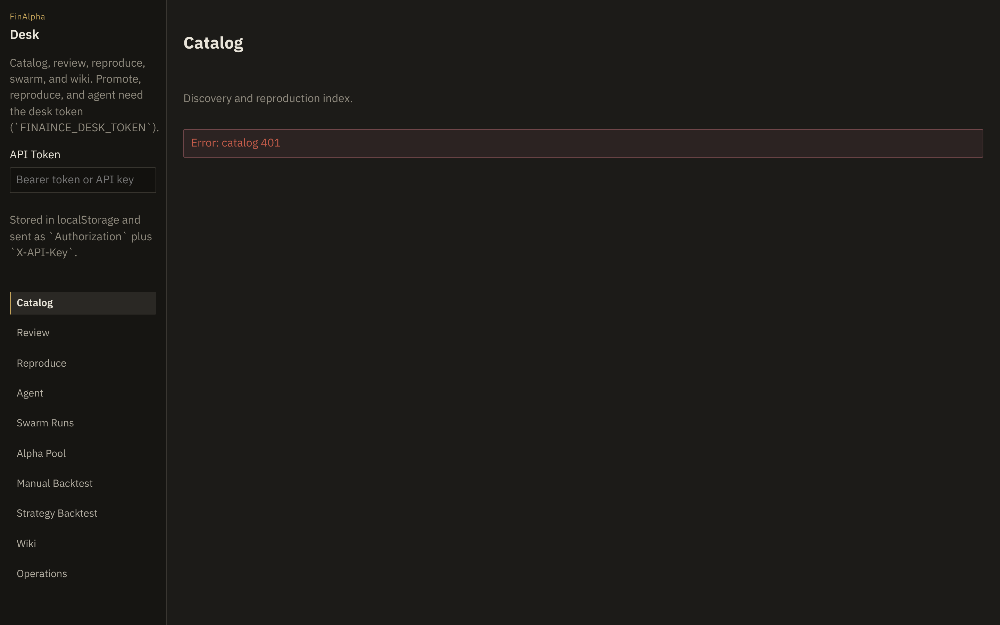

绑定 `0.0.0.0` 需要同时设置 `FINAINCE_ALLOW_PUBLIC_BIND=1`。

---

## 4. 工作台导览

侧栏：Catalog、Review、Reproduce、Agent、Swarm Runs、Alpha Pool、Manual Backtest、Strategy Backtest、Wiki、Operations。Token 存在 `localStorage`，请求头同时带 `Authorization: Bearer …` 和 `X-API-Key`。

### 4.1 Catalog

发现与复现共用一张索引。本手册环境里有两行：研报复现写入的 `mock_momentum`（status `review`），以及隔离 impl 写入的 `rank_delta`（status `candidate`）。

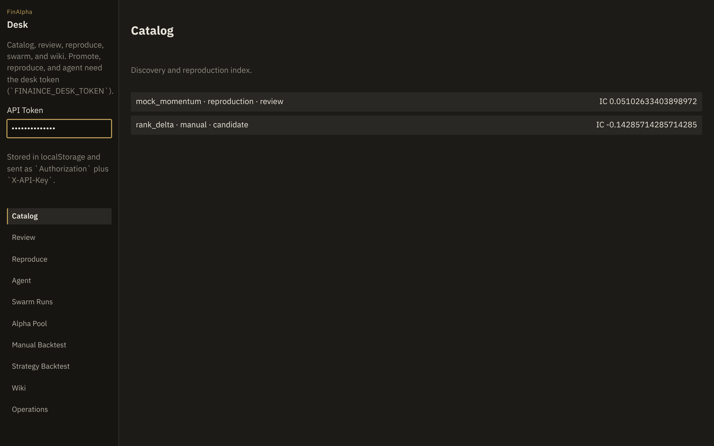

点进一行看表达式、universe、`thin_panel` 标记，以及「提交晋升」。HTTP 晋升只入 review 队列，不直接写 pool。

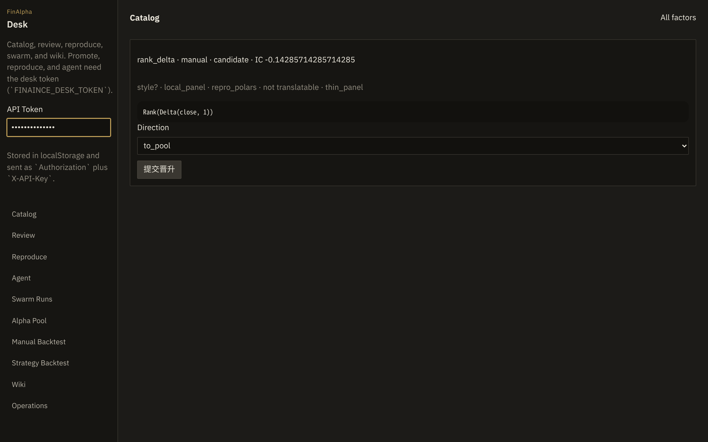

### 4.2 Review

待审晋升。图中这一条 `to_pool` / `pending`，门禁失败原因是 `thin_panel`。页面上的 **Approve** 不会带 override；点下去会失败并保持 fail-closed。要用 CLI `--override thin_panel`。

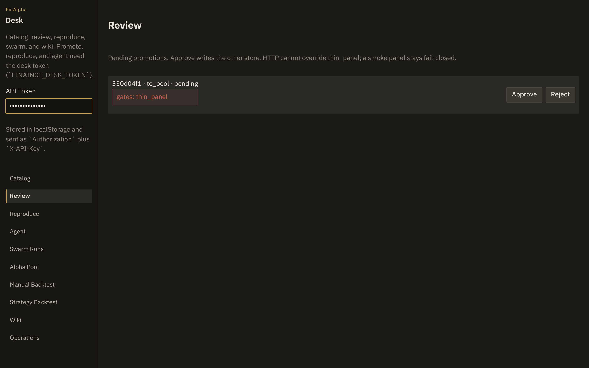

### 4.3 Reproduce

`pdf_path` 必须落在 `FINAINCE_PDF_ROOT` 下面，否则 HTTP 403。CLI `finaince reproduce` 不受这个 HTTP 白名单限制（本机文件路径）。

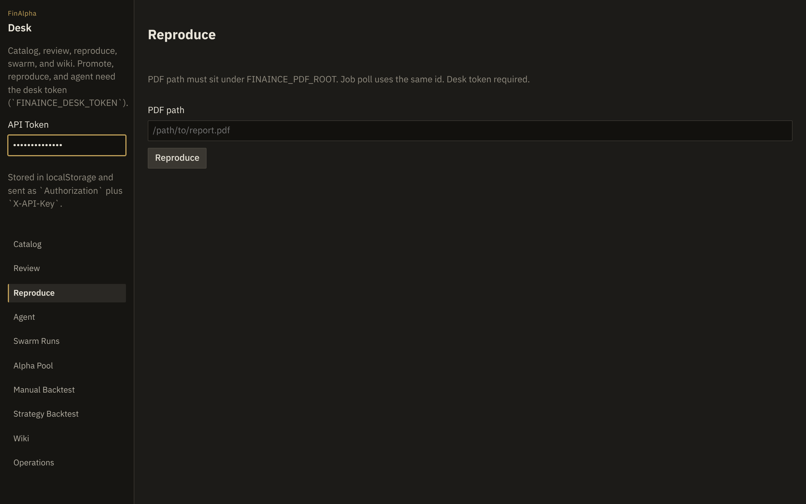

### 4.4 Agent

把自然语言交给 desk：catalog / eval / reproduce / review。它不会编造回测。完整对话需要 `.[agent]` 和本机 `claude` CLI。

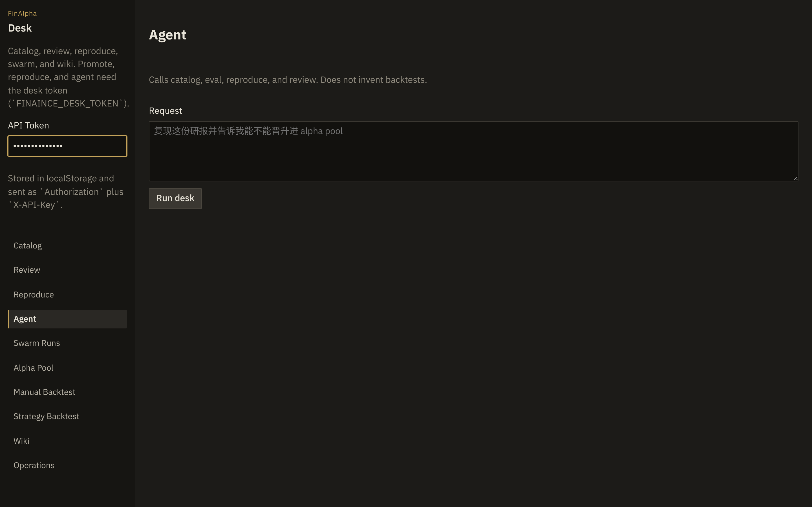

### 4.5 Swarm Runs / Alpha Pool / 回测 / Wiki / Ops

这些页来自同源挂载的 aiminer 工作台。Pool 图里能看到 catalog 对偶写入的 `mock_momentum` 与 `rank_delta`（IC 与 catalog 一致）。Swarm、Manual、Strategy 要真实行情或 live 凭据才有研究意义。

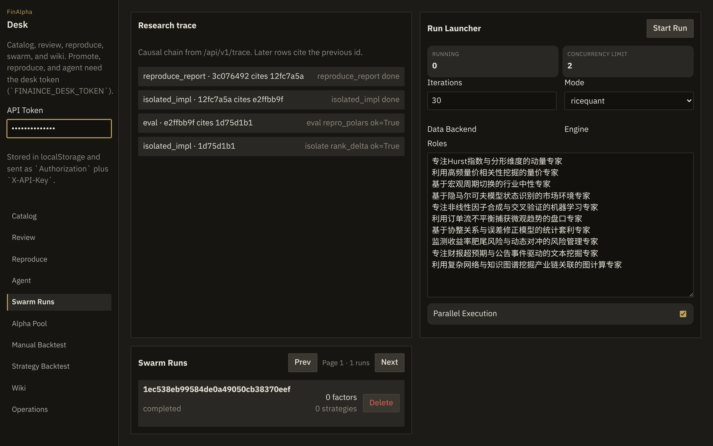

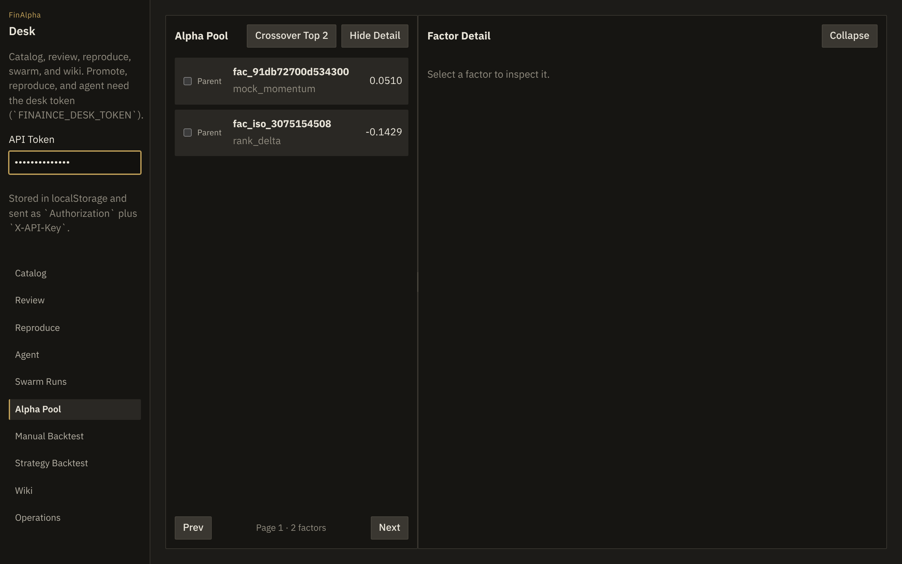

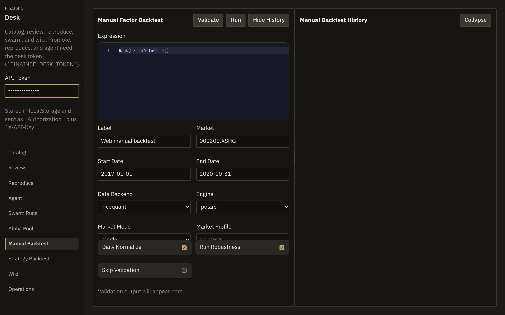

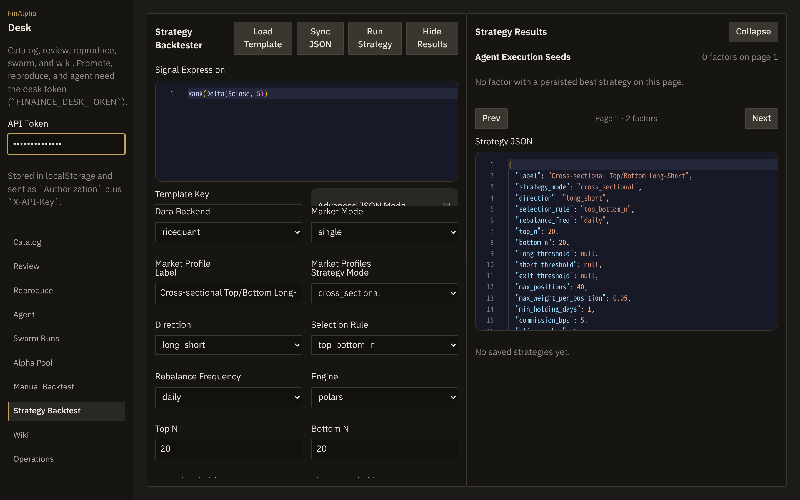

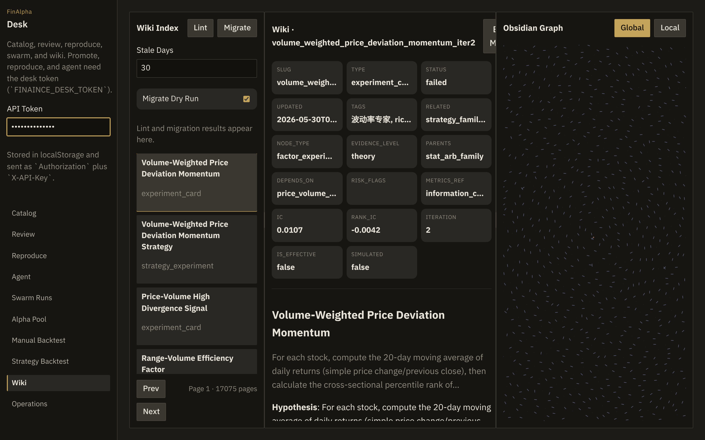

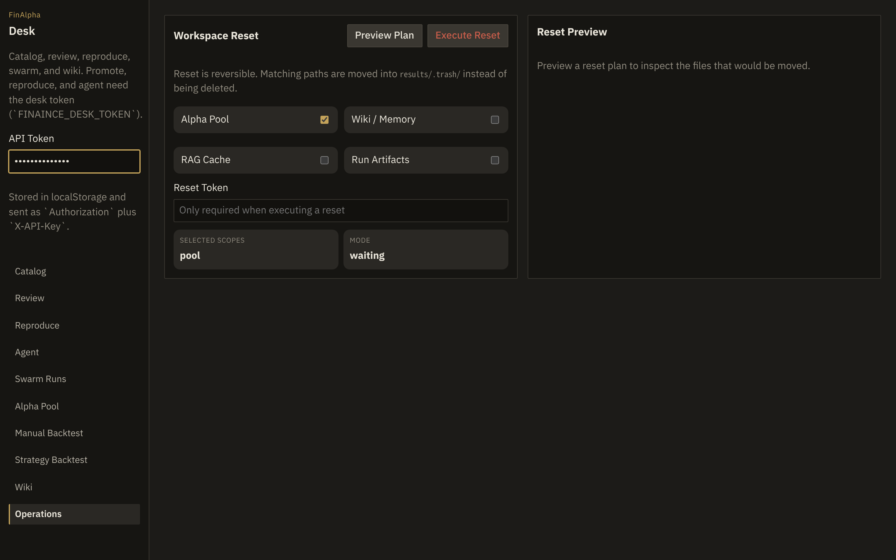

---

## 5. 命令一览

```text
finaince --help
```

| 命令 | 做什么 |
|---|---|
| `doctor` | 家目录、import、panel、qlib child、LLM 探测 |
| `baseline` | 锁定冒烟窗口 |
| `eval EXPR --dialect repro_polars\|qlib --backend local\|ricequant` | 评测路由 |
| `validate EXPR` | polars 表达式校验 |
| `impl PATH.py --name … --universe local_panel` | 隔离 `compute(panel)` → catalog |
| `reproduce PDF --sync` | 研报摄入与回测 |
| `catalog` | 列出 catalog |
| `library` | catalog 优先，再搜引擎库 |
| `promote ID --to to_pool --yes` | 提交审核 |
| `review` / `review --approve ID --override thin_panel` | 队列与放行 |
| `discover --demo` | 无 LLM 的 IC/相关 cull |
| `discover --swarm` | aiminer manager swarm（要 LLM） |
| `serve --host 127.0.0.1 --port 8000` | 同源工作台 |
| `jobs` / `trace` / `loop` | 作业、事件链、薄组合环 |
| `agent` / `sdk-info` / `sdk-query` | Claude Agent desk |

---

## 6. 门禁（fail-closed）

晋升到 pool 时这些会挡住：

| 门禁 | 何时触发 |
|---|---|
| `thin_panel` | 载入 panel 的 `n_assets < 20`（与 universe 字符串无关） |
| `formula_proxy` | 复现用了公式代理 |
| `missing_ic` | IC 缺失或非有限 |
| `missing_returns` | 没有日收益 |
| `weak_ic` | 有限 IC 的绝对值 ≤ 0.005 |
| `correlated` | 与 pool 已有因子收益相关 > 0.7 |

CLI 可以用 `--override thin_panel`（会记进 audit）。HTTP 拒绝任何 `override`。

---

## 7. HTTP 面

默认 `127.0.0.1:8000`。CORS 默认只放行 localhost:8000 / 5173。

| 路径 | 鉴权 |
|---|---|
| `GET /`、`GET /api/v1/health`、`GET /api/v1/baseline` | 公开 |
| `GET /api/v1/catalog`、`/review`、`/jobs`、`/audit`、`/trace` | desk token |
| `POST` promote / eval / approve / reject / reproduce / impl / agent / loop | desk token |
| `POST /api/v1/review/{id}/approve` + `{"override":[…]}` | **403** |
| `POST /api/v1/reproduce` 且 PDF 不在 `FINAINCE_PDF_ROOT` | **403** |

Token 头：`Authorization: Bearer <token>` 或 `X-API-Key: <token>`。`FINAINCE_DESK_TOKEN` 会抄到 `AIMINER_AUTH_TOKEN`，aiminer `/api/*` 写操作同样 fail-closed。

---

## 8. 环境变量

复制 [`.env.example`](../.env.example)。常用项：

| 变量 | 作用 |
|---|---|
| `FINAINCE_DESK_TOKEN` | 工作台与 mutation HTTP |
| `FINAINCE_DATA_SOURCE=local` | 默认走本地 panel |
| `FINAINCE_PDF_ROOT` | HTTP 复现白名单 |
| `FINAINCE_PACKAGED_SPA=1` | 强制占位 SPA |
| `FINAINCE_ALLOW_PUBLIC_BIND=1` | 才允许 `0.0.0.0` |
| `FINAINCE_PATH_HACK=1` | 作者树 sibling src |
| `FINAINCE_NO_PATH_HACK=1` | CI / 陌生人安装 |
| `ALLOW_MOCK_LLM=true` | 离线 mock 抽取 |
| `RQ_TOKEN` / `RQ_USER`+`RQ_PASS` | 米筐（opt-in） |
| `DEEPSEEK_API_KEY` / `ANTHROPIC_AUTH_TOKEN` | 真抽取（opt-in） |
| `FINAINCE_LIVE_AGENT=1` | live Claude 测试 |

---

## 9. 测试

```bash
python -m pytest tests --ignore=tests/test_live_real.py
```

GitHub Actions：`packaging-312`（公开 extras + `FINAINCE_NO_PATH_HACK=1`）和 `pytest-offline`。Live 米筐 / 券商 PDF / Claude 用 `pytest -m live`，没凭据就不要跑。

---

## 10. 范围

适合：本机 desk、公开 clone、catalog → eval → CLI review、sample PDF 复现、3.12 上 qlib child。

需要另备：编好的前端 dist、≥20 只股票的研究 panel、米筐或自己的行情、LLM 才能做真研报抽取和 swarm。

冒烟 IC / Sharpe 只描述打包 `local_panel`。对外引用时带上 `claim` 字段里的那句 *install smoke local_panel fixture; cost 0 bps*。
