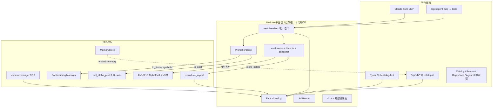

# FinAlpha / `finaince` 第二代全面改进方案

| 字段 | 值 |
|------|-----|
| 文档标题 | FinAlpha（包名 `finaince`）第二代全面彻底改进方案 |
| 作者 | TBD |
| 日期 | 2026-08-13 |
| 状态 | Accepted |
| 受众 | 会读 `finaince` / `aiminer` / `reproagent` / `rustminer` 源码的资深工程师 |
| 工作区 | `/home/wh/Documents` |
| 前置 | `/home/wh/Documents/finaince/docs/platform-improvement.md`（Accepted，2026-08-13） |

---

> 勘误（2026-08）：本文为历史设计文档。§API 中通用 `POST /api/v1/jobs {kind, payload}` 端点从未实现；job 提交走 `/api/v1/reproduce` 与 `/api/v1/loop`，取消走 `POST /api/v1/jobs/{id}/cancel`。实际接口以 docs/handbook.md 为准。

## Overview

第一代方案已经把 `finaince` 从「双引擎遥控器」做成了**平台壳**：`FactorRecord` + `platform.db` catalog、`(dialect, data_backend)` 求值路由、`promote → review → approve` 晋升、JobRunner、同源 `/api/v1` + aiminer `/api`、Claude Agent SDK 研究台、`FINAINCE_HOME`、跨平台 `compat`。这些不是规划，而是 2026-08-13 之后对照源码和 live 跑通的事实。

第二代不再发明第三套引擎，也不重写 LangGraph / 研报流水线。它针对两件事做增量彻底改进：

1. **交付与契约缺口**：`finaince[reproduction]` / `[discovery]` 仍是空 extra；`library` CLI 仍先扫引擎库；没有 `GET /api/v1/catalog/{id}`；`validation_status=synthetic` 未落地；qlib 只是结构占位却没有诚实对外说明；方言翻译只有 `is_listed` 布尔，没有 `alt_text`。
2. **真生产踩坑固化成纪律**：mock 读到 `LLM_API_KEY` 打真实 DeepSeek、CPA thinking 模型 + instructor `tool_choice` 400、米筐 `Int64` → Polars、`formula_proxy` 污染整篇 catalog、swarm 写 cwd `results/`、CPA key 被官方 `DEEPSEEK_API_KEY` 盖成 401、wiki embedding 落到 gptsapi、`~/Documents/Data` 4 股 2005Q1 不够当 CSI300。

目标态：一份可安装的 3.12 `finaince[reproduction]`（**同时**拉 `reproagent` + 瘦 `aiminer`，才能 `import reproagent` 与 `cull_alpha_pool`）、一份 3.10 `aiminer[all]` swarm 拓扑；catalog 是研究员与 Agent 的第一索引；求值不撒谎；工作台 Review / Reproduce / Agent 是可用流程而不是 JSON dump；晋升 fail-closed；swarm 产物只落 `FINAINCE_HOME`。

---

## Background & Motivation

### 当前四棵树（2026-08-13 对照源码）

```text
/home/wh/Documents/
├── finaince/          # 3.12 平台壳 0.1.0；venv；依赖 claude-agent-sdk / typer / fastapi
├── aiminer/           # 发现 swarm；3.10 conda 跑完整 LangGraph；3.12 可 cull/score/persist
├── reproagent/        # 3.12 研报复现；pipeline + FactorLibrary + FastMCP
└── rustminer/         # 只读第三引擎；共享 alpha_pool schema
```

平台核已存在，不再是第一代文档里的「规划模块」：

```text
finaince/src/finaince/
  cli.py settings.py runtime.py compat.py _paths.py
  domain/{factor,adapters,scoring}.py
  catalog/{store,hooks,rebuild}.py
  eval/{router.py,operators.yaml}          # 无 dialects.py / snapshot.py / remap.py
  review/{desk,gates}.py
  jobs/runner.py
  serve.py tools.py sdk_ext.py agent.py agent_playbook.py
  discovery.py reproduction.py
```

引擎侧第一代加法也已落地：`aiminer.pool_io`（无 `SummaryAgent`）、`reproagent.pipeline._notify_catalog_library`、`serialize_equity_returns`、`proxy_factors` 逐条打标、记忆表 `report_knowledge` / `archetypes` / `feedback_memory`、`AppPaths.memory_dir`。

### 第一代 PR 对照（2026-08-13 后实测，必须当事实）

| 条目 | 状态 | 源码事实 |
|---|---|---|
| PR-1 默认 discover 不再撒谎 | **做好** | `cli.py:143-149` 裸 `discover` exit 2；`--demo` 才走演示 JSON |
| PR-2 研究记忆落库 | **基本做好** | `tables.py` 有 `report_knowledge` / `archetypes` / `feedback_memory`；`Repository.save_knowledge_atom` 等在；`AppPaths.memory_dir` 在。无 `reproagent memory` CLI（按原计划，文档 Phase 4 仍标 ✅ 是错的） |
| PR-3 HOME + doctor | **做好** | `FinainceSettings.home` default_factory；`FINAINCE_HOME`；`doctor_report()` |
| PR-4 catalog 双写 | **主路径好，契约未齐** | `pool_io._notify_catalog`、`pipeline._notify_catalog_library`、`catalog rebuild --source rustminer` 只读都在。`library` CLI 仍调 `reproduction.search_library` 扫 `FactorLibraryManager.list()`，不是先读 catalog。`validation_status` Literal 仍是 `pending\|valid\|invalid` |
| PR-5 求值契约 | **部分** | `eval.router.evaluate`：`repro_polars` + local/ricequant 真回测（`build_backtest_bundle`）；`qlib` 只返回 `note: live AlphaEval stays on 3.10 swarm` 且 `ok=True`（不诚实）。无 `dialects.py` 真翻译、无金标快照 |
| PR-6 晋升/复核 | **做好** | `promote` 写 `pending`；`approve` fail-closed；真因子已写入 pool（`test_approve_reproduction_to_pool_writes_nonempty_code`） |
| PR-7 JobRunner | **做好** | `jobs.runner` + `compat.terminate_process_tree`（POSIX `killpg` / Windows `taskkill /T`） |
| PR-8a serve | **基本** | `/api/v1/health|catalog|jobs|eval|review|reproduce|agent`；`include_router(aiminer_app.router)`。slim 3.12 无 `aiminer[web]` 时走 placeholder `/api/health` |
| PR-8b Catalog 首页 | **页面在** | `App.tsx` `/` → `CatalogPage`；Layout 品牌 FinAlpha |
| PR-8c Review/Reproduce 页 | **薄** | 表单 + `JSON.stringify`；无 reject、无 job 轮询、无 Playwright |
| PR-9 MCP 单点 | **基本** | `tools.handle_score_factor` 按 kwargs 分发；FastMCP `score_factor` 调同一 handler。`sdk_ext.handle_search_library` 仍走引擎库，与 `tools.handle_search_library`（catalog 优先）不一致 |
| PR-10 extras | **没做好** | `finaince/pyproject.toml`：`reproduction = []`、`discovery = []`。安装面仍靠 `_paths.ensure_import_paths` 把兄弟 `src` 塞进 `sys.path` |
| PR-13 rustminer 只读 | **做好** | `rebuild(source="rustminer")` 只 `SELECT`；`lineage.engine_db="rustminer"` |
| PR-12 catalog embed memory | **没做** | `serve.py` 无 `GET /api/v1/catalog/{id}`，无 `memory_summary` |

aiminer extras 本身已经按第一代 K6 瘦身：默认 deps 只有 pydantic/pandas/numpy/loguru/polars；`all = [swarm,qlib,rq,tui,portfolio,web]`。缺口在 **finaince 侧 extra 是空的**，以及 `environment.yml` pip 段仍把 langchain/qlib **再列一遍**（与 `.[all]` 重复，不是拓扑错误）。

### 已做好 / 部分做好 / 没做好（按子系统）

#### 已做好

- 裸 `discover` 不再吐演示。
- `FINAINCE_HOME`（默认 `~/.finaince`）+ `apply_engine_env` 写 `AIMINER_RESULTS_DIR` / `AIMINER_DATA_DIR`。
- catalog 双写活路径：persist 后 hook；三处 `register` 后带 extras。
- `proxy_factors` 逐因子打标（`adapters._scoped_proxy`），不再用 run-level `formula_proxy` 污染整篇。
- 晋升：pending → approve；缺 IC / 空收益 / 空 code fail-closed；reproduction → pool 写非空 `code`。
- JobRunner + 跨平台杀进程树。
- mock 路径强制 `llm_api_key=""`（`reproagent_runtime_settings`），避免读到环境钥打真实 API。
- CPA 默认抽取模型 `deepseek-chat`（`runtime.CPA_DEEPSEEK_MODEL`）；thinking `deepseek-v4-flash` + instructor `tool_choice` 已避开。
- 米筐鉴权回退 `RQ_USER`/`RQ_PASS`（token/uri 在 rqdatac 3.6.2 失败）。
- `_pandas_to_polars` 兜底 pandas `Int64`/`Float64`。
- swarm 子进程 `cwd=cfg.home` 且注入 `AIMINER_RESULTS_DIR`；CPA 时 **覆盖** `DEEPSEEK_API_KEY`。
- `resolve_embedding_backend`：chat-only provider（含 deepseek）走本地 bge，不再落到 gptsapi `text-embedding-3-large`。
- `compat`：Windows 进程组、conda 解释器探测、不再写死 `/home/wh`。
- rustminer rebuild 只读。
- 真抽取：广发系列 5（应用分析下篇）可诚实 `no_factors`；广发系列 3 / 海通动量反转可抽出因子并有日收益（live 路径已验证过）。

#### 部分做好

- catalog：活路径双写好，但 CLI `library`、SDK `search_library`、HTTP 详情、synthetic 状态、memory embed 都缺。
- 求值：`repro_polars` 真回测好；qlib 占位没有对外契约；YAML 算子表在，翻译器不在。
- serve：`/api/v1` 骨架在；缺 `{id}`、缺 `POST /api/v1/promote`、缺 `GET /api/v1/jobs/{id}`、缺 audit。不另开通用 `POST /api/v1/jobs`（Reproduce 继续 `POST /api/v1/reproduce`）。
- 工作台：路由和导航在；Review 只有 Approve、Reproduce 只收本机路径字符串、Agent 只 dump JSON。
- MCP：分发规则在；`sdk_ext` 仍有死后代码（`handle_cull_factor_pool` return 之后的旧实现）且 `search_library` 未切到 catalog。
- doctor：能跑、exit 0；不检查三包是否可 import、不检查 qlib extra、无 `--audit-check`、audit 表无哈希链。
- 记忆：落库好；平台不索引；`research-memory.md` Phase 4 CLI 仍标完成。

#### 没做好

- 可安装交付：空 extra、无 workspace、`_paths` 仍是 `__init__.py` 的第一动作。
- `GET /api/v1/catalog/{id}` + `memory_summary`。
- `ResearchReport.validation_status="synthetic"`（desk 今天写 `"valid"`，会把挖掘合成报告伪装成已校验研报）。
- 方言 AST 翻译 + repro_polars fixture 金标快照（不是 3.12 双引擎对拍）。
- 工作台可用流程 / Playwright。
- 观测：`metrics.jsonl`、health `degraded`、固定 PDF 回归集。
- 米筐磁盘缓存仍写 `~/.reproagent/cache/ricequant_*`，不跟 `FINAINCE_HOME`。
- 本地 4 股面板没有「不得声称 CSI300」的硬门。

### 真生产已踩坑（第二代必须消化，不当未知）

| # | 坑 | 已做缓解 | 第二代还要锁什么 |
|---|---|---|---|
| 1 | mock 路径读到 `LLM_API_KEY` 打真实 DeepSeek | `reproagent_runtime_settings` mock 分支强制空钥 | **空钥是唯一 mock 契约**。不发明 `FINAINCE_FORCE_REAL_LLM`。测试断言 `allow_mock_llm=True` ⇒ `Settings.llm_api_key` 为空且抽取 client 不得持有非空 key。要打真 LLM 必须关掉 mock（不设 `ALLOW_MOCK_LLM`） |
| 2 | CPA `deepseek-v4-flash` thinking + instructor `tool_choice` = 400 | 抽取默认 `deepseek-chat` | doctor 打印 `extract_model`；禁止把 thinking 模型写进 instructor 路径 |
| 3 | 米筐 pandas `Int64` → Polars 要 pyarrow | `_pandas_to_polars` 先 coerce | 保留回归测；不要「再装 pyarrow 了事」——slim 3.12 可以没有 |
| 4 | 任一因子 `formula_proxy` 污染整篇 catalog | `proxy_factors` 逐条 | gate 继续读 `lineage.formula_proxy`；UI 按因子显示 |
| 5 | swarm 写 cwd `results/` + CPA 被官方 key 盖成 401 | `AIMINER_RESULTS_DIR` + CPA 覆盖 key | doctor 检查 `results_dir` 在 home 下；禁止再 `cwd=repo` |
| 6 | Wiki embedding 把 DeepSeek 落到 gptsapi 401 | `resolve_embedding_backend` chat-only → 本地 bge | `swarm_argv` 继续强制 `--embedding-provider local` |
| 7 | `os.killpg` / `/home/wh` / conda `bin/python` | `finaince.compat` | doctor 报告 `os_name` / `aiminer_python` / 进程树策略 |
| 8 | 广发系列 5 真抽取可 `no_factors` | pipeline 已返回结构化 status | 工作台 / Agent 必须展示 `no_factors`，禁止改写成 mock 因子 |
| 9 | `~/Documents/Data` 仅 4 股、2005Q1 | `detect_local_date_range` 自动窗 | **禁止**在该面板上声称 `universe=csi300` 的真实回测；自动降级或要求米筐 |

### 痛点（量化，针对剩余缺口）

- 新同事按 README `uv pip install -e ".[reproduction]"` 装完，`import reproagent` 只在作者机器上因为 `_paths` 碰巧找到 `/home/wh/Documents/reproagent/src` 才成功。干净 venv 没有兄弟目录就会炸。
- 研究员跑 `finaince library` 看不到刚刚双写进 catalog 的 discovery 行。
- Agent 调 `search_library`（SDK 工具）与 `catalog_list` 看到两套世界。
- `desk._write_library` 把合成报告标成 `validation_status="valid"`，library UI 无法区分「真研报」和「挖掘晋升」。
- Review 页一点 Approve 没有 gate 摘要、没有 Reject；研究员必须回 CLI。
- 3.12 上 `finaince eval --dialect qlib` 返回 `ok=True` + note，容易被脚本当成「回测成功」。

---

## Goals & Non-Goals

### Goals

1. **可安装交付**：干净 3.12 venv 装 `finaince[reproduction]`（该 extra **同时**依赖 path 上的 `reproagent` 与瘦 `aiminer`）后，不靠 `_paths` 就能 `import reproagent` 与 `from aiminer.manager import cull_alpha_pool`。完整 swarm 仍以 3.10 `aiminer[all]` 为受支持拓扑。
2. **catalog 契约补齐**：`library` / FastMCP `search_factor_library` / SDK `search_library` 先读 catalog 且尊重 `--style`；`GET /api/v1/catalog/{id}`；`validation_status=synthetic` 并抄到 catalog 行；可选 `memory_summary`。
3. **求值诚实性**：qlib 在 3.12 的定位写死（占位 `ok=false`，或显式 3.10 子进程）；方言翻译写出 `alt_text`；3.12 上做 repro_polars **金标快照**（不叫双引擎 parity）；repro_polars `ok` = 回测真正跑出行与 IC。
4. **工作台可用流程**：Review / Reproduce / Agent 从 JSON dump 做到可操作；本期不引入 Playwright；不 deprecate `reproagent serve`。
5. **AI 整体化（Claude SDK，不是换 SpaceXAI）**：desk playbook、工具失败语义、禁止静默 approve、catalog 空/代理因子纪律。
6. **数据与 LLM 运行时**：米筐 vs 本地自动窗；CPA 模型选择；抽取失败诚实 `no_factors`；禁止再 mock 冒充实复现。
7. **晋升纪律收口**：proxy 逐因子（已有）；缺收益 fail-closed（已有）；跨源相关；approve 写非空 code（已有）；合成报告不得标 `valid`。
8. **跨平台与 doctor**：Windows 进程树、解释器探测、路径；doctor 报告缺口。
9. **观测与质量门**：live 标记测试、对真实 PDF 的小而固定回归集、swarm 产物必须落 `FINAINCE_HOME`。

### Non-Goals（明确不做）

- 不合并两套 Polars 实现（aiminer `polars_plugins` vs reproagent AST 白名单）。
- 不物理合并 `aiminer/data/wiki_vault`（~1.7 万篇）与 `$FINAINCE_HOME/reproagent/wiki`。
- 不把 LangGraph swarm / `PortfolioManager` 重写成纯 Claude SDK。
- 不把 reproagent 解析 / 偏差自愈 / 反思循环改成「只有 SDK tool call」。
- 不多租户 SaaS、云调度、实时交易执行。
- 不改包名 / CLI 入口 `finaince`；展示名保持 FinAlpha。
- 不把 rustminer 纳入运行时依赖、不启动其进程、不加列。
- 本期不引入 Playwright / 浏览器 E2E（工作台先做可用流程）。
- 本期不 deprecate `reproagent serve`（8765 stdlib 工作台继续可用）。
- 本期不把 `platform.db` 从手写 sqlite 迁到 SQLModel（第一代写过，未落地；第二代明确推迟，避免无收益迁移）。
- 不新增 `reproagent memory show|plan|export` CLI（仍按 PR-2 原决定）。

---

## Key Decisions

第一代 K1–K19 **沿用且多数已落地**。下表只列第二代**新决策**，或「沿用但收紧」的条款。不要把已落地的 19 条再抄一遍当新决议。

| # | 决策 | 理由 |
|---|------|------|
| G1 | **extras 必须非空；`_paths` 降为 last-resort fallback**。`finaince[reproduction]` path-depends **`reproagent` 与瘦 `aiminer`**（默认 deps，含 `pool_io` / `cull_alpha_pool` / `selection_score`）。`finaince[discovery]` 只依赖瘦 `aiminer`（不要 repro）。干净 3.12 CI 设 `FINAINCE_NO_PATH_HACK=1`，在**隔离 venv**里装三棵树后断言两个 import。 | PR-10 没做完。promote/cull/rebuild 在 3.12 上都要 `aiminer.manager` / `pool_io`；只装 reproagent 达不到 Goal 1。 |
| G2 | **受支持拓扑写死两档，第三档是 dev-only**。(A) 3.12 `uv pip install -e ./reproagent -e ./aiminer -e "./finaince[reproduction]"` = 平台 + 复现 + catalog + 晋升 + cull/score；(B) 3.10 conda `aiminer[all]` = 完整 swarm / qlib / RAG / `/api`；(C) 同仓 `_paths` 只给开发者。A 的 extra 自己会拉瘦 aiminer，命令里显式 `-e ./aiminer` 是为了 path 源，不是第二套引擎。 | 与 K6 一致。禁止「只拷贝两棵树再 import aiminer」。 |
| G3 | **`library` / FastMCP `search_factor_library` / SDK `search_library` 一律 catalog-first，且过滤 `style`**。无命中再 fallback `FactorLibraryManager.list`。`sdk_ext.handle_search_library` 删掉，只转调 `tools.handle_search_library`。FastMCP 保持返回 `list[dict]`。Discovery 行 `style` 通常是 `"other"`，`--style momentum` 不会命中它们。 | 今天 CLI / SDK / FastMCP 仍扫引擎库；tools 已经 catalog-first 但丢掉 `style`。 |
| G4 | **补 `GET /api/v1/catalog/{id}`。`memory_summary` 做可选 embed，默认关。** Join key **只有** `lineage.report_id`。知识：`MemoryStore.list_knowledge(report_id=key)`（此 API 真实存在）。反馈：**不要**写 `FeedbackQuery(report_id=…)`——`FeedbackQuery`（`models/memory.py:122-131`）没有该字段，Pydantic 会丢掉 extra，`query_feedback` 会返回任意报告的最近 `limit` 条。本代在 `finaince.catalog.memory` 内：`query_feedback(FeedbackQuery(include_mock=False, limit=10_000))`，再 ` [r for r in rows if r.report_id == key]`。不改 MemoryStore 公开名、不加 `FeedbackQuery` 字段（K13）。缺 report_id 或过滤后零行 → `{ok: true, knowledge_count: 0, …}`。未装 reproagent / 表未 migrate / import 失败 → `{ok: false, error}`，详情 HTTP 仍 200。Discovery 行除非合成 `report_id` 真写过记忆表，否则空摘要（本代不给合成报告写 memory）。 | 兑现 PR-12。反馈 join 是平台侧过滤，不是已有 Repository 能力。 |
| G5 | **合成研报必须 `validation_status="synthetic"`，并抄到 catalog。** 扩展 Literal。`desk._write_library` 沿用第一代字段：路径 `$FINAINCE_HOME/reproagent/reports/synthetic/<source_ref>.md`（不是 `rec.id`）、`broker="finaince-discovery"`、`file_hash=sha256(file bytes)`、`deviation_passed=False`、`version="0.1.0"`、`report_id="disc_"+source_ref`（去冒号）。catalog 行必打 tags `synthetic` 与 `source:discovery`。Catalog `/catalog/:id` 与 8765 都读这个标「来源：挖掘」。 | 否则 FactorRecord 看不到 `validation_status`，library UI 把挖掘晋升当成已校验研报。今天 `deviation_passed=True` / `version="1.0.0"` / path 用 `rec.id` 是 bug，不是沉默决议。 |
| G6 | **qlib 在 3.12 继续结构占位；`ok` 必须为 false。** 若调用方要真 AlphaEval，走显式 `data_backend=qlib` + `AIMINER_PYTHON` 3.10 子进程（`finaince.eval.qlib_subprocess`），失败则 `ok=False`。禁止再返回 `ok=True` + note。 | 今天 `router.py:106-115` `ok=bool(req.expression.strip())` 会让脚本当回测成功。 |
| G7 | **方言翻译从「算子是否在 YAML」升级为「写出 `alt_text` 或明确不可译」。** 新增 `eval/dialects.py`，沿用已有 `operators.yaml`。未列出 ⇒ `translatable=false`、`alt_text=None`。晋升 to_pool 时若 dialect 是 `repro_polars` 且无 `alt_text`，**允许**把原文写入 `code`（已落地，G7 不收回），但 catalog 必须标 `translatable=false`。 | K14 的 YAML 在，翻译器不在；`is_listed` 只是正则。 |
| G8 | **3.12 不做双引擎 parity，做 repro_polars 金标快照。** 新增 `eval/snapshot.py` + `finaince eval --snapshot`。两侧是「当前 `build_backtest_bundle`」vs「检入的 `tests/fixtures/eval_snapshot.json`」（三条表达式的 `ic_mean`/`sharpe`/`rows`）。漂移只 warning，不阻断晋升。双引擎对拍（repro_polars vs qlib AlphaEval）只在 3.10 + `FINAINCE_QLIB_SUBPROCESS=1` 下可选（PR-24b），不叫本代的 `--snapshot`。 | 禁止 qlib-on-3.12 之后，「parity」没有第二侧。金标才是可实现的。 |
| G9 | **工作台做可用流程，本期不上 Playwright。** Review：gate 摘要 + Reject + 链到 catalog 行。Reproduce：投递 job、轮询 `/api/v1/jobs/{id}`、展示 `no_factors`。Agent：展示 `text` 与工具失败，不把 `ok:false` 画成成功。 | 8c 是薄表单；Playwright 对当前 SPA 收益低、维护贵。 |
| G10 | **不 deprecate `reproagent serve`。** 壳的 `/reproduce` `/review` 是平台晋升面；8765 仍是研报库/偏差队列工作台。文档写清分工。 | 功能尚未对等；强 deprecate 会拆研究员现有习惯。 |
| G11 | **工具失败必须结构化，禁止静默 approve。** 每个 handler 返回 `{ok, error?, error_type?}`。`review_approve` 门禁失败原样返回，SDK playbook 禁止「再调一次当成功」。PreToolUse 增：`pdf_path` 必须在 `pdf_root` 下；`review_approve` 无 `promotion_id` 已拒。 | 今天 Agent 页只 dump JSON；playbook 有纪律但工具层不统一。 |
| G12 | **thin_panel 检测与声称分离；默认 universe 跟着面板走。** `local_panel_stats()`：`n_assets < 50` 或 `n_days < 60` → 面板是 thin。此时 `EvalRequest.universe`、`from_aiminer_dict`、`FactorRecord` 默认值改为 `"local_panel"`（不再写死 `"csi300"`）；`EvalResult.warnings` 含 `thin_panel`，`metrics.universe_claim="local_panel"`。**门禁只在行仍声称** `csi300`/`csi500`/`hs300`/`全a`/`all` 时 fail `thin_panel`。`universe=cb` / 显式代码列表豁免。override：`finaince review --approve ID --override thin_panel`（保持现有 option 风格，**不是** `review approve` 子命令）与 `POST /api/v1/review/{id}/approve` body `{override:["thin_panel"]}`，写入 `gate_json.override.thin_panel=true`。现代研报（报告日 ≥ 2018）+ local + thin → reproduce 顶层 `data_insufficient_for_modern_report`，仍允许跑完。 | 坑 9 的 4 股/57 日面板会触发检测；R5 是门禁规则，不是第二套产品。 |
| G13 | **抽取失败保持诚实 `no_factors`。** 工作台 / CLI / Agent 不得把 `no_factors` 改写成演示因子。广发系列 5 是回归锚点。 | 真生产已出现；这是正确行为。 |
| G14 | **米筐磁盘缓存迁到 `$FINAINCE_HOME/reproagent/cache/ricequant_*`。** `data_loader._RQ_DISK_CACHE_DIR` 今天写死 `~/.reproagent/...`。 | 否则 `FINAINCE_HOME` 不是唯一 home。 |
| G15 | **`platform.db` 继续手写 sqlite，不迁 SQLModel。** `audit_log` 今天只有 DDL、**零 INSERT**。本代加 `finaince.catalog.audit.append(action, detail, actor)`：`promote` / `approve` / `reject` / `eval` / `job_finished` 必写；detail 禁止 key/token 字段（redaction 名单：`api_key`/`password`/`token`/`authorization`/`secret`）。然后 ALTER `prev_hash`/`hash`。`doctor --audit-check` 重放尾 100 行。catalog 宽表不做。 | 空表上的哈希链不是审计面。 |
| G16 | **固定 3 份真实 PDF 回归集，live 标记。** 路径相对 `FINAINCE_PDF_ROOT`（默认 categorized），**文件名钉死**（见 §10.2）。广发 3：应抽出 ≥1 因子且有日收益。广发 5：允许 `no_factors`，禁止 `mock_momentum`。海通系列 1 动量反转：应抽出并有收益（`output/live-real-pdf2` 已跑过该文件）。 | 小而固定。OQ1 已关闭。 |
| G17 | **swarm / reproduce 产物必须落 `FINAINCE_HOME`。** `run_swarm` 已 `cwd=cfg.home` + `AIMINER_RESULTS_DIR`。补：doctor 扫描 cwd `results/alpha_miner.db` 若存在则 warning `orphan_results`；reproduce cache 只用 `Settings.data_dir`（已是 home/reproagent）。 | 防止再出现「跑完找不到库」。 |
| G18 | **doctor 是安装与运行时的唯一健康面。** 必须报告：python 版本、`finaince`/`aiminer`/`reproagent` importable、是否用了 `_paths` hack、`aiminer.api` 是否可用、qlib extra、记忆表是否 migrate、米筐 creds、面板厚度、CPA 模型、`extract_model`、进程树策略、`results_dir`。`--audit-check` 重放哈希链尾 100 行。 | 今天 doctor 只覆盖 home/provider/pdf/llm 的子集。 |

沿用且不再重开讨论的第一代冻结项：K1 平台壳、K8 裸 discover exit 2、K12 promote=pending、K16 persist helper、K17 展示名 FinAlpha、K19 rustminer 只读、不改 `alpha_pool` 列。

---

## Proposed Design

### 1. 目标架构（第二代增量，不是重画）



### 2. A. 可安装交付

#### 2.1 现状

```toml
# finaince/pyproject.toml 今天
[project.optional-dependencies]
reproduction = []
discovery = []
```

`finaince/__init__.py` 与 `cli.py` 第一行都 `ensure_import_paths()`。`_paths.documents_root()` 向上找同时含 `aiminer/src` 与 `reproagent/src` 的目录——在作者工作区是 `/home/wh/Documents`，在干净机器是空。

aiminer 默认 deps 已瘦（`pyproject.toml` 11–19 行）；`all` extra 含 swarm/qlib/rq/tui/portfolio/web。`environment.yml` pip 段是 `-e .[all]` **再加** 一份 langchain/qlib 列表，冗余但不破坏 3.10。

#### 2.2 目标拓扑

| 档 | Python | 安装命令 | 能做什么 | 不能做什么 |
|----|--------|----------|----------|------------|
| A 平台+复现 | 3.12 venv | `uv pip install -e ./reproagent -e ./aiminer -e "./finaince[reproduction]"` | CLI/catalog/eval(repro_polars)/promote/cull/score/serve(`/api/v1`) | 完整 LangGraph swarm、qlib AlphaEval、aiminer React `/api/swarm`（除非另装 `aiminer[web]`） |
| B 完整发现 | 3.10 conda | `pip install -e "./aiminer[all]"`；可选再装 finaince 以便 hook 双写 | swarm、qlib、RAG、`/api`+`/ws` | 不要求 3.12 |
| C 开发 | 3.12 工作区 | 三棵树 sibling + `_paths` | 作者日常 | **不是**发布拓扑 |

`finaince[reproduction] = ["reproagent", "aiminer"]`（瘦默认 deps）。这是 Goal 1 的**唯一**安装面：一个 extra 同时给出复现与 `cull_alpha_pool`。`finaince[discovery] = ["aiminer"]` 给「只要发现瘦模块、不要 repro」的人，**不是** Topology A。3.12 上 `import aiminer.sub_agent.AlphaResearcher` 允许失败，此时 `run_swarm` 走已有 conda 子进程。

禁止：只拷贝 `finaince`+`reproagent` 两棵树再 `from aiminer.manager import cull_alpha_pool`。

#### 2.3 `pyproject.toml` 变更

```toml
# finaince/pyproject.toml
[project.optional-dependencies]
reproduction = ["reproagent", "aiminer"]   # sqlmodel 随 reproagent 流入，不在此重复钉
discovery = ["aiminer"]
all = ["finaince[reproduction,discovery]"]
dev = ["pytest>=8.0", "ruff"]

[tool.uv.sources]
reproagent = { path = "../reproagent", editable = true }
aiminer = { path = "../aiminer", editable = true }
```

无 uv workspace 根包时，README 写死上表命令（不要假装有 index 上的 `aiminer==0.1.0`）。

`_paths.ensure_import_paths`：

```python
def ensure_import_paths() -> list[str]:
    if os.environ.get("FINAINCE_NO_PATH_HACK") == "1":
        return []
    # 现有 sibling 探测……
```

CI job `packaging-312`（**PR-21 必做，不是 flag 单测**）：

1. 空 tmp **父目录**，把 `finaince/`、`reproagent/`、`aiminer/` 拷成**兄弟目录**（与 `[tool.uv.sources]` 的 `../reproagent`、`../aiminer` 以及 `_paths.documents_root()` 一致）。不要复用 `/home/wh/Documents`；不要打乱成非兄弟布局，否则 path extra 解析失败。
2. `uv venv --python 3.12` + `FINAINCE_NO_PATH_HACK=1`（关掉 sibling `sys.path` hack；安装面靠 extras）。
3. 在 `finaince/` 下：`uv pip install -e ../reproagent -e ../aiminer -e ".[reproduction]"`。
4. `python -c "import reproagent, finaince; from aiminer.manager import cull_alpha_pool; from aiminer.pool_io import load_alpha_pool_rows"`。
5. `python -c "import aiminer.sub_agent"` 允许失败。

实现：`finaince/.github/workflows/packaging-312.yml`（本仓今天没有 `.github/`）。PR-21 的 in-tree 测试仍测 flag；隔离 job 才算 Goal 1。

#### 2.4 影响文件

- `finaince/pyproject.toml`、`finaince/README.md`
- `finaince/src/finaince/_paths.py`、`__init__.py`
- 新 `finaince/.github/workflows/packaging-312.yml`
- 可选根 `pyproject.toml` workspace（不强制三包合成一个项目）
- `aiminer/environment.yml`：pip 段可去重为 `-e .[all]`，但必须在注释或 `aiminer/constraints-qlib.txt` 里保留 `qlib @ git+https://github.com/microsoft/qlib.git`，避免 conda 用户丢掉 git pin。不缩小已 pin 的栈。

### 3. B. catalog 契约补齐

#### 3.1 `library` CLI catalog-first

今天：

```245:254:finaince/src/finaince/cli.py
@app.command("library")
def library_cmd(...):
    from finaince.reproduction import search_library
    hits = search_library(query=query, style=style)
```

改为调 `tools.handle_search_library`（catalog-first，空则 fallback 引擎库）。`FactorCatalog.list` 增加 `style: str | None = None`，SQL 或内存过滤 `record.style`。`handle_search_library` 必须把 `style` 传下去——今天丢掉该参数，G3 之后非空 catalog 会让 `library --style` 静默失效。Discovery 行 `from_aiminer_dict` 写 `style="other"`，`--style momentum` 只命中 reproduction 行。

输出字段在现有 `id/name/name_cn/style/status` 上加 `catalog_id` / `source` / `ic` / `formula_proxy`（缺省 null）。

`reproduction.search_library` **保留**给裸引擎 fallback，不删。

FastMCP `search_factor_library`（`mcp_server.py:388-419`，今天自己扫 `FactorLibraryManager`）改为：

```python
from finaince.tools import handle_search_library
payload = handle_search_library(query=query, style=style)
return list(payload.get("items") or [])   # 保持 list[dict]，K9 签名冻结
```

未装 finaince 时走现有 `_legacy` 引擎扫描。

#### 3.2 HTTP

在 `serve.create_app` 增加（**不开**通用 `POST /api/v1/jobs`）：

```text
GET  /api/v1/catalog/{id}          # FactorRecord + 可选 memory_summary
POST /api/v1/promote               # {catalog_id, direction} → pending
GET  /api/v1/jobs/{id}             # 已有 JobRunner.get_job；Reproduce 轮询这条
GET  /api/v1/audit?action=
POST /api/v1/review/{id}/reject    # 必须把 catalog 行打回 candidate
POST /api/v1/review/{id}/approve   # 已有；body 可带 {override:["thin_panel"]}
```

Reproduce UI 继续 `POST /api/v1/reproduce` `{pdf_path, sync:false}` + `GET /api/v1/jobs/{id}`。`kind` 枚举不在本代 HTTP 上暴露。

`GET /api/v1/catalog/{id}`：

```python
@app.get("/api/v1/catalog/{catalog_id}")
def catalog_detail(catalog_id: str, embed: str | None = None) -> dict:
    rec = FactorCatalog().get(catalog_id)
    if rec is None:
        raise HTTPException(404, "unknown catalog id")
    body = rec.model_dump(mode="json")
    if embed == "memory" or os.getenv("FINAINCE_CATALOG_MEMORY") == "1":
        body["memory_summary"] = _memory_summary(rec)  # 失败则 {ok:false,error}
    return body
```

`_memory_summary` 只读聚合，不复制行。Join：

```text
key = record.lineage.report_id
if not key:
    return empty_ok()          # {ok: true, knowledge_count: 0, ...}
atoms = MemoryStore.list_knowledge(report_id=key)   # 真实 API
# FeedbackQuery 无 report_id（memory.py:122-131）。Pydantic 会忽略 extra。
# 在 finaince 内宽查再过滤；limit=10000 写进注释与测试。
raw = MemoryStore.query_feedback(FeedbackQuery(include_mock=False, limit=10_000))
feedback = [r for r in raw if r.report_id == key]
```

```python
{
  "ok": True,
  "knowledge_count": int,
  "archetype_ids": [str],          # atoms 上非空的 archetype_id
  "feedback_count": int,
  "latest_failure_types": [str],
}
```

- 缺 `lineage.report_id`、零行、或 discovery 行从未往记忆表写过 → `{ok: true, knowledge_count: 0, ...}`（不是错误）。
- 未装 reproagent / 表未 migrate / import 失败 → `{ok: false, error: "..."}`，详情接口本身仍 200。
- 本代 **不**给合成报告写 memory。`disc_*` report_id 因此几乎总是空摘要。

实现放 `finaince/catalog/memory.py`，延迟 import `MemoryStore`。

#### 3.3 `validation_status=synthetic`

`reproagent/models/report.py`：

```python
validation_status: Literal["pending", "valid", "invalid", "synthetic"] = "pending"
```

`desk._write_library` 完整字段（继承第一代 §3，覆盖今天的错误默认）：

| 字段 | 本代值 | 今天（错误） |
|------|--------|--------------|
| 路径 | `$FINAINCE_HOME/reproagent/reports/synthetic/<source_ref>.md` | `…/synthetic/<rec.id>.md` |
| `validation_status` | `"synthetic"` | `"valid"` |
| `broker` | `"finaince-discovery"` | 未设 |
| `file_hash` | `sha256(md bytes)` | `rec.id` |
| `deviation_passed` | `False` | `True` |
| `version` | `"0.1.0"` | `"1.0.0"` |
| `report_id` | `"disc_" + source_ref.replace(":", "")` | `discovery:{source_ref}` 或已有 report_id |
| `page_count` | `1` | `1`（保持） |

catalog 行：`tags` 必须含 `synthetic` 与 `source:discovery`。`FactorRecord` **不加** `validation_status` 列（G15 不扩宽表）；UI 读 tags。

谁显示「来源：挖掘」：

- 平台 Catalog 列表与 `/catalog/:id`：`tags` 含 `synthetic`。
- 8765 `reproagent serve` library：`ResearchReport.validation_status == "synthetic"` 或 `broker == "finaince-discovery"`。
- CLI `library`：输出加 `synthetic: bool`。

#### 3.4 catalog rebuild 补 extras

今天 `rebuild.py` 对 reproduction 传空 extras + `allow_incomplete=True`，会索引无 IC/无收益的行。保持允许回填，但：

- 若 `backtest/<id>/equity_curve.parquet` 存在，现读 `serialize_equity_returns`；
- 行带 `tags`：`rebuild:incomplete` 当 extras 仍空；
- 这些行 **不能** 过 to_pool 门禁（已有 gate）。

### 4. C. 求值诚实性

#### 4.1 路由表（收紧）

| dialect | data_backend | 3.12 行为 | `ok` |
|---------|--------------|-----------|------|
| `repro_polars` | `local` / `ricequant` | `build_backtest_bundle`（已有） | `ic_mean is not None` **且** `rows > 0`；否则 `false`，`error=empty_backtest` |
| `repro_polars` | `qlib` | 拒绝 | `false`，`error=backend_unsupported` |
| `qlib` | `local` / `ricequant` / `qlib` | **默认占位** | **`false`**，`error=qlib_not_on_312`，`metrics.note` 说明 |
| `qlib` | 同上 + `FINAINCE_QLIB_SUBPROCESS=1` | `AIMINER_PYTHON` 调 `aiminer.core.evaluator_factory.build_evaluator` | 子进程成败 |

占位路径今天 `ok=True` 必须改掉。`EvalResult` 增加 `warnings: list[str] = []`（`thin_panel` 等）。CLI / `POST /api/v1/eval` JSON 原样转发 `warnings`。

CLI `eval` 退出码：`ok=False` 且 `error=qlib_not_on_312` → **exit 3**；其它 `ok=False`（非法表达式、`empty_backtest`、`backend_unsupported`）→ **exit 1**。今天 `eval` 从不因 `ok=False` 非零退出，本代改掉。

#### 4.2 方言翻译

新增 `finaince/eval/dialects.py`：

```python
def translate(text: str, *, src: str, dst: str) -> TranslateResult:
    # TranslateResult = {ok, text, translatable, warnings}
```

规则沿用第一代 K14，本代真正实现：

- YAML 列出的算子才改写；`Delay→Ref`、`Ts_Mean→Mean`、`Divide→Div`。
- `$close` ↔ `close`；`$vwap` 译到 qlib 时 `translatable=false`。
- `ast.parse` 后根是 `Call` 且名字在 YAML → PascalCase；`BinOp` `/ * + -` 仅在目标 `repro_polars` 时改写，禁止对已是 `Div(a,b)` 再包一层。
- 未列出 ⇒ 不写 `alt_text`。

`from_library_entry` / `from_aiminer_dict` upsert 时调用一次，把结果写入 `expression.alt_text` / `translatable`。

#### 4.3 金标快照（不是双引擎 parity）

`finaince/eval/snapshot.py`。两侧：

- **左**：当前进程 `evaluate(EvalRequest(expr, dialect="repro_polars", data_backend="local"))`，面板 = `reproagent/tests/fixtures/test_data/prices.parquet`。
- **右**：检入的 `finaince/tests/fixtures/eval_snapshot.json`。

三条表达式：

1. `Rank(Delta(close, 1))`
2. `Ref(close, 20)`
3. `Mean(close, 5)`

比较 `ic_mean` / `sharpe_ratio` / `rows`。字段 `delta` / `warning`。漂移只 warning（相对阈值 0.25 或绝对 0.02，先到者），不 fail CI。`finaince eval --snapshot` 打印报告；pytest `test_eval_snapshot_warning_only`。

更新金标：显式 `finaince eval --snapshot --write`（仅维护者）。

**不**在 3.12 上对拍 qlib AlphaEval。两引擎对拍若做，只在 PR-24b / 3.10 子进程，命令是 `finaince eval --engine-parity`（默认关）。

### 5. D. 工作台

现有页都在 `aiminer/frontend/src/pages/{Catalog,Review,Reproduce,Agent}Page.tsx`，路由已挂好。本代只加厚，不新建 SPA。

| 页 | 今天 | 本代 |
|----|------|------|
| Catalog | `/` 列表：name / source / status / IC | 行链到 **`/catalog/:id`**（`App.tsx` 新路由，不是抽屉）。详情打 `GET /api/v1/catalog/{id}`；标 `formula_proxy`、`thin_panel`、`synthetic`、`translatable`；「提交晋升」→ `POST /api/v1/promote` |
| Review | 列表 + Approve；结果 JSON | 展示 `gates.failures`；Approve / Reject；Reject 后该行回到 candidate；失败红色、禁止二次乐观更新 |
| Reproduce | 本机路径 input + 同步 JSON | `POST /api/v1/reproduce` `{sync:false}`；轮询 `GET /api/v1/jobs/{id}`；`no_factors` 用明确文案 |
| Agent | textarea + JSON | 渲染 `text`；`ok=false` 显示 `error_type`；不提供「一键 approve」 |

`reproagent serve :8765` 保留。Layout 文案加一句：研报库/偏差队列仍可用 8765。

Playwright：Non-Goal。质量靠 `TestClient` + 扩展 `test_frontend_default_route_is_catalog`：断言 `path="/catalog/:id"`、`path="/review"`、Reject 按钮文案存在。

### 6. E. AI 整体化（Claude SDK）

不换运行时。补的是纪律，不是新 Agent 框架。

#### 6.1 工具表面收口

`sdk_ext.py` 的 `handle_*` 全部变成一行转调 `finaince.tools`。删除 `handle_cull_factor_pool` return 之后的死代码（约 46–70 行）。`search_library_tool` 改走 catalog-first。

**补注册 `review_reject` 工具。** playbook 已写 `review_approve / review_reject`（`agent_playbook.py:48`），`tools.handle_review_reject` 已存在，但 `sdk_ext.CUSTOM_TOOLS` 只有 `review_approve`。PR-26 加：

```python
@tool("review_reject", "Reject a pending promotion; row returns to candidate.", {"promotion_id": str})
async def review_reject_tool(args):
    return _json_content(handle_review_reject(str(args.get("promotion_id") or "")))
```

PreToolUse：空 `promotion_id` deny（与 approve 对称）。

每个 handler 统一：

```python
{"ok": bool, "error": str | None, "error_type": str | None, ...payload}
```

`handle_review_approve` 已返回 `ok=False` + `gates`。playbook 加硬句：

```text
review_approve 返回 ok=false 时停止晋升，向用户解释 failures。
禁止在同一 turn 再次 approve。
要否定用 review_reject，不要假装 approve 过了。
catalog 为空时先 reproduce 或 rebuild，不要编造 fac_* id。
formula_proxy=true 的行必须告诉用户，不得 promote。
```

#### 6.2 PreToolUse 增补

已有：拒 Bash、空 `pdf_path`、空 `catalog_id`、空 `promotion_id`。

新增：`reproduce_report` 的路径必须 `Path(pdf_path).resolve().is_relative_to(pdf_root)`（`FINAINCE_PDF_ROOT`，默认知识库 categorized 或 `$FINAINCE_HOME/inbox`）。测试夹具路径在 `reproagent/tests/fixtures` 时，允许该目录（doctor 打印 `pdf_root_extra`）。

#### 6.3 失败语义

| 场景 | 工具返回 | Agent 应做 |
|------|----------|------------|
| 无 PDF | PreToolUse deny | 问用户路径 |
| `no_factors` | `ok=true, status=no_factors` | 诚实报告，不编因子 |
| 门禁失败 | `ok=false, error=gates_failed` | 列 failures |
| 3.12 qlib | `ok=false, error=qlib_not_on_312` | 建议 repro_polars 或 3.10 |
| 薄面板 | `ok=true, warnings=[thin_panel]` | 说明不是 CSI300 |

### 7. F. 数据与 LLM 运行时

#### 7.1 自动窗（已有，收紧声明）

`runtime.default_backtest_window`：

- env `FINAINCE_BT_START/END` 优先；
- local → parquet `trade_date` min/max；
- 否则米筐默认 `2024-01-02`–`2024-03-29`（`RQ_EVAL_START/END`）。

本代加：`local_panel_stats()` 返回 `{n_assets, n_days, start, end}`。`n_assets < 50` 或 `n_days < 60` → 面板 thin（`~/Documents/Data` 实测 4 股、57 个交易日，两条都触发）。

默认 universe 跟着面板走，**不是**再写死 CSI300：

```python
# eval/router.py EvalRequest.universe 默认
# domain/factor.py FactorRecord.universe 默认
# adapters.from_aiminer_dict
universe = "local_panel" if panel_is_thin else "csi300"
```

`build_backtest_bundle(..., universe=req.universe)` 吃这个值。显式 `--universe csi300` / HTTP `universe=csi300` 仍可声称，但会带 `warnings=["thin_panel"]` 且晋升门禁失败（除非 override）。

现代研报启发式：`ResearchReport.report_date.year >= 2018` 或 PDF mtime/路径年份 ≥ 2018。此时 `data_source=local` 且 thin → reproduce 顶层 `warnings` 含 `data_insufficient_for_modern_report`，**仍允许**跑完，catalog 打 tag `thin_panel`。

#### 7.2 LLM

| 路径 | 模型 | key |
|------|------|-----|
| 抽取 / instructor | `deepseek-chat`（`CPA_DEEPSEEK_MODEL`） | CPA `ANTHROPIC_AUTH_TOKEN` 优先 |
| swarm chat | `swarm_argv` 注入的 `llm["model"]`；CPA 时同样默认 chat，除非用户 `--llm-model` | CPA 覆盖官方 key |
| 官方 DeepSeek fallback | 允许 `deepseek-v4-flash`（无 instructor） | `DEEPSEEK_API_KEY` |
| mock | 无模型 | **空钥** |

doctor 打印 `llm.via` / `llm.model` / `extract_model=deepseek-chat` / `has_key`（不打印 key）。

#### 7.3 米筐

继续 user/pass。`data_loader` 缓存目录改为：

```python
_RQ_DISK_CACHE_DIR = Path(os.getenv("FINAINCE_HOME", Path.home()/".finaince")) / "reproagent" / "cache" / "ricequant_prices"
```

旧 `~/.reproagent/cache/ricequant_prices`：doctor 提示 `--adopt` 建 symlink，不默认搬迁。

### 8. G. 晋升纪律

已落地且保持：

- `formula_proxy` 逐因子（`_scoped_proxy` + `proxy_factors`）。
- `missing_ic` / `missing_returns` / `empty_code` fail-closed。
- 相关 vs 现 `alpha_pool`，`corr > 0.7` 或 `_series_correlation is None` 失败。
- approve 写非空 `code`（reproduction 原文可写入 pool）。

本代补：

1. **跨源相关**：to_library 时对手改为 catalog 中带非空 `daily_returns` 的 reproduction 行（第一代写过，`gates.py` 今天只比 pool）。抽 `gates.correlation_against(series, peers)`。
2. **synthetic 状态**（G5）。
3. **thin_panel** 门禁（G12）：仅当 `record.universe` ∈ {`csi300`,`csi500`,`hs300`,`all`,`全a`,`全A`} **且** 面板 thin 时 fail。`cb` / 显式列表豁免。override 见下。
4. Review 页展示 failures；Agent 禁止静默 approve（G11）。
5. **`reject()` 必须实现状态机**（今天只改 `promotion_events.decision`，行卡在 `review`）：

```python
def reject(promotion_id: str) -> dict[str, Any]:
    cat = FactorCatalog()
    event = next((p for p in cat.list_promotions() if p["id"] == promotion_id), None)
    if event is None:
        return {"ok": False, "error": "unknown promotion"}
    rec = cat.get(event["catalog_id"])
    if rec is not None:
        rec.status = "candidate"
        cat.upsert(rec)
    cat.update_promotion(promotion_id, "rejected")
    append_audit("reject", {"promotion_id": promotion_id, "catalog_id": event["catalog_id"]})
    return {"ok": True, "status": "candidate"}
```

测试：reject 后再 `promote` 同一 `catalog_id` 必须成功（新 pending）。

override 表面：

```text
finaince review --approve ID --override thin_panel   # 现有 option，不是子命令
finaince review --reject ID
POST /api/v1/review/{id}/approve   {"override": ["thin_panel"]}
```

写入该 event 的 `gate_json.override`。只允许已列名的 gate（`thin_panel`；后续可加 `deviation`）。未知 override → 400。

状态机：

```text
candidate --promote--> review
review    --approve--> ready
review    --reject-->  candidate     # 行 status 必须回去
```

### 9. H. 跨平台与打包

`compat.py` 已覆盖：`popen_detached`（Windows `CREATE_NEW_PROCESS_GROUP` / POSIX `start_new_session`）、`terminate_process_tree`、`python_in_env`、`conda_env_roots`（含 `LOCALAPPDATA`）。`runtime.default_pdf_root` 不再写死 `/home/wh`。

本代只补 doctor 字段：

```json
{
  "os_name": "posix|nt",
  "platform": "linux|win32|darwin",
  "python": "3.12.x",
  "path_hack_used": false,
  "imports": {"finaince": true, "aiminer": true, "reproagent": true, "aiminer_api": false},
  "aiminer_python": "/path/to/conda/aiminer/bin/python",
  "process_tree": "killpg|taskkill",
  "qlib_extra": false,
  "memory_tables": true
}
```

打包见 §2。Windows 上 `aiminer_python` 必须能找到 `Scripts/python.exe`（已有测试 `test_python_in_env_finds_posix_and_windows_layouts`）。

### 10. I. 观测与质量门

#### 10.1 日志 / 指标

第一代写过 `$FINAINCE_HOME/logs/metrics.jsonl`，未落地。本代最小集：

```text
job_finished (kind, elapsed_ms, status)
catalog_upsert (source)
promote_decision (direction, passed)
eval_finished (dialect, data_backend, ok, thin_panel)
```

实现：`finaince/obs.py` 一行 JSON append，失败吞掉。`GET /api/v1/health` 若最近 3 个 job 都 `error` → `degraded=true`。

audit：`catalog/store.py` 的 `audit_log(ts, action, detail)` 今天 **零写入**。本代：

```python
# finaince/catalog/audit.py
REDACT_KEYS = {"api_key", "password", "token", "authorization", "secret", "llm_api_key"}

def append(action: str, detail: dict, *, actor: str = "cli") -> None:
    payload = _redact(detail, REDACT_KEYS)
    prev = _tail_hash()  # None if empty table
    digest = sha256(f"{prev}|{action}|{json.dumps(payload, sort_keys=True)}".encode()).hexdigest()
    # INSERT ts, action, detail, actor, prev_hash, hash
```

谁写：`desk.promote` / `desk.approve` / `desk.reject` / `eval.router.evaluate`（每次 CLI/HTTP eval）/ `jobs.runner` 在 job 终态。PR-22b 先让 desk 三条走 helper（可先不写 hash 列）；PR-29 ALTER + 哈希 + doctor `--audit-check`。空表 replay = ok。

#### 10.2 测试分层

| 层 | 标记 | 内容 |
|----|------|------|
| hermetic | 默认 | 现有 unit + `ALLOW_MOCK_LLM=true` + fixture parquet |
| live | `@pytest.mark.live` | CPA ping、米筐 `get_price`、wiki embed、三份固定 PDF |
| packaging | CI job | `FINAINCE_NO_PATH_HACK=1` 干净 venv |

固定 PDF 回归（路径相对 `FINAINCE_PDF_ROOT` / categorized）：

| 锚点（相对 `FINAINCE_PDF_ROOT`） | 期望 |
|------|------|
| `factor_investing/广发多因子系列3：估值与动量结合的选股模型.pdf` | `status` ∈ {passed, partial}；≥1 因子；至少一行 catalog `daily_returns` 非空 |
| `factor_investing/广发多因子系列5：沪深300成份股的应用分析下.pdf` | 允许 `no_factors`；**禁止** `mock_momentum` |
| `factor_investing/海通选股因子系列研究1：弱者终有逆袭日,强势几无持续时：A股市场的动量反转效应研究.pdf` | 抽出因子且有日收益（`output/live-real-pdf2` 已用该路径） |

live 测试已有 `test_reproduce_categorized_pdf_writes_returns` 与「禁止 mock_momentum」断言；本代把它拆成上表三例，避免一份测试绑死单一 PDF。

swarm 产物：`test_swarm_writes_under_home`（可用 `--demo` 级别的 dir 断言，或 mock `run_swarm` 检查 env）。doctor `orphan_results`：若 `cwd/results/alpha_miner.db` 存在且不在 home 下，warning。

### 11. J. 明确不做（再陈述一次，方便评审打回）

- 不合并两套 Polars。
- 不物理合并两套 wiki。
- 不把 swarm 重写成纯 SDK。
- 不多租户 SaaS。
- 不上 Playwright。
- 不 deprecate `reproagent serve`。
- 不迁 `platform.db` 到 SQLModel。
- 不加 `reproagent memory` CLI。

---

## API / Interface Changes

### 保持不变

- `aiminer.core.strategy.selection_score` / `cull_alpha_pool` / `pool_io.load|persist_alpha_pool_rows`
- `reproagent.pipeline.reproduce_report` 签名
- `FactorLibraryManager.register/get/list`
- `finaince.discovery.score_factor` / `cull_factor_pool` / `run_swarm`
- FastMCP 工具名与参数表
- 裸 `discover` exit 2

### 版本化 / 破坏性（小、可接受）

| 接口 | 变更 | 兼容 |
|------|------|------|
| `ResearchReport.validation_status` | 增加 `"synthetic"` | 旧三值仍合法 |
| `finaince library` | 默认读 catalog；`--style` 过滤 `record.style` | 字段超集；无 catalog 时 fallback 引擎库 |
| FastMCP `search_factor_library` | 转调 `handle_search_library`，仍返回 `list[dict]` | 名称/参数不变 |
| `eval` qlib 占位 | `ok` 从 True 改为 False | 破坏性；changelog；exit 3 |
| `eval` repro_polars | `ok=False` 当 `ic_mean is None` 或 `rows==0`；CLI 此时 exit 1 | 破坏性（今天 validate 过就 ok） |
| `EvalResult.warnings` | 新 `list[str]`；CLI/`POST /eval` JSON 转发 | 纯加法 |
| `EvalRequest.universe` 默认 | thin 面板时 `"local_panel"`，否则 `"csi300"` | 薄本地面板不再默称 CSI300 |
| `GET /api/v1/catalog/{id}` | 新增；`?embed=memory` | 纯加法 |
| `POST /api/v1/review/{id}/reject` | 新增；行回到 `candidate` | 纯加法 |
| `POST /api/v1/review/{id}/approve` | body 可 `{override:["thin_panel"]}` | 缺省与今天相同 |
| `desk.reject` | 必须 upsert `status=candidate` | 行为修复 |
| `_paths` | `FINAINCE_NO_PATH_HACK=1` 跳过 | 默认仍 hack |
| extras | `[reproduction]` = reproagent+瘦 aiminer | 安装面变更 |

### 新 / 收口的 HTTP

```text
GET  /api/v1/catalog/{id}?embed=memory
POST /api/v1/promote               # {catalog_id, direction}
POST /api/v1/review/{id}/reject
POST /api/v1/review/{id}/approve   # 已有；+ optional override
GET  /api/v1/jobs/{id}
GET  /api/v1/audit
GET  /api/v1/health                # 已有；加 degraded
POST /api/v1/eval                  # 已有；响应加 warnings
POST /api/v1/reproduce             # 已有；UI 用 sync:false
```

**不做**通用 `POST /api/v1/jobs`。`kind` 仍只由 CLI / 内部 runner 使用。

---

## Data Model Changes

### `platform.db`

保持现有 `factor_catalog`（`record_json` blob + `UNIQUE(source, source_ref)`）、`promotion_events`、`jobs`。

```sql
ALTER TABLE audit_log ADD COLUMN prev_hash TEXT;
ALTER TABLE audit_log ADD COLUMN hash TEXT;
```

启动时 `PRAGMA table_info` 补列（与 `jobs` 已有 ALTER 模式一致）。`append()` 在 PR-22b 即可 INSERT（hash 可空）；PR-29 补哈希后回填尾部即可，不重写历史。

不新增 `metrics_json` / `returns_json` 独立列。查询 IC/收益继续反序列化 `record_json`（本地 1 万行可接受）。`FactorRecord.tags` 承载 `synthetic` / `source:discovery` / `thin_panel`。

### reproagent

```python
# models/report.py
validation_status: Literal["pending", "valid", "invalid", "synthetic"] = "pending"
```

记忆表已存在，不改。

### aiminer / rustminer

**不加列。**

### 迁移

1. extras / path hack：安装面变更，无数据迁移。
2. synthetic：只影响新的 to_library 写入；旧合成行仍是 `valid`，`catalog rebuild` 不改引擎 `reports` 行（避免误伤真研报）。可选 `finaince catalog rebuild --retag-synthetic` 按 `broker=finaince-discovery` 或路径 `reports/synthetic/` 回写，默认关。
3. 米筐缓存：doctor 提示 adopt，不搬。
4. 回滚：`FINAINCE_CATALOG=0`；丢 `platform.db`；引擎库语义不变。

容量：与第一代相同，catalog &lt; 20 MB / 1 万行。metrics.jsonl 按 90 天、日 100 事件可忽略。

---

## Alternatives Considered

### A. 把 qlib 留在 3.12 in-process，装 git pyqlib

- **优点**：路由表「完整」。
- **缺点**：`polars_plugins` cp310 wheel、qlib 对 3.12 不稳（R1 仍在）。
- **否决**：占位 + 可选 3.10 子进程。

### B. 本期上 Playwright 把 8c 一次做「产品级」

- **优点**：UI 回归。
- **缺点**：Vite/React 页还在快速加厚；E2E 会锁薄实现。
- **否决**：先可用流程 + TestClient；Playwright 列第三代。

### C. 把 `_paths` 直接删掉

- **优点**：强迫 extras。
- **缺点**：作者与现有测试 `pythonpath = ["src"]` + sibling 布局会立刻全红。
- **否决**：flag 关闭 + CI 干净 venv 才禁 hack。

### D. catalog 改 SQLModel 宽表（第一代规范）

- **优点**：与 reproagent 一致、可 SQL 滤 IC。
- **缺点**：已有 blob + 测试；迁移无用户故事。
- **推迟**。

### E. 合并工作台，deprecate `reproagent serve`

- **优点**：一个端口。
- **缺点**：8765 仍有 library/偏差队列/TUI 对等缺口。
- **否决**（G10）。

---

## Security & Privacy Considerations

| 威胁 | 严重度 | 缓解 |
|------|--------|------|
| SDK 逃逸到 Bash | 高 | 保持 PreToolUse deny + allowlist |
| `reproduce_report` 任意读盘 | 中 | 本代强制 `pdf_root`（夹具目录白名单） |
| mock 持钥打真实 LLM（已踩） | 高 | 空钥 + 测试锁 + doctor 在 mock 时断言 `has_key` 对抽取路径为 false |
| 合成报告伪装 valid | 中 | `validation_status=synthetic` |
| 薄面板冒充 CSI300 | 中 | `thin_panel` tag + gate |
| 晋升污染对侧库 | 高 | 已有 gates；补跨源相关 / thin_panel |
| 本机 API 无认证 | 中 | 沿用 `AIMINER_AUTH_TOKEN`；serve 默认 `127.0.0.1` |
| 密钥进日志 / SQLite | 高 | doctor 只打 `has_key`；`audit.append` 对 `REDACT_KEYS` 打码后再 INSERT |

认证本期仍不 fail-closed（与 K10 一致）。

---

## Observability

见 §10。目标（沿用，未改 SLA）：

- local parquet 单表达式 evaluate p95 &lt; 5 s（fixture 量级，已满足）。
- cull 100 候选 p95 &lt; 200 ms。
- catalog rebuild 1 万行 &lt; 10 s。
- swarm / 全量研复现不设平台 SLA。

告警：连续 3 个 job 失败 → health `degraded`。`doctor --watch` 仍非本期。

---

## Rollout Plan

### Feature flags

| Flag | 默认 | 作用 |
|------|------|------|
| `FINAINCE_CATALOG` | 1 | 双写（已有） |
| `FINAINCE_AUTO_PROMOTE` | 0 | 过门禁自动 approve（已有） |
| `FINAINCE_NO_PATH_HACK` | 0（CI 置 1） | 禁止 sibling `sys.path` |
| `FINAINCE_QLIB_SUBPROCESS` | 0 | 3.10 子进程真 qlib |
| `FINAINCE_QLIB_PLACEHOLDER_OK` | 0 | hotfix：让 3.12 qlib 占位再返回 `ok=true`。下个 minor 删除 |
| `FINAINCE_CATALOG_MEMORY` | 0 | 详情 embed memory |
| `FINAINCE_FORCE_REAL_DATA` | 0 | mock 时仍可用米筐（已有） |
| `FINAINCE_SERVE_SPA` | 0 | 壳挂 dist（已有） |

### 阶段

1. **可安装**（PR-21）：extras + 隔离 packaging-312。没有 workflow，Goal 1 不算完成。
2. **契约**（PR-22a/22b/22c、23）：catalog-first+style+FastMCP、HTTP 详情/reject、synthetic、可选 memory。
3. **诚实求值**（PR-24）：qlib `ok=false`、dialects、金标快照。
4. **工作台 + Agent 纪律**（PR-25/26）。
5. **数据/晋升/doctor/观测**（PR-27–30）。

### 回滚

- extras 回空不影响已装 editable sibling。
- qlib `ok=false` 若有外部脚本依赖 `ok=true`，临时 `FINAINCE_QLIB_PLACEHOLDER_OK=1`（仅 hotfix，默认关，changelog 标 deprecated）。
- 关 `FINAINCE_CATALOG`；引擎 CLI 始终可单独用。

---

## Risks

| ID | 风险 | 严重度 | 缓解 |
|----|------|--------|------|
| R1 | qlib / cp310 wheel 仍不可在 3.12 跑 | 高 | G6 占位 + 可选子进程 |
| R2 | 两套引擎 IC 不可比 | 高 | 3.12 只做金标快照；晋升锁同一 backend；双引擎对拍仅 3.10 可选 |
| R3 | 空 extra 改非空后，无 workspace 的 pip 找不到 `reproagent` | 中 | README 写 path 安装；禁止 index 版本钉 |
| R4 | `validation_status` Literal 扩展导致旧 pydantic 数据校验失败 | 低 | 只加值；读旧行仍是 valid/invalid/pending |
| R5 | thin_panel 门禁误杀合法小宇宙（转债 20 只） | 中 | 仅当 `universe` 声称 csi300/全 A 时启用；显式 `universe=cb` 不触发 |
| R6 | 3.10 子进程 qlib 的 PYTHONPATH / 结果 JSON 协议漂移 | 中 | 子进程只允许 `FINAINCE_QLIB_SUBPROCESS=1`；契约测用 fixture 假解释器 |
| R7 | 工作台加厚但无 E2E | 低 | TestClient + 源码断言；接受 |

---

## Open Questions

产品级冻结项不再开放：包名 `finaince`、展示名 FinAlpha、不重写 swarm、rustminer 只读、promote=pending。

本轮评审已关掉原先三条 OQ：

1. ~~广发系列 5 文件名~~ → 钉死 `factor_investing/广发多因子系列5：沪深300成份股的应用分析下.pdf`。海通钉死 `factor_investing/海通选股因子系列研究1：弱者终有逆袭日,强势几无持续时：A股市场的动量反转效应研究.pdf`。
2. ~~转债是否豁免 thin_panel~~ → 是。门禁只打在声称 `csi300`/`csi500`/`hs300`/`all`/`全A` 的行上（G12 / R5 已合并）。
3. ~~`FINAINCE_QLIB_PLACEHOLDER_OK`~~ → 要，默认 0，列入 flag 表，下个 minor 删。

无未决产品问题。若 categorized 里上述 PDF 被改名，live 测试 skip 并打印期望相对路径，不模糊匹配。

---

## References

- 第一代：`/home/wh/Documents/finaince/docs/platform-improvement.md`
- `finaince/src/finaince/{cli,settings,runtime,compat,_paths,serve,tools,sdk_ext,agent,agent_playbook}.py`
- `finaince/src/finaince/{catalog,domain,eval,review,jobs}/`
- `finaince/pyproject.toml`（`reproduction = ["reproagent", "aiminer"]`）
- `aiminer/pyproject.toml` extras；`aiminer/src/aiminer/{pool_io,api,core/embeddings}.py`
- `reproagent/src/reproagent/{pipeline,mcp_server,models/report,persistence/tables,reproducer/{metrics,data_loader,run_flags}}.py`
- `aiminer/frontend/src/{App.tsx,components/Layout.tsx,pages/{Catalog,Review,Reproduce,Agent}Page.tsx}`
- `finaince/tests/{test_platform,test_live_real,test_compat,conftest}.py`
- 知识库 PDF：`/home/wh/Documents/KnowledgeBase/Quant/WH/Articles/categorized`

---

## PR Plan

每条独立可 review、可 merge。编号从 **PR-21** 起，避免与第一代 PR-1…13 混淆。原 PR-22 拆成 22a/22b/22c。

### PR-21 — 非空 extras + 隔离 packaging CI

- **标题**：`build: reproduction extra pulls slim aiminer; isolated packaging-312`
- **影响文件**：`finaince/pyproject.toml`；`finaince/src/finaince/_paths.py`；`finaince/README.md`；`finaince/tests/test_packaging_flag.py`（flag 单测）；新 `finaince/.github/workflows/packaging-312.yml`（三棵树隔离 venv）；可选 `aiminer/environment.yml` + `aiminer/constraints-qlib.txt`（保留 qlib git pin 注释）
- **依赖**：无
- **内容**：G1/G2。`reproduction = ["reproagent", "aiminer"]`，**不**重复钉 sqlmodel。`FINAINCE_NO_PATH_HACK=1`。workflow 按 §2.3 把三棵树拷成**兄弟目录**（新 tmp 父目录，不复用作者 Documents），再 `uv pip install -e ../reproagent -e ../aiminer -e ".[reproduction]"` 与 `from aiminer.manager import cull_alpha_pool`。没有这份 workflow 就不算 Goal 1 完成。

### PR-22a — catalog-first search（含 FastMCP + style）

- **标题**：`feat(catalog): catalog-first library/search_library/search_factor_library`
- **影响文件**：`finaince/src/finaince/cli.py`；`finaince/src/finaince/tools.py`（把 `style` 传进 `FactorCatalog.list`）；`finaince/src/finaince/catalog/store.py`（`list(style=)`）；`finaince/src/finaince/sdk_ext.py`（`search_library` 转调 tools）；`reproagent/src/reproagent/mcp_server.py`（`search_factor_library` → `handle_search_library`，返回 `list[dict]`）；测试：`--style` 在非空 catalog 下仍过滤；discovery `style=other` 不进 `--style momentum`
- **依赖**：无（可与 PR-21 并行）
- **内容**：G3。未装 finaince 时 FastMCP 走现有引擎扫描。

### PR-22b — HTTP 详情 / promote / reject / jobs/{id}

- **标题**：`feat(serve): catalog detail, promote, reject→candidate, job GET`
- **影响文件**：`finaince/src/finaince/serve.py`；`finaince/src/finaince/review/desk.py`（`reject()` 写回 `candidate` + 调 `audit.append`）；新 `finaince/src/finaince/catalog/audit.py`（先写 `ts/action/detail/actor`，hash 列可空）；`cli.py review`；测试：reject 后再 promote
- **依赖**：无（与 22a 并行；碰 `desk.py` 时 22c 后合）
- **内容**：G9 HTTP 面。**不开** `POST /api/v1/jobs`。Approve body 先接受 `{override:[]}` 空实现，PR-27 接 thin_panel。

### PR-22c — synthetic 报告 + rebuild extras

- **标题**：`feat(review): synthetic ResearchReport; rebuild reads equity`
- **影响文件**：`reproagent/src/reproagent/models/report.py`；`finaince/src/finaince/review/desk.py`（§3.3 字段表）；`finaince/src/finaince/catalog/rebuild.py`；`finaince/src/finaince/domain/adapters.py`（to_library 打 tags `synthetic`/`source:discovery`）；测试
- **依赖**：无（与 22a/22b 并行；`desk.py` 与 22b 冲突则 22b 先合）
- **内容**：G5。路径用 `source_ref`；`deviation_passed=False`；`version=0.1.0`。

### PR-23 — 可选 catalog memory_summary

- **标题**：`feat(catalog): optional memory_summary embed`
- **影响文件**：新 `finaince/src/finaince/catalog/memory.py`；`serve.py`；测试：无 `report_id` → `{ok:true, knowledge_count:0}`；未装 repro → `{ok:false}`
- **依赖**：PR-22b（详情路由）
- **内容**：G4。知识用 `list_knowledge(report_id=)`。反馈用 `query_feedback(include_mock=False, limit=10000)` 后在 finaince 内按 `FeedbackRecord.report_id == key` 过滤。测试：无 report_id / 过滤后零行 → `{ok:true, knowledge_count:0}`；未装 repro / import 失败 → `{ok:false}`。不改 `FeedbackQuery`、不加表列。

### PR-24 — 求值诚实：qlib ok=false、dialects、金标快照

- **标题**：`feat(eval): honest qlib placeholder, dialects, snapshot (not parity)`
- **影响文件**：`finaince/src/finaince/eval/router.py`（`warnings`、repro_polars `ok` 定义、qlib `ok=false`）；新 `eval/dialects.py`、`eval/snapshot.py`；新 `finaince/tests/fixtures/eval_snapshot.json`；`eval/__init__.py`；`cli.py eval`（`--snapshot`、exit 1/3）；`domain/adapters.py`（`alt_text`）；`FINAINCE_QLIB_PLACEHOLDER_OK` 读取
- **依赖**：无
- **内容**：G6/G7/G8。不实现 3.10 子进程。不把文件命名为 `parity.py`。

### PR-24b（可选） — qlib 3.10 子进程 + 可选 engine-parity

- **标题**：`feat(eval): optional AlphaEval via AIMINER_PYTHON subprocess`
- **影响文件**：新 `finaince/src/finaince/eval/qlib_subprocess.py`；`router.py`；可选 `--engine-parity`
- **依赖**：PR-24
- **内容**：仅 `FINAINCE_QLIB_SUBPROCESS=1`。假解释器单测。可砍。

### PR-25 — 工作台可用流程

- **标题**：`feat(ui): /catalog/:id, Review reject/gates, Reproduce job poll`
- **影响文件**：`aiminer/frontend/src/App.tsx`（加 `path="/catalog/:id"`）；`pages/{Catalog,Review,Reproduce,Agent}Page.tsx`；`components/Layout.tsx`（可选）；`finaince/tests/test_platform.py::test_frontend_default_route_is_catalog` 断言路由字符串
- **依赖**：PR-22b
- **内容**：G9/G10。详情是独立路由不是抽屉。不上 Playwright。不 deprecate 8765。

### PR-26 — Agent / MCP 纪律

- **标题**：`fix(sdk): review_reject tool; structured errors; pdf_root PreToolUse`
- **影响文件**：`finaince/src/finaince/sdk_ext.py`（删死代码、注册 `review_reject_tool`、统一 handle）；`finaince/src/finaince/tools.py`；`finaince/src/finaince/agent_playbook.py`；`finaince/tests/test_sdk_ext.py`
- **依赖**：PR-22a（catalog-first search）；PR-22b（reject 语义）
- **内容**：G11。FastMCP search 已在 22a，本 PR 不再重复。

### PR-27 — 数据自动窗诚实 + 米筐缓存迁 home

- **标题**：`feat(runtime): thin_panel, local_panel default universe, RQ cache under HOME`
- **影响文件**：`finaince/src/finaince/runtime.py`（`local_panel_stats`）；`finaince/src/finaince/eval/router.py`（`warnings`、默认 universe）；`finaince/src/finaince/domain/factor.py` / `adapters.py`；`finaince/src/finaince/review/gates.py` + `desk.py`（`--override thin_panel`）；`reproagent/src/reproagent/reproducer/data_loader.py`；`cli.py review`；测试：mock 空钥、thin 默认 `local_panel`、声称 csi300 才 fail
- **依赖**：PR-22b（approve override 钩子）
- **内容**：G12/G13/G14。删除任何 `FINAINCE_FORCE_REAL_LLM` 草稿。空钥测试放这里。

### PR-28 — 跨源相关门禁

- **标题**：`feat(review): cross-source correlation gate`
- **影响文件**：`finaince/src/finaince/review/gates.py`；测试用两条高相关 catalog 行
- **依赖**：PR-22c、PR-27
- **内容**：to_library 对手改为 catalog reproduction 行。

### PR-29 — doctor 完整健康面 + audit 哈希链

- **标题**：`feat(doctor): import/path-hack/qlib/memory/audit-check`
- **影响文件**：`finaince/src/finaince/settings.py`；`cli.py`（`--audit-check`）；`catalog/store.py`（ALTER hash 列）；`catalog/audit.py`（补 hash）；desk/eval/jobs 调用点若 22b 已写 insert 则只加 hash
- **依赖**：PR-21；PR-22b（desk 已写 audit）
- **内容**：G15/G18。redaction 在 helper。不打印密钥。

### PR-30 — 观测 + 钉死的 live PDF 集

- **标题**：`test: metrics.jsonl, health degraded, pinned live PDF suite`
- **影响文件**：`finaince/src/finaince/obs.py`；`serve.py` health；`finaince/tests/test_live_real.py`（三锚点，路径见 §10.2）；`conftest.py`；README `pytest -m live`
- **依赖**：PR-29
- **内容**：G16/G17。文件名不模糊匹配。

### 建议合并顺序

```text
PR-21 ──────────────────────────────────► PR-29 ─► PR-30
PR-22a ─► PR-26
PR-22b ─► PR-23
       └► PR-25
       └► PR-27 ─► PR-28
PR-22c ─────────────► PR-28
PR-24 ─► PR-24b（可选）
```

21 / 22a / 22b / 22c / 24 第一周可并行。25 等 22b。26 等 22a+22b。27 等 22b 的 override 钩子。28 等 22c+27。24b 随时可砍。
