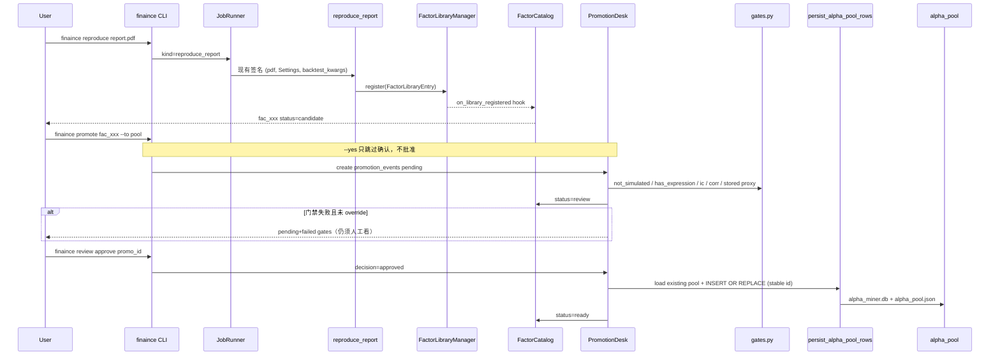

# finaince 全面改进方案：从双引擎遥控器到一站式量化研究平台

| 字段 | 值 |
|------|-----|
| 文档标题 | FinAlpha（包名 `finaince`）全面改进方案 |
| 作者 | TBD |
| 日期 | 2026-08-13 |
| 状态 | Accepted |
| 受众 | 会读 `finaince` / `aiminer` / `reproagent` 源码的资深工程师 |
| 工作区 | `/home/wh/Documents` |

---

> 勘误（2026-08）：本文为历史设计文档。§7 的 `review list|approve|reject <id>` 子命令语法与通用 `POST /api/v1/jobs` 端点从未实现；实际接口以 docs/handbook.md 为准（review 用 `--approve/--reject/--override` 选项；job 提交走 `/api/v1/reproduce` 与 `/api/v1/loop`）。门禁与 CLI 的最新清单见 handbook §5/§6。

## Overview

`finaince`（`/home/wh/Documents/finaince`，2026-08-13 新建）目前是一层 **薄门面**：Typer CLI + Claude Agent SDK in-process MCP，通过 `sys.path` hack（`finaince._paths.ensure_import_paths`）把兄弟目录 `aiminer/src` 与 `reproagent/src` 塞进解释器。它不拥有因子对象、不拥有库、不拥有求值、不拥有任务、不拥有配置。默认 `finaince discover` 走写死演示（`if demo or True`），真正的挖掘只在显式 `--swarm` 时才转发到 `aiminer.manager.main`。

本方案把 `finaince` 做成 **平台壳（platform shell）**，而不是第三套引擎：

- 两边的定义性流水线保持原位：aiminer 的 Manager-SubAgent swarm + `PortfolioManager.evaluate_and_combine` IC/相关性淘汰；reproagent 的 ingest → parse → reproduce → deviation → reflection → library。
- 在 `finaince` 内新增 **统一因子记录、统一目录库、统一求值契约、统一任务表、统一配置、统一工作台壳**。
- 通过适配器把复现结果晋升进发现池、把挖掘 alpha 晋升进复现库，结束「两条流水线不能互喂」。
- 可增量落地：每个 PR 独立可 merge；不重写 LangGraph / 不把研报流水线改成「只有 Claude SDK」。

---

## Background & Motivation

### 当前三棵树（已对照源码）

```text
/home/wh/Documents/
├── finaince/          # 3.12 薄门面，0.1.0，无 aiminer/reproagent 依赖声明
├── aiminer/           # 3.10 conda 多 Agent 因子挖掘；FastAPI + React + TUI
├── reproagent/        # 3.12 研报复现；stdlib HTTP 工作台 + Textual TUI + FastMCP
└── rustminer/         # aiminer 的 Rust 并行实现，共享 alpha_pool SQLite schema
```

#### 1. finaince — 遥控器，不是平台

| 模块 | 实际行为 |
|------|----------|
| `src/finaince/cli.py` | `discover` / `reproduce` / `validate` / `library` / `sdk-info` / `sdk-query` |
| `src/finaince/discovery.py` | `score_factor` → `aiminer.core.strategy.selection_score`；`cull_factor_pool` → `aiminer.manager.cull_alpha_pool`；`run_swarm` → `aiminer.manager.main` |
| `src/finaince/reproduction.py` | `reproduce_report` → `reproagent.pipeline.reproduce_report`；`validate_expression` → `reproagent.reproducer.polars_engine.validate_expression`；`search_library` 自己扫 `FactorLibraryManager.list()` |
| `src/finaince/sdk_ext.py` | `@tool` + `create_sdk_mcp_server`；`build_claude_agent_options`；PreToolUse 拒绝 `Bash` / 空 `pdf_path` |
| `src/finaince/_paths.py` | 不是 pip 依赖，是路径注入 |
| `pyproject.toml` | `requires-python >= 3.12`；依赖只有 claude-agent-sdk、typer、pandas、numpy、loguru、pydantic；**未声明** aiminer / reproagent |

默认 discover 的信任伤害是实锤：

```133:134:finaince/src/finaince/cli.py
    if demo or True:
        # Default discover path is the hermetic score + cull demo so the
```

`tests/test_cli.py::test_discover_dry_path_scores_and_culls` 还把「无参数 `discover` 返回演示 JSON」当成正确行为锁死。

#### 2. aiminer — 发现引擎

- 两条挖掘入口：`aiminer.main:main`（LangGraph `app_workflow.graph.build_workflow` 单假设迭代）与 `aiminer.manager:main`（`PortfolioManager` 多角色 ProcessPool swarm）。finaince 只接了后者。
- 因子形态是 **无类型 dict**：`hypothesis` + Qlib 风格 `code` + `perf_metric` / `selection_score` + `returns` + `role` + `market_profile`。入池后被赋 `id = f"alpha_{uuid.uuid4().hex[:8]}"`。
- 淘汰：`PortfolioManager.evaluate_and_combine`（`manager.py:639`）——`IC_CULL_THRESHOLD = 0.005`、负 IC 翻转（`_orient_negative_ic_factor`）、同 `market_profile` 收益序列相关 > 0.7 淘汰、`_is_simulated_factor` 拒绝模拟指标。`cull_alpha_pool`（`manager.py:1532`）是 `PortfolioManager.__new__` 后直接调该方法，专供 3.12 环境在缺 LangGraph/qlib 时仍能 import 淘汰逻辑。
- 评分：`aiminer.core.strategy.selection_score` —— `0.35*ann + 0.35*sharpe + 0.15*IC - 0.08*|dd| - 0.04*turnover - 0.03*cost_drag`，walk-forward ≥ 2 窗时把一半 Sharpe 权重挪到 OOS。
- 求值：`aiminer.core.evaluator_factory.build_evaluator` 按 `data_backend` 构造 `RiceQuantEval` / `AlphaEval`（qlib）/ `LocalDataEval`。Polars 路径在 `core/alphaeval/polars_engine.py`，依赖 `polars_plugins` 的 Rust 编译器 + Python fallback；接受 `$close` Qlib 语法。
- 存储：`results/alpha_miner.db` 表 `alpha_pool` / `portfolio_pool` / `strategy_backtests` / `agent_checkpoints`；镜像 `results/alpha_pool.json`。**与 rustminer `src/persistence.rs` 共享 schema**。
- 知识：Chroma RAG（`data/chroma_db`）+ `data/wiki_vault`（约 1.7 万篇 md）。
- UI：FastAPI `aiminer.api`（`/api/swarm/*`、`/api/results`、`/api/wiki/*`、`/api/backtest/*`、`/api/strategy/*`、`/ws`）+ React `frontend/src/pages/{SwarmRuns,AlphaPool,ManualBacktest,StrategyBacktest,Wiki,Admin}Page.tsx` + Textual TUI。
- 运行时：`environment.yml` 钉死 `python=3.10`；`pyproject.toml` `requires-python >= 3.10`；重依赖 langgraph、qlib（git）、rqdatac、cvxpy、chromadb。
- LLM 密钥：`PROVIDER_API_KEY_ENV` 多 provider 别名（`LLM_KEY` / `ClaudeCode_KEY` / `GLM_KEY` / `OpenAI_KEY` / …），`detect_llm_provider()` 扫描环境。

#### 3. reproagent — 复现引擎

- 主路径：`reproagent.pipeline.reproduce_report(pdf_path, settings, backtest_kwargs=None) -> dict | None`：upload → validate → parse（`ReportParser`）→ 逐因子 `FactorReproducer.reproduce` → `DeviationAnalyzer` → `ReflectionLoopController` → `FactorLibraryManager.register`。另有 `reproduce_text` 跳过 PDF。
- 领域对象：`FactorDefinition`（`models/factor_def.py`：`id/spec_id/name/name_cn/style/formula/input_fields/universe/rebalance_frequency/...`）与 `FactorLibraryEntry`（强制 `report_id` + `config_id` + `backtest_result_id` + `deviation_passed` + `dedup_hash`）。
- 库：`FactorLibraryManager.register` — `compute_dedup_hash(formula + sorted(input_fields))` → 分类 → SQLite `factor_library` → `INDEX.md` / `wiki/factors/*.md`。
- 求值：`reproagent.reproducer.polars_engine.validate_expression` + `PolarsEngine.compute`；算子是 PascalCase 函数（`Rank/Ref/Delta/Corr/...`），字段白名单含裸名与 `$field`。另有 `rqalpha` extra。
- 存储：`Settings.data_dir` 默认 `~/.reproagent`；`reproagent.db` 四张表：`reports` / `factor_library` / `reflection_states` / `manual_review_queue`。`AppPaths` 只管 cache/reports/factors/wiki/logs，**没有** `memory_dir`。
- UI：`reproagent serve` 自研 `WebApp.handle`（`/api/health|/summary|/library|/review|/reproduce|/jobs`，端口默认 8765）；Textual TUI；CLI 还含 `ingest/text/review/benchmark/mcp`。
- MCP：`reproagent.mcp_server.build_mcp_server` FastMCP 8 工具（`validate_expression/list_operators/run_backtest/score_factor/diagnose_factor/run_anti_overfitting/list_universes/search_factor_library`）。其 `score_factor` 是 **0–100 + A/B/C/D 等级**，与 aiminer `selection_score` **不是同一函数**。
- 研究记忆是半成品：`models/memory.py` + `memory/store.py` + `memory/rma.py` + `memory/writer.py` + `docs/design/research-memory.md`（文档声称 Phase 0–4 已完成）都在，但：
  - `Repository` **没有** `save_knowledge_atom` / `save_archetype` / `save_feedback` / `get_archetype` / `query_feedback` / `list_knowledge_atoms`
  - `tables.py` **没有** `report_knowledge` / `archetypes` / `feedback_memory`
  - `AppPaths` **没有** `memory_dir`
  - `enqueue_review(self, report_id, reason)` **不接受** `payload`
  - `tests/unit/test_memory_store.py` 与 `test_rma_and_pipeline_memory.py` 因此失败（至少 8 个用例）

### 已核实的平台缺口

| 缺口 | 代码证据 |
|------|----------|
| 两条流水线不能互喂 | 复现入库只走 `FactorLibraryManager.register`；挖掘入库只走 `alpha_pool` INSERT。finaince 无 promote / import |
| 两套因子对象 | aiminer dict vs `FactorDefinition`/`FactorLibraryEntry` |
| 两套库 | `results/alpha_miner.db::alpha_pool` vs `~/.reproagent/reproagent.db::factor_library` |
| 两套 wiki | `aiminer/data/wiki_vault` + Chroma vs `~/.reproagent/wiki` |
| 两套表达式方言 | Qlib `$close/Ref($close,20)` + Rust compile vs PascalCase `Rank(Delta(close,1))` + AST 白名单 |
| 两套求值引擎 | `aiminer.core.alphaeval.*` vs `reproagent.reproducer.polars_engine` / `rqalpha_engine` |
| 两套数据布局 | aiminer `data/` + `AIMINER_LOCAL_DATA_PATH` vs reproagent `Settings.local_data_path` / `tests/fixtures/test_data` |
| 两套 Web/TUI/API | FastAPI:8000 + React vs stdlib HTTP:8765；finaince 只有 CLI |
| 两套 MCP | FastMCP `reproagent` vs Claude SDK in-process `finaince` |
| 安装不可交付 | path hack、双 Python（3.10 vs 3.12）、双 Settings、双 data dir、双 LLM 密钥模型 |
| 无统一任务 / 审计 / 平台基准 | aiminer 有 swarm run 清单；reproagent 有 `WebApp.jobs` dict 与 `benchmark` CLI；二者不相通 |
| 默认 discover 是演示 | `if demo or True` + 测试把它锁成默认 |
| 品牌名 | 包名/CLI 仍是 `finaince`；展示名定为 **FinAlpha**（K17） |

### 痛点（量化）

- 研究员复现出 `status=passed` 的因子后，无法把它丢进 `evaluate_and_combine` 做相关淘汰或当 swarm 种子。
- 挖掘出的 `alpha_*` 无法进入 `FactorLibraryManager`：`FactorLibraryEntry` 强制 `report_id` FK 到 `reports`。
- 同一条 `Rank(Delta(close,1))` 在两边的 IC/Sharpe 不可比：数据窗、股票池、成本模型、引擎实现都不同。
- 新同事要跑通「一站式」需同时装 conda 3.10 aiminer 与 uv 3.12 reproagent，再靠 `_paths.py` 把两边 `src` 拼起来。

---

## Goals & Non-Goals

### Goals

1. **统一因子对象 + 统一目录库**，来源标记 `discovery | reproduction | manual`，两边流水线可互喂。
2. **统一求值契约**（请求/响应/指标字典），不合并两套引擎实现。
3. **一个工作台壳**：任务、目录库、复核、晋升、日志；底层仍调用原 API。
4. **可安装的平台 + 复现路径**：Python 3.12 干净 venv 能装 `finaince[reproduction]`（含 cull/score 瘦模块）；完整 swarm 仍以 3.10 conda 为受支持拓扑。一份配置、一份 home 目录。
5. **一条主用户路径**：默认 `finaince discover` 不再吐演示数据。
6. **研究记忆补完**：让已写的 `MemoryStore` / `MemoryWriter` / RMA 真正落库，并接到目录库。
7. **SDK/MCP 收敛**：工具体共享同一 handler；不维持两套语义。
8. **可增量落地**，且不破坏 rustminer 共享的 `alpha_pool` schema。

### Non-Goals

- 不把 aiminer LangGraph swarm 或 `PortfolioManager` 重写成 Claude Agent SDK 工作流。
- 不把 reproagent 解析 / 偏差自愈 / 反思循环改成「只有 SDK tool call」。
- 本期不合并两套 Polars 算子实现为单一二进制（只做契约 + 方言翻译 + 对拍）。
- 本期不把 `wiki_vault`（1.7 万篇）与 `~/.reproagent/wiki` 物理合并。
- 本期不把 rustminer 纳入运行时依赖、不启动其进程；只读其 `alpha_pool`（K19），且 **不破坏** 共享列集。
- 不在本期做多租户 SaaS、云调度、实时交易执行。
- 不改 Python 包名 / CLI 入口 `finaince`（展示名已定为 FinAlpha）。

---

## Key Decisions

| # | 决策 | 理由 |
|---|------|------|
| K1 | **平台壳 + 适配器，不是单体重写**。`finaince` 拥有目录库 / 任务 / 配置 / 工作台壳；`aiminer` 与 `reproagent` 仍是可独立运行的引擎包。 | 约束要求保留两边定义性机制；重写风险高、无法增量 merge。 |
| K2 | **规范模型放在 `finaince.domain`，两边保留原类型**。新增 `FactorRecord`；`from_aiminer_dict` / `from_library_entry` / `to_*` 适配。 | 不改 `FactorDefinition` 签名就能开工；aiminer swarm 继续产出 dict。 |
| K3 | **目录库是索引 + 晋升面，不是替换引擎库**。引擎库仍是 SoR。原生 CLI/API **在已安装 finaince 且 `FINAINCE_CATALOG != "0"` 时** 经引擎内 **懒加载** 双写；未装 finaince 的裸引擎不双写。hook 载荷必须带 metrics/returns/flags，不能只传 `FactorLibraryEntry`。 | 默认 `None` 回调等于没双写。`FactorLibraryEntry` 没有 IC/收益；pipeline 的 observability 在 `register` 之后才快照。 |
| K4 | **求值按 `(dialect, data_backend)` 路由，不按 dialect 单独猜引擎类**。`interfaces.BacktestBackend` 只覆盖 `RiceQuantEval`/`LocalDataEval`；`AlphaEval`（qlib）是另一套形状，禁止当 Protocol 用。 | `EvalRequest.dialect="qlib"` 配 `data_backend="local"` 是常态（Qlib 句法跑本地 parquet）。只看 dialect 会调错类。 |
| K5 | **两套评分并存，注册表命名；MCP 工具按旧签名分发，禁止静默换语义**。`scorer.selection_score` = 纯函数 `aiminer.core.strategy.selection_score`；`scorer.library_grade` = FastMCP 现有「跑回测再 0–100」。此决策在 PR-5 落地，不是可选 PR。 | 两边公式已在生产路径使用；FastMCP `score_factor(expression, backtest_id)` 有副作用，SDK `score_factor(metrics, factor_ic)` 没有。 |
| K6 | **平台 + 复现跑 3.12；完整 swarm 仍以 3.10 conda 为受支持拓扑**。`cull_alpha_pool` / `selection_score` / 新建 persist helper 抽到不 import `SummaryAgent` 的模块。aiminer 重依赖从 `dependencies` **挪到** extras，不是再叠一层 extra。 | qlib / `polars_plugins` cp310 wheel 在 3.12 不可靠（R1）。`aiminer==0.1.0` 无 index 不可装。 |
| K7 | **`FINAINCE_HOME`（默认 `~/.finaince`）为唯一平台 home**。引擎 data dir 成为其下的链接或子目录；Settings 做 façade。 | 结束双 data dir / 双密钥扫描。 |
| K8 | **默认 discover 必须是真路径**。无 `--demo` 且无 `--cull-json` 且无 `--swarm` 时退出码 2 并提示。`--demo` 仅测试/教学。 | 当前 `if demo or True` 直接伤害信任。 |
| K9 | **Claude SDK in-process MCP 是 Agent 主表面**；`reproagent mcp` FastMCP 改为调用同一 `finaince.tools` handlers。 | 避免第三套语义；Desktop 用户仍可 `reproagent mcp`。 |
| K10 | **工作台壳基于 aiminer React + FastAPI，同源托管**。aiminer 路由保持 `/api/*` 与 `/ws`；平台路由只加 `/api/v1/*`。**不**把 `aiminer.api.app` mount 到 `/legacy/aiminer`（可做可选 alias，不是默认）。`finaince serve` 在 prod 提供 `frontend/dist`；dev 继续 Vite `0.0.0.0:5173` 代理 `/api`、`/ws`，并加 `/api/v1`。 | Vite/nginx/`api.ts` 写死 `/api/swarm/*` 与 `/ws`。改前缀会让现有 Swarm/Pool/Wiki/Ops 页 404。 |
| K11 | **任务表是平台级，不替换 swarm 内部 ProcessPool**。`jobs` 表记录 kind/status/`engine_run_id`/pid；swarm 仍由 `PortfolioManager` 调度。取消不依赖 HTTP：杀跟踪到的进程组。 | 统一可观察性，不重写并行模型。`POST /api/swarm/runs/{run_id}/stop` 只在 serve 已起来时可用。 |
| K12 | **晋升默认是「提交复核」，不是「立刻写对侧 SoR」**。`finaince promote` 写 `promotion_events.decision=pending`、catalog `status=review`；`--yes` 只跳过交互确认。`finaince review approve` 才跑 persist helper / `FactorLibraryManager.register` 并把 status 置 `ready`。`FINAINCE_AUTO_PROMOTE=1` 在门禁全过后等价于自动 approve（仍写 audit）。 | 防止模拟因子 / proxy 公式污染对侧库。序列图、CLI、状态机必须同一语义。 |
| K13 | **研究记忆先补完 reproagent 已写的 API，再被平台索引**。不在 finaince 另起一套记忆 schema。`MemoryStore` 公开名（`save_knowledge` / `list_knowledge` / …）保持不动。 | 文档与测试已经规定了 `MemoryStore` 方法名；欠的是 Repository / tables / AppPaths。 |
| K14 | **表达式翻译是 best-effort**。第一期只实现一份 15–20 行算子 YAML；未列出的一律 `translatable=false`。 | 算子别名与 `$field` 可覆盖常见量价因子；基本面/自定义 op 不能假装可译。 |
| K15 | **同源 URL**：平台与 aiminer 同 origin、同端口。SPA 由 `finaince serve`（prod）或现有 Vite/nginx（dev）提供；nginx 继续把 `/api/` 与 `/ws` 指到该进程。 | 见 Issue：`/legacy/aiminer` 会拆掉现有工作台。 |
| K16 | **晋升写 pool 走抽出的公共 persist/load helper，禁止 `PortfolioManager.__init__`**。新函数 `aiminer.manager.load_alpha_pool_rows` / `persist_alpha_pool_rows`（从 `_persist_alpha_factors` / `_write_alpha_pool_json_backup` / `_series_correlation` 抽出）。不调用 `cull_alpha_pool`、不构造 `SummaryAgent`。`report_path` 可空或指向合成 md。接受的 id 用 catalog `source_ref`（已是 `alpha_*`）或新记的 `alpha_*`，**禁止**每次晋升 `uuid4` 换 id。 | `cull_alpha_pool` 不写库、不读现 pool、每次重赋 id。`__init__` 在 3.12 上 `SummaryAgent is None` 会 TypeError。 |
| K17 | **展示名 FinAlpha；包名与 CLI 入口仍是 `finaince`**。`FinainceSettings.product_name` 默认 `"FinAlpha"`。banner、工作台 `<title>` / Layout 标题、README 标题用 FinAlpha；`pyproject.toml` `name`、`finaince = "finaince.cli:main"`、import 路径不变。 | 用户拍板。改包名会拆坏已有 entry / 测试 / path hack，不值得。 |
| K18 | **工作台登录后默认路由是 Catalog**（`/` → `CatalogPage`）。Swarm Runs 挪到 `/runs`（现有 `SwarmRunDetailPage` 的 `/runs/:runId` 保持）。不影响 `/api/*`。 | 用户拍板。平台叙事以统一目录为首页；swarm 仍是一等页面。 |
| K19 | **rustminer 是支持的第三引擎，只读**。`catalog rebuild --source rustminer` 用 `load_alpha_pool_rows` 读其 `alpha_miner.db`（路径 `FINAINCE_RUSTMINER_DB` 或 `$FINAINCE_HOME/rustminer/results/alpha_miner.db`），`source="discovery"`、`lineage.engine_db="rustminer"`、`tags` 含 `engine:rustminer`。不启动 rustminer 进程，不写其库，不加列。 | 用户拍板。与 aiminer 共享 schema，只读即可进目录；写回仍只走 aiminer persist helper。 |

---

## Proposed Design

### 1. 目标架构

```mermaid
flowchart TB
    subgraph Surface["平台表面（finaince）"]
        CLI["Typer CLI"]
        API["FastAPI 工作台壳"]
        WEB["React 工作台"]
        SDK["Claude Agent SDK MCP"]
        FMCP["FastMCP 兼容入口"]
    end

    subgraph Platform["finaince 平台核"]
        Domain["domain.FactorRecord"]
        Catalog["catalog.FactorCatalog"]
        Eval["eval.FactorEvaluator"]
        Jobs["jobs.JobRunner"]
        Review["review.PromotionDesk"]
        Settings["settings.FinainceSettings"]
        Tools["tools handlers"]
    end

    subgraph Engines["保持原位的引擎"]
        Swarm["aiminer.manager.PortfolioManager"]
        Graph["aiminer.app_workflow.graph"]
        Cull["aiminer.manager.cull_alpha_pool"]
        Sel["aiminer.core.strategy.selection_score"]
        AEval["aiminer.core.evaluator_factory"]
        Pipe["reproagent.pipeline.reproduce_report"]
        Lib["reproagent.library.FactorLibraryManager"]
        REval["reproagent.reproducer.PolarsEngine"]
        Mem["reproagent.memory.MemoryStore"]
    end

    subgraph Stores["存储"]
        PDB["$FINAINCE_HOME/platform.db"]
        ADB["$FINAINCE_HOME/aiminer/results/alpha_miner.db"]
        RDB["$FINAINCE_HOME/reproagent/reproagent.db"]
        RMDB["rustminer alpha_miner.db (read-only)"]
    end

    CLI --> Domain
    API --> Domain
    SDK --> Tools
    FMCP --> Tools
    Tools --> Domain
    Domain --> Catalog
    Domain --> Eval
    Domain --> Jobs
    Domain --> Review
    Settings --> Domain

    Jobs -->|kind=discover_swarm| Swarm
    Jobs -->|kind=reproduce_report| Pipe
    Jobs -->|kind=cull offline| Cull
    Review -->|approve to_library| Lib
    Review -->|approve to_pool| Persist["persist_alpha_pool_rows"]
    Persist --> ADB
    Catalog --> PDB
    Catalog -.->|rebuild --source rustminer| RMDB
    Swarm --> ADB
    Pipe --> RDB
    Mem --> RDB
    Eval -->|"local/ricequant + qlib syntax"| AEval
    Eval -->|repro_polars + local/rq| REval
    Cull --> Sel
```



### 2. 目标模块布局（finaince 新增，不拆散引擎）

```text
finaince/src/finaince/
  domain/
    factor.py          # FactorRecord / FactorExpression / FactorMetrics / FactorLineage
    adapters.py        # from_aiminer_dict / from_library_entry / to_*
    scoring.py         # ScorerRegistry: selection_score + library_grade
  catalog/
    models.py
    store.py           # FactorCatalog（platform.db）
    migrate.py
  eval/
    contract.py        # EvalRequest / EvalResult / FactorEvaluator Protocol
    router.py          # 按 (dialect, data_backend) 路由
    dialects.py        # YAML 驱动的 15–20 算子翻译
    operators.yaml     # 第一期可译算子表
    parity.py          # 对拍 runner（warning-only）
    remap.py           # instrument/datetime ↔ asset/date
  jobs/
    models.py
    runner.py
    kinds.py           # discover_swarm / reproduce_report / evaluate / cull / promote
  review/
    desk.py            # 复核 + 晋升门禁
    gates.py           # simulated / proxy / IC / corr / deviation
  settings.py          # FinainceSettings façade
  paths.py             # FINAINCE_HOME 布局（取代仅 sys.path 的 _paths.py）
  serve.py             # FastAPI 壳
  tools.py             # 共享 MCP/SDK handler（sdk_ext 与 FastMCP 共用）
  cli.py               # 扩展后的统一入口
  discovery.py         # 保留，内部改走 jobs + catalog
  reproduction.py      # 保留，内部改走 jobs + catalog
  sdk_ext.py           # 改为 import tools
```

引擎侧只做 **加法**（PR-4 必须落地 hook **与注册**，否则原生 CLI/API 不双写）：

- `aiminer`：
  - 抽出 `aiminer.pool_io`：`load_alpha_pool_rows(db_path) -> list[dict]`、`persist_alpha_pool_rows(db_path, results_path, factors, *, run_id=None) -> list[dict]`。从 `_persist_alpha_factors` / `_write_alpha_pool_json_backup` 搬出，**不**读 `self.summary_agent`；缺 `report_path` 时写 `$FINAINCE_HOME/aiminer/results/reports/synthetic_{id}.md` 或空字符串。
  - `cull_alpha_pool` / `selection_score` / `build_evaluator` 签名不变。
  - `pool_io` / `cull_alpha_pool` / `selection_score` **不得**顶层 import `SummaryAgent` / `AlphaResearcher` / langgraph。
- `reproagent`：
  - 补完记忆持久化（PR-2）。
  - `enqueue_review(self, report_id, reason, payload=None)` 向后兼容；同键 pending 返回同一 `entry_id`。`dequeue_review` **保持 3 元组**。

#### Hook 注册与载荷（K3 可执行定义）

裸引擎（未 pip/editable 安装 `finaince`）**不双写**，这是支持的拓扑，不是 bug。

已安装 finaince 且 `os.environ.get("FINAINCE_CATALOG", "1") != "0"` 时，引擎在 **调用点懒加载**，禁止依赖 sitecustomize / 用户手写赋值：

```python
# aiminer.pool_io 与 reproagent.library.manager / pipeline 共用此模式
def _notify_catalog(kind: str, payload: dict) -> None:
    if os.environ.get("FINAINCE_CATALOG", "1") == "0":
        return
    try:
        from finaince.catalog.hooks import accept_pool_row, accept_library_entry
    except ImportError:
        return  # finaince 未安装
    if kind == "pool":
        accept_pool_row(payload)          # payload = persist 后的 aiminer dict
    else:
        accept_library_entry(**payload)   # 见 extras
```

`persist_alpha_pool_rows` 每条成功 `INSERT OR REPLACE` 后调 `_notify_catalog("pool", factor_dict)`。`_persist_alpha_factors` 改为调同一函数（不再另设可被忘掉的 `on_pool_accepted = None`）。

`on_library_registered` **不能**只吃 `FactorLibraryEntry`（该类型无 IC/收益/flags）。签名：

```python
def accept_library_entry(
    entry: FactorLibraryEntry,
    *,
    extras: dict[str, Any],
) -> None: ...

# extras 必填键（缺键 = hook 打 warning 且 **不** upsert catalog）
#   metrics: {ic_mean, ic_ir, sharpe_ratio, max_drawdown, long_short_annual_return}
#   daily_returns: {iso_date: float}   # serialize_equity_returns(equity_curve_path)
#   factor_values_uri: str | None      # result.factor_values_path
#   observability: dict                # snapshot_run_flags() 在 **register 当时** 的拷贝
```

`serialize_equity_returns(path) -> dict[str, float]` 放在 `reproagent.reproducer.metrics`（与 `metrics.py:108-109` 同一列检查）：

```python
def serialize_equity_returns(path: Path) -> dict[str, float]:
    df = pl.read_parquet(path)
    if "date" not in df.columns or "ls_return" not in df.columns:
        return {}  # 缺列 = 无 extras.daily_returns，hook 不 upsert
    # 用日收益 ls_return，禁止 (1+ls_return).cum_prod()——那是净值，不是 daily_returns
    out: dict[str, float] = {}
    for d, r in zip(df["date"].to_list(), df["ls_return"].to_list()):
        if r is None:
            continue
        key = d.isoformat() if hasattr(d, "isoformat") else str(d)
        out[key] = float(r)
    return out
```

`StrategyBacktester` 写出的 parquet 列是 `date` + `ls_return` / `ls_return_raw` / `turnover`（`backtester.py:212-234`）。`BacktestResult.equity_curve_path` 注释里的 `long_short` 是过期文档，**不要**按它实现。

调用点：`_process_one_factor` 里 **三处** `library_manager.register(entry)` 成功之后各调一次 helper + hook（漏一处就会出现无收益的 catalog 行）：

| 分支 | 约行 | 回测对象 |
|------|------|----------|
| `deviation.passed` 直接入库 | `pipeline.py:178` | `result` |
| 反思 `converged` | `pipeline.py:236` | 该步的 backtest（`best_step` / `cand`） |
| soft-pass 入库 | `pipeline.py:370` | `cand` |

每处 extras：`metrics` 从该次回测对象取 `ic_mean/ic_ir/sharpe_ratio/max_drawdown/long_short_annual_return`；`daily_returns = serialize_equity_returns(obj.equity_curve_path)`；`factor_values_uri = str(obj.factor_values_path)`；`observability = snapshot_run_flags()`。`FactorLibraryManager.register` 本身 **不**调 catalog。`reproduce_text` 若走同一 `_process_one_factor` 则自动覆盖；若另有 register 点同样包一层。

`finaince.catalog.hooks.accept_*` 内部用 `from_aiminer_dict` / `from_library_entry(..., extras=)` upsert。测试：不装 finaince 时 persist/register 零异常；装了且 `FINAINCE_CATALOG=0` 不写库；装了默认写库且 extras 缺 `daily_returns` 则不写。

### 3. 领域模型

`finaince.domain.factor` 是平台唯一对外因子类型。两边原类型不删除。

```python
# finaince/domain/factor.py
from datetime import datetime
from typing import Any, Literal
from pydantic import BaseModel, Field

Dialect = Literal["qlib", "repro_polars"]
Source = Literal["discovery", "reproduction", "manual"]
Status = Literal["candidate", "review", "ready", "deprecated", "culled"]

class FactorExpression(BaseModel):
    dialect: Dialect
    text: str
    input_fields: list[str] = Field(default_factory=list)
    validated: bool = False
    translatable: bool = False
    alt_text: str | None = None          # 翻译后的另一方言，失败则为 None

class FactorMetrics(BaseModel):
    ic: float | None = None
    rank_ic: float | None = None
    sharpe: float | None = None
    annualized_return: float | None = None
    max_drawdown: float | None = None
    turnover: float | None = None
    cost_drag: float | None = None
    selection_score: float | None = None  # aiminer.core.strategy.selection_score
    library_grade: str | None = None      # A/B/C/D
    library_score: float | None = None    # 0–100
    extra: dict[str, Any] = Field(default_factory=dict)

class FactorLineage(BaseModel):
    source: Source
    source_ref: str                       # alpha_xxxxxxxx 或 FactorLibraryEntry.id
    run_id: str | None = None
    report_id: str | None = None
    spec_id: str | None = None
    parent_id: str | None = None          # 晋升/版本父节点
    engine_db: str | None = None
    formula_proxy: bool = False           # 从 reproduce 结果 observability 固化，禁止读 ContextVar
    formula_fallback: bool = False
    universe_fallback: bool = False
    recovery_used: bool = False

class FactorRecord(BaseModel):
    id: str                               # fac_<ulid>
    name: str
    name_cn: str | None = None
    hypothesis: str | None = None
    role: str | None = None
    style: str | None = None
    expression: FactorExpression
    universe: str = "csi300"
    market_profile: str = "cn_stock"
    rebalance_frequency: str | None = None
    metrics: FactorMetrics = Field(default_factory=FactorMetrics)
    daily_returns: dict[str, float] = Field(default_factory=dict)
    status: Status = "candidate"
    lineage: FactorLineage
    tags: list[str] = Field(default_factory=list)
    is_simulated: bool = False
    created_at: datetime
    updated_at: datetime
```

适配器规则（必须可逆到「引擎能再吃进去」的程度）。**日收益字段统一**：`FactorRecord.daily_returns` 是平台名；读 aiminer dict 的 `returns`（或已规范化的 `_normalized_return_series`）；读 `BacktestBackend.daily_returns`；写回 aiminer 时键名仍是 `returns`。三者都是 `{iso_date: float}`。

| 方向 | 字段级映射 |
|------|------------|
| aiminer dict → Record | `id` 新建 `fac_<ulid>`（catalog 主键）；`lineage.source_ref = dict["id"]`（`alpha_*`，缺则 persist 时再发）；`name = hypothesis or role or source_ref`；`name_cn = name`；`hypothesis = hypothesis`；`role = role`；`expression.dialect="qlib"`；`expression.text = code or ""`；`expression.input_fields` 从 text 抽裸字段；`metrics.ic = ic or metrics.information_coefficient or perf_metric`；`metrics.rank_ic = rank_ic or metrics.rank_ic`；`metrics.selection_score = selection_score`；`daily_returns = _serialize_returns(returns)`；`market_profile = market_profile or "cn_stock"`；`universe = "csi300"`（aiminer 无此字段时的默认）；`style = "other"`；`rebalance_frequency = "daily"`；`is_simulated = _is_simulated_factor(dict)`；`lineage.source="discovery"`；`lineage.run_id = run_id` |
| Record → aiminer dict | `id = lineage.source_ref if startswith("alpha_") else f"alpha_{source_ref[-8:]}"`（晋升时若 pool 尚无此 id，用新 `alpha_` + catalog id 后 8 位，并回写 `source_ref`）；`role = role or "reproagent"`；`hypothesis = hypothesis or name`；`code = expression.text if dialect=="qlib" else expression.alt_text`（`code` 空则 **拒绝** to_pool）；`perf_metric = metrics.ic or 0.0`；`selection_score = metrics.selection_score`；`returns = daily_returns`；`market_profile` 原样；`is_simulated` 原样 |
| `FactorLibraryEntry` + `extras` → Record | `lineage.source="reproduction"`；`lineage.source_ref = entry.id`；`lineage.report_id = report_id`；`name = factor.name`；`name_cn = factor.name_cn`；`style = factor.style`；`expression.dialect="repro_polars"`；`expression.text = factor.formula`；`expression.input_fields = factor.input_fields`；`universe = factor.universe`；`rebalance_frequency = factor.rebalance_frequency`；**`metrics.ic = extras["metrics"]["ic_mean"]`**（缺 extras 则 `ic=None`，不得填 0）；`metrics.sharpe = extras["metrics"].get("sharpe_ratio")`；`metrics.max_drawdown = extras["metrics"].get("max_drawdown")`；`daily_returns = extras["daily_returns"]`（缺则 `{}`）；`lineage.formula_proxy = extras["observability"].get("formula_proxy", False)`（及 fallback / universe_fallback / recovery_used）。**禁止**只拿 `FactorLibraryEntry` 适配后假装有收益。rebuild 无 extras 时：若 `backtest/<id>/factor_values.parquet` 或 equity parquet 存在则现读；否则留下 `ic=None`、`daily_returns={}`，该行 **不能** 过 to_pool 门禁 |
| Record → `FactorLibraryEntry` + 合成 `ResearchReport` | 见下表。选方案 **(a)**：扩展 `validation_status`，写真实 md 文件，凑齐所有必填字段。不把 `report_id` 改成可选。 |

`ResearchReport.validation_status` 版本化：`Literal["pending", "valid", "invalid", "synthetic"]`。合成报告 **必须** 是真实路径，禁止 `synthetic://`：

```text
$FINAINCE_HOME/reproagent/reports/synthetic/<source_ref>.md
```

内容为因子名、表达式、来源 `discovery`、`source_ref`。`file_path=Path(该文件)`；`file_hash=sha256(file bytes)`；`page_count=1`；`title=name`；`broker="finaince-discovery"`；`validation_status="synthetic"`。

`Record → FactorLibraryEntry` 必填默认（缺一则适配器失败，不调用 `register`）：

| `FactorLibraryEntry` / `FactorDefinition` 字段 | 默认 |
|------|------|
| `id` | 新 `uuid4().hex`（库主键）；catalog 用自己的 `fac_*` |
| `report_id` | 合成报告 id = `disc_` + `source_ref`（去冒号） |
| `config_id` | `"discovery"` |
| `backtest_result_id` | `lineage.run_id` 或 `"discovery-unbacked"` |
| `deviation_passed` | `False`（除非 catalog 已有独立 repro 偏差且通过） |
| `status` | `"review"` |
| `version` | `"0.1.0"` |
| `dedup_hash` | `compute_dedup_hash(factor)` — 必须先构造完整 `FactorDefinition` |
| `created_at` | `datetime.now(UTC)` |
| `factor.id` | 与 entry.id 相同 |
| `factor.spec_id` | `lineage.spec_id or "discovery"` |
| `factor.name` | `name` |
| `factor.name_cn` | `name_cn or name` |
| `factor.style` | 若在 `FactorDefinition.style` Literal 内则用，否则 `"other"` |
| `factor.formula` | `expression.text if dialect=="repro_polars" else alt_text`（空则拒绝 to_library） |
| `factor.input_fields` | `expression.input_fields` |
| `factor.universe` | `universe` |
| `factor.rebalance_frequency` | `rebalance_frequency or "daily"` |
| `tags` | 原 tags + `"source:discovery"` |

去重：

- 复现侧继续 `compute_dedup_hash(factor: FactorDefinition)`（`formula + "|" + "|".join(sorted(input_fields))` 的 sha256）。适配器必须先建 `FactorDefinition`，不能对裸字符串调用。
- catalog `expr_hash`：

```python
def normalize_expr(dialect: str, text: str) -> str:
    s = " ".join((text or "").split())          # 折叠空白
    s = re.sub(r"\$(\w+)", r"\1", s)            # 剥 $field
    s = s.lower()
    # 仅折叠 YAML 里登记的别名：correlation→corr, divide→div, mult/multiply→mul,
    # subtract→sub, negate→neg, power→pow
    return f"{dialect}\n{s}"

expr_hash = sha256(normalize_expr(dialect, text).encode()).hexdigest()
```

- `return_fingerprint` **不进 catalog 表**，直到 PR-5 有稳定 `daily_returns`。跨源相关门禁用内存里对 `returns_json` 做 `_series_correlation`（阈值 0.7），不另存指纹列。
- rebuild 幂等键是 `UNIQUE(source, source_ref)`：`source=discovery` 时 `source_ref` 永远是 `alpha_*`（或 persist 回写后的 id）；`source=reproduction` 时是 `FactorLibraryEntry.id`。catalog 自己的 `id` 永远是 `fac_<ulid>`，rebuild 命中 unique 则 UPDATE 其余列、保留原 `fac_*`。

### 4. 统一求值契约

```python
# finaince/eval/contract.py
from datetime import date
from typing import Literal, Protocol, runtime_checkable

class EvalRequest(BaseModel):
    expression: FactorExpression
    universe: str
    start: date
    end: date
    data_backend: Literal["local", "ricequant", "qlib"] = "local"
    engine: Literal["polars", "pandas", "rqalpha"] = "polars"
    market_profile: str = "cn_stock"
    daily_normalize: bool = True

class EvalResult(BaseModel):
    ok: bool
    metrics: FactorMetrics
    daily_returns: dict[str, float] = Field(default_factory=dict)
    factor_values_uri: str | None = None
    warnings: list[str] = Field(default_factory=list)
    engine_name: str = ""
    elapsed_ms: int = 0
    error: str | None = None

@runtime_checkable
class FactorEvaluator(Protocol):
    name: str
    dialects: tuple[str, ...]
    def validate(self, expression: FactorExpression) -> dict: ...
    def evaluate(self, req: EvalRequest) -> EvalResult: ...
```

路由（`eval/router.py`）按 **`(dialect, data_backend)`**，禁止「dialect=qlib ⇒ 一定是 `BacktestBackend`」：

| dialect | data_backend | 实现类 | 读指标的方式 |
|---------|--------------|--------|--------------|
| `qlib` | `local` | `aiminer.core.alphaeval.local_eval.LocalDataEval`（经 `build_evaluator`） | 当 `BacktestBackend`：`ic/rankic/sharpe/max_dd/daily_returns` |
| `qlib` | `ricequant` | `RiceQuantEval`（经 `build_evaluator`） | 同上 |
| `qlib` | `qlib` | `aiminer.core.alphaeval.modeltester.AlphaEval` | **不是** `BacktestBackend`。适配器读其公开属性（`ic`/`rankic`/`sharpe`/`max_dd`/`daily_returns`，以该类实际字段为准；缺的填 None 并 warning）。`interfaces.py` 已写明 “Qlib is not abstracted by this protocol.” |
| `repro_polars` | `local` / `ricequant` / `qlib` | 新装配 `reproagent.reproducer.backtest_bundle.build_backtest_bundle`（**不要**复用已有 `reproagent.reproducer.evaluator_factory.build_evaluator`，那只返回 `PolarsEngine\|RiceQuantEval` 因子引擎，不含 `DataLoader`+`StrategyBacktester`） | `BacktestResult.ic_mean/ic_ir/sharpe_ratio/max_drawdown` + equity→`daily_returns` |

`prefer="aiminer"|"reproagent"` 可覆盖实现类，但仍必须满足该 backend 在目标包内可用，否则返回 `EvalResult(ok=False)`。

列名重映射（`eval/remap.py`），parity 与跨引擎 eval 都走这里：

| aiminer / qlib 面板 | reproagent 面板 |
|---------------------|-----------------|
| `instrument` | `asset` |
| `datetime` | `date` |
| `$close` / `close` | `close` |
| 宽表因子列 = 表达式原文 | 长表 `factor_value` |

方言翻译（`eval/dialects.py` + `eval/operators.yaml`）第一期 **只** 翻译 YAML 列出的算子。未列出 → `translatable=false`，不写 `alt_text`。禁止对已是 `Div(a,b)` 的树再包一层。检测：`ast.parse` 后若根是 `Call` 且名字在 YAML，当 PascalCase；若含 `BinOp`（`/` `*` `+` `-`）且目标是 `repro_polars`，只改写那些 `BinOp` 节点。

`operators.yaml` 第一期（canonical 名小写；arity 含窗口参数）：

```yaml
# name: 翻译输出用的 PascalCase（repro 侧）
# aliases: 输入里视作同一算子
# arity: 固定参数个数；null = 可变
- {name: Rank, aliases: [rank], arity: 1}
- {name: CSRank, aliases: [csrank], arity: 1}
- {name: CSZScore, aliases: [cszscore], arity: 1}
- {name: Mean, aliases: [mean], arity: 2}
- {name: Std, aliases: [std], arity: 2}
- {name: Median, aliases: [median], arity: 2}
- {name: Sum, aliases: [sum], arity: 2}
- {name: Ref, aliases: [ref], arity: 2}
- {name: Delta, aliases: [delta], arity: 2}
- {name: Abs, aliases: [abs], arity: 1}
- {name: Log, aliases: [log], arity: 1}
- {name: If, aliases: [if], arity: 3}
- {name: Greater, aliases: [greater], arity: 2}
- {name: Corr, aliases: [corr, correlation], arity: 3}      # 输出一律 Corr
- {name: Div, aliases: [div, divide, divi], arity: 2}       # 输出一律 Div
- {name: Mul, aliases: [mul, mult, multiply], arity: 2}
- {name: Sub, aliases: [sub, subtract, minus], arity: 2}
- {name: Neg, aliases: [neg, negate], arity: 1}
- {name: EMA, aliases: [ema], arity: 2}
- {name: Max, aliases: [max], arity: 2}
```

字段：`$close/$open/$high/$low/$volume` ↔ 裸名。`$vwap`：repro 白名单有、aiminer 不一定有 → 译到 qlib 时 `translatable=false` 并 warning，不发明 `vwap` 列。`$ytm` 等转债字段同理。

`validate` **不走 HTTP**：

- `repro_polars`：`reproagent.reproducer.polars_engine.validate_expression`
- `qlib`：对翻译后或原文做括号/AST 检查 + YAML 算子白名单（独立函数 `finaince.eval.dialects.validate_qlib_static`）。真正 `PolarsEngine.evaluate` 需要 DataFrame，留给 `evaluate()`，不放在 `validate()`。

对拍（`eval/parity.py`）：fixture `reproagent/tests/fixtures/test_data/prices.parquet`，日期窗用该文件的 min/max。三条公共表达式（两边 YAML 都能表示）：

1. `Rank(Delta(close, 1))`
2. `Ref(close, 20)`
3. `Mean(close, 5)`

比较 `metrics.ic` 与 `metrics.sharpe`。**第一期不对齐就 warning**，不设 `1e-6` 门禁（列名/分组/成本模型未对齐前这个阈值必炸）。晋升复评必须指定同一 `(engine_name, data_backend)`。

**延迟目标（不在前 6 个 PR）**：YAML 扩到全算子并生成两边 context；aiminer `polars_plugins` 作可选加速器。

### 5. 存储与数据流

#### 5.1 `FINAINCE_HOME` 布局

```text
$FINAINCE_HOME/                    # 默认 ~/.finaince；env FINAINCE_HOME
  config.toml                      # 可选覆盖
  platform.db                      # catalog / jobs / audit / promotions
  logs/
  cache/
  aiminer/                         # 原 AIMINER_DATA_DIR / RESULTS_DIR 的新默认
    data/                          # 可 symlink → 现有 aiminer/data
    results/alpha_miner.db
    results/alpha_pool.json
  reproagent/                      # 原 ~/.reproagent 的新默认
    reproagent.db
    cache/ reports/ factors/ wiki/ memory/ logs/
```

兼容：若检测到旧 `~/.reproagent/reproagent.db` 或 cwd `results/alpha_miner.db`，启动时打印迁移提示；`finaince doctor` 可 `--adopt` 建 symlink，不默认搬迁 1.7 万篇 wiki。

#### 5.2 `platform.db` 表

```sql
CREATE TABLE factor_catalog (
    id            TEXT PRIMARY KEY,          -- fac_<ulid>
    source        TEXT NOT NULL,             -- discovery|reproduction|manual
    source_ref    TEXT NOT NULL,
    name          TEXT NOT NULL,
    name_cn       TEXT,
    hypothesis    TEXT,
    style         TEXT,
    dialect       TEXT NOT NULL,
    expression    TEXT NOT NULL,
    alt_expression TEXT,
    expr_hash     TEXT NOT NULL,
    universe      TEXT,
    market_profile TEXT,
    metrics_json  TEXT NOT NULL DEFAULT '{}',
    returns_json  TEXT NOT NULL DEFAULT '{}',
    status        TEXT NOT NULL,             -- candidate|review|ready|deprecated|culled
    is_simulated  INTEGER NOT NULL DEFAULT 0,
    lineage_json  TEXT NOT NULL,
    tags_json     TEXT NOT NULL DEFAULT '[]',
    created_at    TEXT NOT NULL,
    updated_at    TEXT NOT NULL
);
CREATE UNIQUE INDEX idx_catalog_source_ref ON factor_catalog(source, source_ref);
CREATE INDEX idx_catalog_expr_hash ON factor_catalog(expr_hash);
CREATE INDEX idx_catalog_status ON factor_catalog(status);

CREATE TABLE jobs (
    id            TEXT PRIMARY KEY,          -- job_<ulid>
    kind          TEXT NOT NULL,             -- discover_swarm|reproduce_report|evaluate|cull|promote
    status        TEXT NOT NULL,             -- queued|running|succeeded|failed|cancelled
    payload_json  TEXT NOT NULL,
    result_json   TEXT,
    error         TEXT,
    created_at    TEXT NOT NULL,
    started_at    TEXT,
    finished_at   TEXT,
    parent_job_id TEXT
);

CREATE TABLE promotion_events (
    id            TEXT PRIMARY KEY,
    catalog_id    TEXT NOT NULL,
    direction     TEXT NOT NULL,             -- to_library|to_pool
    gate_json     TEXT NOT NULL,
    reviewer      TEXT,                      -- user / agent / auto
    decision      TEXT NOT NULL,             -- approved|rejected|pending
    created_at    TEXT NOT NULL
);

CREATE TABLE audit_log (
    id            TEXT PRIMARY KEY,
    ts            TEXT NOT NULL,
    actor         TEXT NOT NULL,             -- cli|api|sdk|system
    action        TEXT NOT NULL,             -- promote|cull|review|settings|eval
    target        TEXT,
    detail_json   TEXT NOT NULL,
    prev_hash     TEXT,                      -- 简单哈希链，防静默改写
    hash          TEXT NOT NULL
);
```

`platform.db` 用 **SQLModel 表类**（与 reproagent 一致），`init_platform_db` 调 `SQLModel.metadata.create_all`。上面的 SQL 是规范，不是第二套手写 DDL。finaince 因此依赖 `sqlmodel`。

引擎库 schema **不加破坏列**。reproagent 侧加法：

```sql
-- 列与 reproagent.models.memory 字段 1:1（JSON 列存 list/dict）
CREATE TABLE report_knowledge (
    id TEXT PRIMARY KEY,
    report_id TEXT NOT NULL,
    chunk_text TEXT NOT NULL DEFAULT '',
    source_pages_json TEXT NOT NULL DEFAULT '[]',
    a_decision TEXT NOT NULL,
    a_reason TEXT NOT NULL DEFAULT '',
    mechanism_family TEXT,
    research_path TEXT NOT NULL DEFAULT '',
    archetype_id TEXT,
    factor_spec_id TEXT,
    extra_json TEXT NOT NULL DEFAULT '{}',
    created_at TEXT NOT NULL
);
CREATE TABLE archetypes (
    id TEXT PRIMARY KEY,
    family TEXT NOT NULL,
    role TEXT NOT NULL,
    report_grounded_paths_json TEXT NOT NULL DEFAULT '[]',
    source_report_ids_json TEXT NOT NULL DEFAULT '[]',
    notes TEXT NOT NULL DEFAULT '',
    created_at TEXT NOT NULL,
    updated_at TEXT NOT NULL
);
CREATE TABLE feedback_memory (
    id TEXT PRIMARY KEY,
    kind TEXT NOT NULL,
    report_id TEXT,
    factor_name TEXT,
    factor_id TEXT,
    mechanism_family TEXT,
    archetype_id TEXT,
    failure_type TEXT,
    root_cause TEXT,
    avoid_rule TEXT,
    repair_hint TEXT,
    principle TEXT,
    metrics_summary_json TEXT NOT NULL DEFAULT '{}',
    source_run_id TEXT,
    source TEXT NOT NULL DEFAULT 'real',
    tags_json TEXT NOT NULL DEFAULT '[]',
    created_at TEXT NOT NULL
);
ALTER TABLE manual_review_queue ADD COLUMN payload_json TEXT DEFAULT '{}';
```

合成 provenance：`reports` 复用现有表。`file_path` = `$FINAINCE_HOME/reproagent/reports/synthetic/<source_ref>.md`（真实文件）。`validation_status="synthetic"`（`ResearchReport` Literal 版本化，见 §3）。**禁止** `synthetic://` URI。

aiminer `alpha_pool` **不加列**。平台需要的 `source=reproduction` 信息放在 `factor_catalog.lineage_json`；写入 pool 时用 `persist_alpha_pool_rows`（K16），`role="reproagent"`，`hypothesis=name`，`code=qlib 文本或翻译`，`id` 稳定。

#### 5.3 互喂序列



反向（挖掘 → 库）对称，仍是 **promote → review → approve**：approve 时写合成 `ResearchReport` md + `FactorLibraryManager.register`（`deviation_passed=False` 除非已有 repro 偏差；标签 `source:discovery`）。`FINAINCE_AUTO_PROMOTE=1` 时，门禁全过则 `promote` 内部直接走 approve 分支。

**相关门禁实现（禁止调用 `cull_alpha_pool`；全部 fail-closed）**：

1. `load_alpha_pool_rows(db_path)` 读出现有 pool（路径来自 **当前进程** 的 `AiminerSettings.db_path`，即 `results_path / "alpha_miner.db"`）。
2. 候选转成 aiminer dict（`returns = daily_returns`）。
3. `_is_simulated_factor` 拒绝。
4. `metrics.ic is None` → 门禁失败 `detail="missing_ic"`（**禁止** `ic or 0`）。`abs(ic) <= IC_CULL_THRESHOLD` → 失败 `below_ic_threshold`。
5. `daily_returns` 空，或 `_series_correlation` 返回 `None`（空序列 / 重叠 &lt; 10，见 `manager.py:266-281`）→ 失败 `detail="missing_returns"`。**不是**「None &gt; 0.7 为假所以通过」。`corr > 0.7` → 失败 `correlated`。
6. 通过才 `persist_alpha_pool_rows`；id 稳定。**禁止**把 `returns_json="{}"` 的行写入 `alpha_pool`（与 `evaluate_and_combine` 拒绝 empty_returns 一致）。

catalog 行缺少 IC 或收益时，`review approve --to pool` 必须先有一次同 `(engine_name, data_backend)` 的 `evaluate` 把结果写回 catalog；否则停在 `review`，提示 `finaince eval <id>`。`gate_json.override.missing_ic` / `override.missing_returns` 才允许人工放行（audit 记 override）。

`cull_alpha_pool` 只留给「一组尚未入库的候选做离线淘汰」（`--cull-json` / demo），不参与晋升。

### 6. 任务编排

`JobRunner`：SQLite 队列 + 单机线程/进程。不引入 Celery。

| kind | 调用 | 并发 |
|------|------|------|
| `discover_swarm` | `aiminer.manager.main(args)`，在 argv **最前**插入 `--run-id {engine_run_id}`（`manager.py:1588` 已有该 flag）。**不**发明 `AIMINER_RUN_ID` env | 平台侧 **1**。互斥读的是 **`AiminerSettings.swarm_run_dir`**（`results_path / "swarm_runs"`，与 `api.py` 的 `SWARM_RUN_DIR` 同一属性），不是硬编码字符串。若该目录已有 `starting/pending/running`，本 job `failed` 并写明对方 `engine_run_id` |
| `reproduce_report` | `reproagent.pipeline.reproduce_report` | 2 |
| `evaluate` | `eval.router.evaluate` | 4 |
| `cull` | `cull_alpha_pool`（仅离线候选，不写库） | 1 |
| `promote` | `review.desk.submit_promotion`（只建 pending；approve 是同步命令，不走队列） | 1 |

`jobs.result_json` 在 swarm 进程起来后立刻写入：

```json
{"engine_run_id": "run_...", "pid": 12345, "pgid": 12345}
```

`engine_run_id` 由平台 `new_run_id()` 生成，通过 `--run-id` 传给 `manager.main`。不设第二通道。

取消：

- **不依赖 serve**：`cancel` 对仍在跑的 job 发 `os.killpg(pgid, SIGTERM)`，再 SIGKILL；行标 `status=cancelled`，`finished_at=now`。
- serve 已起来时额外尝试 `POST /api/swarm/runs/{engine_run_id}/stop`（尽力，失败不阻 cancel）。
- reproduce：pipeline 无 cancellation token。cancel 只杀进程；若已跑完当前因子，行仍标 `cancelled`，已入库的因子不回滚（写进 `result_json.partial=true`）。

`WebApp.jobs`（reproagent 内存 dict）保留到 8c 有功能对等后再标 deprecated（单独 PR，不在 8a）。

### 7. CLI / API / Web

#### 7.1 CLI（扩展现有 Typer，不另起入口）

```text
finaince discover --swarm [aiminer.manager 原参数...]   # 真挖掘
finaince discover --cull-json candidates.json           # 已有
finaince discover --demo                                # 仅显式
finaince reproduce <pdf>                                # 已有，改为投递 job 并可 --sync
finaince validate <expr> [--dialect qlib|repro_polars]
finaince eval <expr-or-id> --start --end --universe
finaince library [--source discovery|reproduction] [-q] [-s style]
finaince promote <catalog_id> --to pool|library [--yes]
        # 只提交复核（pending）。--yes = 跳过「确认要提交吗？」不是批准。
finaince review list|approve|reject <id>
        # approve 才写对侧 SoR
finaince jobs list|show|cancel
finaince serve [--host 127.0.0.1 --port 8000]
finaince doctor [--audit-check]                         # 检查 3.12、引擎 import、数据 dir、密钥、审计链尾
finaince sdk-info / sdk-query                           # 已有
```

破坏性变更（必须进同一 PR，改测试）：

- `discover` 无 flag → exit 2，stderr 说明要用 `--swarm` / `--cull-json` / `--demo`。
- `tests/test_cli.py::test_discover_dry_path_scores_and_culls` 改为 `["discover", "--demo"]`。

`run_swarm(list(ctx.args))` 继续透传，保证 `finaince discover --swarm --iterations 2 --mode ricequant --engine polars` 与 `aiminer-manager` 等价。

#### 7.2 HTTP API（`finaince.serve:app`，同源、不改 aiminer 前缀）

`aiminer.api` 在 **import 时** 绑定 `SETTINGS = build_settings()`、`DB_PATH`、`SWARM_RUN_DIR`（`api.py:50-52`）。`reproagent.settings.get_settings` 是 `@lru_cache`。因此 `serve` 的启动顺序是硬约束：

```python
def run_serve(...):
    cfg = FinainceSettings()
    apply_engine_env(cfg)   # 先写 AIMINER_DATA_DIR / AIMINER_RESULTS_DIR /
                            # AIMINER_LOCAL_DATA_PATH / AIMINER_AUTH_TOKEN
                            # 以及 repro 的 DATA_DIR（或构造 Settings 后 cache_clear）
    from reproagent.settings import get_settings
    get_settings.cache_clear()
    # 然后才允许 import aiminer.api
    from aiminer.api import app as aiminer_app
```

`apply_engine_env` 必须把 `cfg.aiminer_settings()` 的 `data_dir` / `results_dir` / `local_data_path` 写进 `AIMINER_DATA_DIR`、`AIMINER_RESULTS_DIR`、`AIMINER_LOCAL_DATA_PATH`（`build_settings` 已读这些 env）。禁止在 import 之后再改这些路径。

挂载方式：**不要** `mount("/", aiminer_app)`。aiminer 的 `GET /{full_path:path}`（`api.py:2735`）会和第二层 SPA 抢 `/`。推荐：

1. PR-8a 给 `aiminer.api` 加 **加法** `create_app(*, include_spa: bool = True)`（或模块级 `INCLUDE_SPA` 在 import 前由 env `AIMINER_INCLUDE_SPA=0` 控制 catch-all / `/assets` 是否注册）。默认 `include_spa=True` 保持 `aiminer-api` 单独启动行为。
2. `finaince serve` 设 `AIMINER_INCLUDE_SPA=0` 后 import，再 `include_router` 把已有 `/api/*` 与 `/ws` 挂上来（路径不变）。
3. **SPA 只有一个主人**：`FINAINCE_SERVE_SPA` 默认 **0**（沿用 aiminer catch-all 当用户直接跑 `aiminer-api`；`finaince serve` 显式 `--spa` 或 `FINAINCE_SERVE_SPA=1` 时由壳挂 `frontend/dist`，此时 aiminer SPA 必须关）。

`/legacy/aiminer` **不是**推荐布局。**禁止**把平台路由写进 `api.py` 的 2700 行里（`create_app` 除外，且只加 `include_spa` 开关）。

JobRunner 互斥与 persist 一律用 **import 之后** 的 `aiminer.api.SETTINGS.swarm_run_dir` / `SETTINGS.db_path`（或同一 `FinainceSettings.aiminer_settings()`），禁止再写死 `$FINAINCE_HOME/aiminer/results/...` 字符串导致和 API 进程漂移。

`vite.config.ts` proxy 增加 `"/api/v1": API_TARGET`。nginx 保持 `/api/` + `/ws`。

托管 SPA：

- **dev**：现有 Vite `host: 0.0.0.0` port 5173，代理到 `finaince serve` 的 8000。
- **prod**：要么 nginx `/` → dist 且 `FINAINCE_SERVE_SPA=0`，要么 `finaince serve --spa` 单独挂 dist。二者不可同时开。

```text
GET  /api/v1/health
GET  /api/v1/catalog?source=&status=&q=
GET  /api/v1/catalog/{id}
POST /api/v1/jobs                  {kind, payload}
GET  /api/v1/jobs/{id}
POST /api/v1/jobs/{id}/cancel
POST /api/v1/eval                  EvalRequest
POST /api/v1/promote               {catalog_id, direction}   # 建 pending
GET  /api/v1/review
POST /api/v1/review/{id}           {decision}                # approve 才写 SoR
GET  /api/v1/audit?action=
```

鉴权：`FINAINCE_AUTH_TOKEN` 与 `AIMINER_AUTH_TOKEN` 视为同一值（谁先非空用谁）。**今日行为不变**：token 未设，或 `AIMINER_DISABLE_AUTH` 为真时 `AUTH_DISABLED=True`（`api.py:72-73`）。这不是「仅本机」——Vite 绑 `0.0.0.0:5173`，docker-compose 会发布 8000。fail-closed 认证 **不在本期**。`serve` 默认 bind `127.0.0.1`；显式 `--host 0.0.0.0` 才对外。

reproagent `WebApp` 的 `/api/library|/review|/reproduce` 在 8c 由壳 **进程内** 调 `FactorLibraryManager` / `reproduce_report`，不 HTTP 套 HTTP。8c 之前 `reproagent serve :8765` 继续可用，**不**标 deprecated。

#### 7.3 Web 工作台

在 `aiminer/frontend` 加页，不新建 repo。拆成 8a/8b/8c（见 PR Plan）。

| 路由 | 页 | 数据 | PR |
|------|----|------|-----|
| `/catalog` | 统一目录 | `/api/v1/catalog` | 8b |
| `/review` | 复核台 | `/api/v1/review` | 8c |
| `/reproduce` | 研报上传 | `POST /api/v1/jobs` kind=reproduce_report | 8c |
| 现有 `/` `/pool` `/manual` `/strategy` `/wiki` `/ops` | 不动 | 继续打 `/api/*` 与 `/ws` | — |

Layout 导航在 8b 加 Catalog，并把 **`/` 默认到 CatalogPage**（K18）；原 Swarm Runs 列表改挂 `/runs`。8c 再加 Review / Reproduce。品牌文案用 `product_name`（默认 **FinAlpha**）。

TUI：不合并。`aiminer-tui` 与 `reproagent tui` 保留；平台 TUI 非本期。

### 8. SDK / MCP 收敛

抽 `finaince.tools`。**旧工具名当 alias 保留**；handler 按调用形状分发，禁止把「跑回测再打分」静默变成「对 metrics dict 调 selection_score」。

兼容表（PR-9 必须按行实现；K5 的命名在 PR-5 先落地注册表）：

| 对外名 | 旧表面 | 旧参数 | 副作用 | 新实现 | 默认 scorer |
|--------|--------|--------|--------|--------|-------------|
| `cull_factor_pool` | SDK | `{factors: list}` | 否（不写库） | 现 `handle_cull_factor_pool` → `cull_alpha_pool` | — |
| `score_factor` | SDK | `{metrics, factor_ic}` | 否 | `handle_selection_score(metrics, factor_ic)` → `selection_score` | `selection_score` |
| `score_factor` | FastMCP | `{expression?, backtest_id?}` | **是**（`run_backtest`） | `handle_library_grade(expression, backtest_id)`：先回测再 `_score_from_metrics`。参数是 expression/backtest_id 时 **禁止** 走 selection_score | `library_grade` |
| `reproduce_report` | 两边 | `{pdf_path}` | 是 | 现 pipeline | — |
| `validate_expression` | 两边 | `{expression}`；新可选 `dialect` | 否 | 路由；缺省 `repro_polars` 以保持 FastMCP | — |
| `search_library` | SDK | `{query, style}` | 否 | catalog，fallback `FactorLibraryManager.list` | — |
| `search_factor_library` | FastMCP | 同左 | 否 | **alias** → 同一 handler | — |
| `run_backtest` | FastMCP | `{expression, start_date, end_date, universe, num_groups}` | 是 | `handle_run_backtest` 把旧 kwargs 填进 `EvalRequest`（`dialect=repro_polars`），**保留** `num_groups`（EvalRequest 增可选字段） | — |
| `eval_factor` | 新 SDK | `EvalRequest` | 是 | `eval.router` | — |
| `promote_factor` | 新 | `{catalog_id, direction}` | 是（只建 pending） | `desk.submit_promotion` | — |
| `list_jobs` | 新 | — | 否 | jobs | — |
| `list_operators` / `diagnose_factor` / `run_anti_overfitting` / `list_universes` | FastMCP | 原样 | diagnose/anti 有读盘 | 函数体原迁 `finaince.tools`，签名不变 | — |

分发规则：`handle_score_factor(**kwargs)` 若见到 `metrics` 走 selection_score；若见到 `expression` 或 `backtest_id` 走 library_grade；两者都有 → 400，不猜。

`sdk_ext.py` 只保留 `@tool` 包装、`build_claude_agent_options`、PreToolUse。

`reproagent.mcp_server.build_mcp_server` 每个 `@mcp.tool` 调对应 `finaince.tools.handle_*`，**参数表保持 FastMCP 旧签名**。循环依赖：finaince.tools 延迟 import 引擎；mcp_server 延迟 import finaince。未装 finaince 时走 `_legacy_handlers`（现函数体）。

PreToolUse 扩展：

- 继续拒绝 `Bash` / `unsafe`。
- `promote_factor` 无 `catalog_id` → deny。
- `reproduce_report` 空路径 → deny（已有）；路径必须落在 `FINAINCE_PDF_ROOT`（默认 `$FINAINCE_HOME/inbox`）或其显式子目录。
- 记录 audit（actor=`sdk`）。

### 9. 配置与打包

#### 9.1 `FinainceSettings`

```python
class FinainceSettings(BaseSettings):
    model_config = SettingsConfigDict(env_prefix="FINAINCE_", env_file=".env", extra="ignore")

    home: Path = Field(default_factory=lambda: Path("~/.finaince").expanduser())
    product_name: str = "FinAlpha"   # 展示名；包名仍是 finaince
    rustminer_db: Path | None = None         # FINAINCE_RUSTMINER_DB；只读
    auth_token: SecretStr | None = None
    auto_promote: bool = False
    default_data_backend: Literal["local", "ricequant", "qlib"] = "local"
    default_dialect: Dialect = "repro_polars"
    local_data_path: Path | None = None          # FINAINCE_LOCAL_DATA_PATH
    pdf_root: Path | None = None                 # FINAINCE_PDF_ROOT；默认 home/inbox

    llm_provider: str | None = None
    llm_api_key: SecretStr | None = None
    llm_model: str | None = None
    llm_base_url: str | None = None
```

`home` 必须 `default_factory`，禁止在 import 时 `expanduser()`，否则测试设 `FINAINCE_HOME` 无效。

映射表（构造任一边 Settings 之前必须走完；非法组合 `doctor` 失败且 **不** 调用 `build_settings`）：

| 平台字段 / env | → aiminer | → reproagent | 规则 |
|----------------|-----------|--------------|------|
| `home` / `FINAINCE_HOME` | `data_dir=home/aiminer/data`，`results_dir=home/aiminer/results`，`logs_dir=home/logs/aiminer` | `data_dir=home/reproagent` | |
| `default_data_backend` | `data_backend` **且** `evaluation_mode`：`qlib`→`qlib`；`local`/`ricequant`→`ricequant`（满足 `settings.py:177-182`） | `data_source`：`local`/`ricequant`/`qlib`/`tushare` 原样。aiminer 的 `evaluation_engine` 不映射 | |
| `local_data_path` / `FINAINCE_LOCAL_DATA_PATH` | `local_data_path` 覆盖；也写 env `AIMINER_LOCAL_DATA_PATH` 以便 `build_settings` 内部扫描一致 | `local_data_path` | 缺省时 doctor 警告，不瞎猜 |
| `llm_provider` | 仅当值 ∈ `SUPPORTED_LLM_PROVIDERS` 才传入 `build_settings` | 仅当值 ∈ `{openai, anthropic}` 才传入；`claude`/`glm`/… → **不传**，repro 保持其默认 `anthropic`，doctor 打 `provider_unmapped_for_repro` | 不能把 `str` 硬塞进 repro 的 Literal |
| `llm_api_key` / `FINAINCE_LLM_API_KEY` | aiminer **无此字段**。调用 `inject_aiminer_api_key(provider, key)`：按 `PROVIDER_API_KEY_ENV` 把 key 写入该 provider 的第一个 env（`claude`→`ClaudeCode_KEY`，`glm`→`GLM_KEY`，`openai`→`OpenAI_KEY`，…） | `Settings.llm_api_key` | |
| `llm_model` / `llm_base_url` | `llm_model` / `llm_base_url` | 同名 | |
| `auth_token` | 若 `AIMINER_AUTH_TOKEN` 空则导出 | — | |
| `pdf_root` | — | PreToolUse / reproduce CLI 校验 | 默认 `home/inbox` |

密钥解析顺序：`FINAINCE_LLM_API_KEY` → `LLM_API_KEY` → 现有 `PROVIDER_API_KEY_ENV` 扫描。**禁止**把 key 写入 `platform.db`。

`finaince doctor` 打印：python 版本、三个包是否 importable、home 是否可写、token 是否缺失（注明 AUTH_DISABLED 语义）、qlib extra 是否在、记忆表是否已 migrate、provider 能否同时构造两边 Settings。`--audit-check` 重放 `audit_log` 哈希链尾 100 行。

#### 9.2 打包

**不**写 `aiminer==0.1.0` / `reproagent==1.0.0` 这种无 index 的版本钉。用 workspace / path extra。

```toml
# finaince/pyproject.toml
requires-python = ">=3.12"
dependencies = [
    "claude-agent-sdk>=0.1.0",
    "typer>=0.12",
    "pandas",
    "numpy",
    "loguru",
    "python-dotenv",
    "pydantic>=2.5",
    "pydantic-settings>=2.1",
    "sqlmodel>=0.0.16",
    "fastapi",
    "uvicorn",
]

[project.optional-dependencies]
reproduction = ["reproagent"]          # uv workspace / path
discovery-lite = ["aiminer"]           # 仅当 aiminer 默认 deps 已瘦身
dev = ["pytest>=8.0", "ruff", "mypy"]
```

根目录 `pyproject.toml` 或 `uv` workspace：

```toml
[tool.uv.workspace]
members = ["finaince", "reproagent", "aiminer"]

[tool.uv.sources]
reproagent = { workspace = true }
aiminer = { workspace = true }
```

无 workspace 时 README 写明：

```text
uv pip install -e ./reproagent -e ./finaince[reproduction]
# 完整 swarm（历史 conda 3.10）：pip install -e "./aiminer[all]"
```

aiminer `pyproject.toml`（PR-10 必做，否则 extra 仍会把 qlib 拉进来）：

- **从 `dependencies` 移出** `langgraph`、`langchain*`、`chromadb`、`sentence-transformers`、`pyqlib @ git+...`、`rqdatac`、`cvxpy`、`textual*`。
- 默认 deps 只留 `pydantic`、`pandas`、`numpy`、`loguru`、`python-dotenv`、`typing_extensions`（足以 import `selection_score`、`cull_alpha_pool`、`pool_io`）。
- extras：`swarm = [langgraph, langchain*, chromadb, ...]`，`qlib = ["pyqlib @ git+..."]`，`rq = ["rqdatac"]`，`tui = ["textual", "textual-plotext"]`，`portfolio = ["cvxpy", "scipy"]`，**`all = ["aiminer[swarm,qlib,rq,tui,portfolio]"]`**。
- `requires-python = ">=3.10"`（**不**写上限，conda 3.10 必须仍能 resolve）。

**既有 3.10 安装面必须一起改**，否则 `pip install -e ./aiminer` 会静默丢掉 swarm/API/TUI：

| 表面 | PR-10 动作 |
|------|------------|
| `aiminer/environment.yml` | pip 段改为 `-e .[all]` 或显式列出与 `all` extra 相同的包；**不**缩小已 pin 的栈 |
| `aiminer/requirements.txt` | 头行改为 `-e .[all]` 或保留包列表并加注释「等价 aiminer[all]」 |
| `Dockerfile` / `docker-compose.yml` / `start_web.sh` | `pip install` 目标改 `.[all]` |
| `aiminer/README.md` | 主安装命令 `pip install -e ".[all]"`；瘦安装另书 |
| `CHANGELOG` | 记一次破坏：裸 `pip install -e .` 不再带 swarm |

把 `cull_alpha_pool`、`selection_score`、`load_alpha_pool_rows`、`persist_alpha_pool_rows` 放到不 import `SummaryAgent` 的模块（K16）。3.12 上 `finaince[reproduction]` + 该瘦模块即可 cull/score/promote。

受支持拓扑：

| 用途 | 环境 |
|------|------|
| 平台 CLI + 复现 + catalog + 晋升 | Python 3.12 venv，`finaince[reproduction]` |
| 完整 swarm / qlib / RAG | 现有 conda `aiminer` 3.10 + `pip install -e "./aiminer[all]"`；经懒加载 hook 双写 catalog |
| 开发 | workspace editable + `_paths.ensure_import_paths` fallback |

CI：干净 3.12 测 `finaince[reproduction]`（不靠 `_paths`）；3.10 conda 继续 `pip install -e ".[all]"` 后跑 aiminer pytest。

### 10. 数据与密钥

| 数据 | 新位置 | 迁移 |
|------|--------|------|
| 行情 | 用户指定；`FINAINCE_LOCAL_DATA_PATH` 同时注入两边 | 不搬；doctor 检查两边看到同一 path |
| 复现 cache | `$FINAINCE_HOME/reproagent/cache` | adopt symlink |
| alpha_pool | `$FINAINCE_HOME/aiminer/results` | adopt；**不动列** |
| wiki_vault | 仍在 aiminer data；壳只链到现有 `/api/wiki` | 不搬 1.7 万文件 |
| 研报 wiki | `$FINAINCE_HOME/reproagent/wiki` | adopt |
| Chroma | 仍归 aiminer；3.12 无 chromadb 时 RAG 降级 | swarm extra 才启用 |

密钥：`.env` 一份，放 `$FINAINCE_HOME/.env` 或项目根。RiceQuant 用已有 `RICEQUANT_TOKEN` / `RQ_USER` / `RQ_PASS`。Tushare 仍只在 reproagent。

### 11. 复核与晋升工作流

门禁（`review/gates.py`），每条返回 `{name, passed, detail}`：

| Gate | to_pool | to_library |
|------|---------|------------|
| `not_simulated` | `_is_simulated_factor` 必须 False | 同 |
| `has_expression` | 有 qlib `code` 或成功翻译 | 有 formula |
| `ic_threshold` | `ic is None` → 失败 `missing_ic`（禁止 `or 0`）；否则 `abs(ic) > IC_CULL_THRESHOLD`（0.005） | 不强制数值门槛；但 `ic is None` 且无独立 deviation 时 UI 标「未评估」 |
| `correlation` | 空 `daily_returns` 或 `_series_correlation is None` → 失败 `missing_returns`；`corr > 0.7` → `correlated`。对现 pool 行比较（`load_alpha_pool_rows`） | 同一 fail-closed 规则，对手是 catalog 中带非空 `returns_json` 的 reproduction 行。**不**把 `check_redundancy` 当默认门禁；eval 已物化 parquet 时可额外跑 |
| `deviation_passed` | 可选 | 复现源必须 True，除非 `promotion_events` 上 `override.deviation=true` |
| `no_strict_proxy` | — | 读 **catalog `lineage_json.formula_proxy`**（reproduce 结束时从 `result["observability"]` 固化，见 `pipeline.py` 约 603–612 行的 `snapshot_run_flags`）。**禁止** `get_run_flags()`（ContextVar，进程一退就丢）。override 写在 `promotion_events.gate_json` |
| `validate_expr` | 目标方言静态 `validate` 通过 | 同 |

状态机（与 CLI / 序列图一致）：

```text
candidate --promote--> review          # 只建 pending；门禁结果写入 gate_json
review    --approve--> ready           # 此时才 persist / register
review    --reject-->  candidate       # 可再提交
ready     --deprecate--> deprecated
any       --cull--> culled
```

`FINAINCE_AUTO_PROMOTE=1`：`promote` 在门禁全过时内部调用 approve。门禁失败仍停在 `review`。

人工复核队列统一：reproagent `manual_review_queue` 继续承接解析失败 / proxy；平台 `promotion_events` 承接跨引擎晋升。工作台 `/review` 两表 UNION，用 `kind` 区分。

`enqueue_review` 签名版本化：

```python
def enqueue_review(self, report_id: str, reason: str, payload: dict | None = None) -> str:
```

- 旧调用保持有效。
- `payload` 写入 `payload_json`（`init_db` ALTER 补列）。
- **去重**：已有 `status=pending` 且 `(report_id, reason, canonical_json(payload or {}))` 相同 → 返回原 `entry_id`，不 `uuid4()`（`test_review_dedupe`）。
- `dequeue_review` **保持** `(id, report_id, reason)` 三元组。`ingestion/review_queue.py:42` 写死 `entry_id, report_id, reason = entry`，改 4 元组会 TypeError。payload 经新方法 `get_review(entry_id) -> dict | None` 读取。`test_enqueue_review_with_payload` 用 `get_review`（或至少 `item[0]==entry_id`）。

### 12. 研究记忆补完（阻塞测试，优先做）

按 `docs/design/research-memory.md` 与 **已写测试** 补齐。公开名保持 `MemoryStore.save_knowledge` / `list_knowledge` / `save_archetype` / `get_archetype` / `save_feedback` / `query_feedback`（它们再调 Repository）。**禁止**为「不发明新名字」去改 MemoryStore。

PR-2 范围（必须让下列测试变绿；**本 PR 不实现** `reproagent memory show|plan|export` CLI，文档 §7 自称 Phase 4 已完成是错的，只改文档）：

| 测试 | 要求 |
|------|------|
| `test_paths_memory_layout` | `AppPaths.memory_dir` / `memory_feedback_good_dir` / `memory_feedback_bad_dir` / `memory_knowledge_dir`；`ensure_layout()` 建目录 |
| `test_knowledge_atom_roundtrip` | `Repository.save_knowledge_atom` / `list_knowledge_atoms` |
| `test_archetype_roundtrip` | `save_archetype` / `get_archetype` |
| `test_feedback_query_excludes_mock_by_default` | `save_feedback` / `query_feedback`；默认排除 `FeedbackSource.MOCK` |
| `test_enqueue_review_with_payload` | `enqueue_review(..., payload=)` 持久化；dequeue 拿得到同一 id |
| `test_review_dedupe` | 第二次相同 `(report_id, reason, payload)` 返回 **同一** `entry_id` |
| `test_memory_writer_good_bad` | 现有 `MemoryWriter` 经 Store 落库 |
| `test_reproduce_mock_skips_reflection` | writer/enqueue 不再 AttributeError |

表列见 §5.2，与 `models/memory.py` 字段 1:1。`init_db`：`create_all` + 对已有库 `ALTER ... payload_json`。

平台 catalog 不复制 atom 行。`GET /api/v1/catalog/{id}` embed `memory_summary` 放到 PR-12，不在 PR-2。

### 13. 测试与发布门槛

| 门槛 | 标准 |
|------|------|
| 单元 | finaince：adapters 往返、gates、dialect 翻译、discover 无 flag exit 2、catalog upsert |
| 引擎回归 | reproagent 现有 unit + conformance；**记忆相关 8 测必须绿** 才能合平台 PR-2 之后的任何 PR |
| 对拍 | `eval.parity` 3 条公共表达式，local parquet |
| 互喂 | 最小 PDF fixture 复现 → promote → review approve → `load_alpha_pool_rows` 见得到该 `source_ref`；discovery 因子 approve to library → `FactorLibraryManager.get` 看得到 |
| 打包 | `uv pip install -e ./reproagent -e ./finaince[reproduction]` 在干净 3.12 venv **不**靠 `_paths` 也能 `import reproagent` 与 `cull_alpha_pool` |
| 发布 | `finaince doctor` exit 0；`pytest finaince/tests` + `pytest reproagent/tests/unit` 绿；aiminer 现有 pytest 在 3.10 conda 仍绿 |

平台级基准：新 `finaince bench` 包装 `reproagent benchmark --run minimal` + 一条固定 cull 集。不替代 `reproagent benchmark` 的研报 GT 目录。

---

## API / Interface Changes

### 保持不变（禁止改签名，除非本文件标明版本化）

- `aiminer.core.strategy.selection_score(metrics, factor_ic=0.0, walk_forward=None) -> float`
- `aiminer.manager.cull_alpha_pool(results_list) -> list[dict]`
- `aiminer.manager.main(args=None)`
- `aiminer.core.evaluator_factory.build_evaluator(*, factor_expressions, config, ...)`
- `reproagent.pipeline.reproduce_report(pdf_path, settings, backtest_kwargs=None) -> dict | None`
- `reproagent.pipeline.reproduce_text(...)`
- `reproagent.reproducer.polars_engine.validate_expression(expr) -> dict`（keys: `valid/errors/warnings`）
- `FactorLibraryManager.register/get/list/dedup_check`
- `finaince.discovery.score_factor` / `cull_factor_pool` / `run_swarm`（内部实现可换，签名不动）
- `finaince.reproduction.reproduce_report` / `validate_expression`（`search_library` 返回值扩展字段，但保留 `id/name/name_cn/style/status`）

### 版本化变更

| 接口 | 变更 | 兼容策略 |
|------|------|----------|
| `Repository.enqueue_review(report_id, reason)` | 增可选 `payload`；同键 pending 去重 | 关键字默认 None |
| `Repository.dequeue_review` | **不改** 3 元组 | 新增 `get_review(entry_id)` 读 `payload_json`；不改 `dequeue_manual_review` |
| `AppPaths` | 增 `memory_*` | 纯加法 |
| `ResearchReport.validation_status` | Literal 增加 `"synthetic"` | 旧三值仍合法 |
| `aiminer.pool_io` | 新增 `load_alpha_pool_rows` / `persist_alpha_pool_rows`；成功后懒加载 `finaince.catalog.hooks` | 纯加法；`cull_alpha_pool` 签名不动 |
| `reproagent.pipeline` | `register` 成功后带 `extras` 调 `accept_library_entry` | `FactorLibraryManager.register` 签名不动 |
| `aiminer.api.create_app` / `AIMINER_INCLUDE_SPA` | 控制 catch-all SPA | 默认开，兼容 `aiminer-api` |
| `finaince discover` | 默认不再跑 demo | 破坏性；同 PR 改测试与 README |
| `search_library` | 默认读 catalog | 无 catalog 行时 fallback `FactorLibraryManager.list` |
| FastMCP 工具 | 名称与参数保持上表旧签名；实现转调 handlers | 旧客户端不变；**不**给 FastMCP `score_factor` 加 `scorer` 以免和 expression 路径混淆 |

### 新接口（平台，不伪装成旧模块）

见 §7.2 `/api/v1/*` 与 §7.1 CLI。SDK / FastMCP 兼容表见 §8。

```python
# aiminer/src/aiminer/pool_io.py（名可变，须公开、无 SummaryAgent）
def load_alpha_pool_rows(db_path: str | Path) -> list[dict]: ...
def persist_alpha_pool_rows(
    db_path: str | Path,
    results_path: str | Path,
    factors: list[dict],
    *,
    run_id: str | None = None,
) -> list[dict]: ...
```

---

## Data Model Changes

### 迁移策略

1. **加法迁移**：`platform.db` 全新；reproagent 新表 `create_all` + `payload_json` ALTER（与 memory 文档已写的计划一致）。
2. **不改** `alpha_pool` 列集（rustminer `ALPHA_POOL_CREATE_SQL` 对拍）。
3. **双写（活路径）**：`persist_alpha_pool_rows` 与 **pipeline register 点** 懒 `import finaince.catalog.hooks`。失败只打日志，不回滚引擎事务。未装 finaince 或 `FINAINCE_CATALOG=0` 时静默跳过。extras 缺 metrics/returns 则 **不** upsert（避免空行污染门禁）。
4. **回填**：`finaince catalog rebuild` 读 aiminer `alpha_pool` 全表 + `factor_library` 全表，按 `(source, source_ref)` 幂等 UPSERT。可选 `--source rustminer --db <path>` 只读 rustminer 的同构 `alpha_pool`（K19；`source_ref` 仍是其 `alpha_*`，`lineage.engine_db="rustminer"`）。预计本地规模：alpha_pool 通常 < 1e4 行；秒级。
5. **回滚**：停双写 flag `FINAINCE_CATALOG=0`；丢弃 `platform.db`；引擎库未改语义。

### 容量粗估

- catalog 行 ~ 1–2 KB JSON；1 万因子 < 20 MB。
- jobs / audit 按 90 天保留，日 100 job → 可忽略。
- 日收益 `returns_json` 是大头（数年日频 ~ 数 KB/因子）；与现 `alpha_pool.returns_json` 同量级。

---

## Alternatives Considered

### A. 把三个包合成一个 monorepo 单体

- **优点**：依赖一次声明，类型共享。
- **缺点**：aiminer 3.10+qlib 与 reproagent 3.12 冲突立刻爆炸；rustminer schema 同步更难；PR 粒度失控。
- **否决**：与「每条 PR 可独立 merge」冲突。可用 uv workspace 做开发便利，但不合并包身份。

### B. 只写文档 / 保持遥控器，靠研究员手工互喂

- **优点**：零工程。
- **缺点**：缺口全部保留；`if demo or True` 继续伤害信任。
- **否决**：任务目标就是一站式平台。

### C. 用 Claude Agent SDK 重写 swarm 与 reproduce

- **优点**：单一 Agent 运行时。
- **缺点**：直接违反约束；丢掉 LangGraph 迭代、IC 淘汰、偏差自愈这些定义性机制；不可回滚。
- **否决**。

### D. 选一边为「真库」，另一边只做导入器

例如只认 `FactorLibraryEntry`，挖掘结果一律 `register`。

- **优点**：一个 schema。
- **缺点**：`report_id` FK、`deviation_passed`、`dedup_hash` 对 hypothesised alpha 语义错误；swarm 的 `returns` 相关淘汰还是要 dict；rustminer 仍写 `alpha_pool`。
- **否决**：用目录库做第三层索引，而不是消灭任一边的 SoR。

### E. 合并两套 Polars 引擎为单一实现（先做）

- **优点**：IC 天然可比。
- **缺点**：aiminer 依赖 `polars_plugins` cp310 wheel + Rust compile；reproagent 依赖 AST 白名单与 lookahead 检测。先合并会卡死后续 PR。
- **推迟**：契约 + 翻译 + 对拍先行；引擎合并列为后续 RFC。

### F. 工作台从零写第三个 SPA

- **优点**：品牌干净。
- **缺点**：aiminer frontend 已有 WS、Monaco、pool/strategy；再写一套违反增量。
- **否决**：扩展现有 React。

---

## Security & Privacy Considerations

| 威胁 | 严重度 | 缓解 |
|------|--------|------|
| SDK session 逃逸到 `Bash` | 高 | 已有 PreToolUse deny；保持 allowlist = `allowed_mcp_tool_names()` |
| `reproduce_report` 任意路径读盘 | 中 | hook 已拒空路径；路径必须在 `FinainceSettings.pdf_root`（env `FINAINCE_PDF_ROOT`，默认 `$FINAINCE_HOME/inbox`）之下 |
| 晋升把 `_simulated` / proxy 因子写入对侧库 | 高 | gates + audit；`is_simulated` 列；自动晋升默认关 |
| 密钥进仓库 / 进 SQLite | 高 | Settings 用 `SecretStr`；audit 对 key 字段 redaction；doctor 扫日志 |
| 本机 API 无认证被局域网打到 | 中 | 沿用 `AIMINER_AUTH_TOKEN`；`serve` 默认 bind `127.0.0.1` |
| 表达式 `eval` | 中 | 两边都已限制 builtins 空 + 算子白名单；平台 validate 先跑再 evaluate |
| 审计被篡改 | 低 | `audit_log` 哈希链；不声称密码学强，只防误操作 |

认证说明：无 token 时认证关闭（与今日 `AUTH_DISABLED` 相同：`AIMINER_AUTH_TOKEN` 未设 **或** `AIMINER_DISABLE_AUTH` 为真）。这 **不是** 仅本机保护。fail-closed 不在本期。`serve` 默认 `127.0.0.1`。

隐私：研报 PDF 与因子公式视为敏感研究资产，不上传第三方（除用户配置的 LLM provider）。日志默认不写公式全文（`FINAINCE_LOG_EXPRESSIONS=0`）。

`finaince doctor --audit-check` 验证 `audit_log` 哈希链尾（非密码学承诺，防误操作）。

---

## Observability

### 日志

- 平台：loguru → `$FINAINCE_HOME/logs/finaince_{time}.log`，rotation 10 MB / 10 days（与 `aiminer.main.setup_logging` 一致）。
- 每条请求/job 带 `job_id` / `catalog_id` / `run_id`。
- 引擎原日志不改；`JobRunner` 把子进程 stderr 尾 64 行写入 `jobs.error`。

### 指标（第一期文件 JSON，不强制 Prometheus）

`$FINAINCE_HOME/logs/metrics.jsonl`，每事件一行：

```text
job_started / job_finished (kind, elapsed_ms, status)
catalog_upsert (source)
promote_decision (direction, passed_gates)
eval_finished (engine_name, dialect, elapsed_ms, ok)
cull_batch (input_count, kept_count)
simulated_rejected
```

目标：

- `evaluate` local parquet、单表达式：p95 < 5 s（现 fixture 量级）。
- `cull` 100 候选：p95 < 200 ms（纯 pandas 相关，无 IO）。
- `catalog rebuild` 1 万行：< 10 s。
- swarm / 全量研复现：不设平台 SLA，沿用 `AIMINER_SWARM_RUN_TIMEOUT_SECONDS=3600` 与 reproagent 自身超时。

### 告警（本机）

`finaince doctor --watch` 非本期。第一期只在 `jobs` 连续失败 ≥ 3 时于 `serve` health 返回 `degraded`。

---

## Rollout Plan

### Feature flags

| Flag | 默认 | 作用 |
|------|------|------|
| `FINAINCE_CATALOG` | 1（平台 PR 合入后） | 双写目录库 |
| `FINAINCE_AUTO_PROMOTE` | 0 | 过门禁自动晋升 |
| `FINAINCE_DEFAULT_SWARM` | 0 | 无 flag 的 discover 是否暗示 --swarm（**永不默认为 demo**） |
| `FINAINCE_SERVE_SPA` | 0 | `finaince serve` 是否自己挂 `frontend/dist`。默认 0，避免与 aiminer catch-all 双主。`--spa` 才打开，并设 `AIMINER_INCLUDE_SPA=0` |
| `MEMORY_ENABLED` | 沿用 reproagent 文档约定 | 记忆写入 |

### 阶段

1. **可信 CLI**（PR-1）：拆掉 `demo or True`；doctor。用户立刻感到「默认不再撒谎」。
2. **记忆补完**（PR-2）：reproagent 测试变绿。无此则平台索引记忆会建在沙子上。
3. **领域模型 + catalog 双写**（PR-3–4）：只加不改引擎行为。
4. **求值契约 + 翻译**（PR-5）：`finaince eval` 可用。
5. **晋升 + 复核**（PR-6）：互喂打通。
6. **任务 + serve + frontend 页**（PR-7、PR-8a/8b/8c）。
7. **MCP 收敛 + extras 安装**（PR-9–10）。K5 评分命名在 PR-5 已落地。
8. **默认路径打磨**：README 一条主路径：`doctor` → `reproduce` fixture → `promote --to pool` → `review approve` → `discover --cull-json`。

### 回滚

- 任一 PR：关对应 flag；引擎 CLI（`aiminer-manager` / `reproagent reproduce`）始终可单独用。
- catalog 坏了：删 `platform.db` + `catalog rebuild`。
- 破坏性 discover 行为：紧急 tag 可把 `--demo` 设回默认，但必须在 CHANGELOG 写明「信任回退」。

---

## Risks

| ID | 风险 | 严重度 | 缓解 |
|----|------|--------|------|
| R1 | qlib / `polars_plugins` cp310 wheel 无法在 3.12 运行 | 高 | 默认 backend=local/ricequant+polars；完整 swarm 留在 3.10 conda；不把重依赖留在 aiminer 默认 `dependencies` |
| R2 | 两套引擎 IC 不可比导致错误晋升 | 高 | 晋升复评必须指定引擎；parity 只告警；UI 展示 `engine_name` |
| R3 | rustminer 读到被我们改过的 `alpha_pool` | 高 | **不加列、不改类型**；reproduction 因子以现有列表达 |
| R4 | `FactorLibraryEntry.report_id` FK 逼出脏数据 | 中 | 合成 reports 行，`validation_status=synthetic`，library UI 显示「来源：挖掘」 |
| R5 | 循环 import（finaince ↔ reproagent mcp） | 中 | 延迟 import；handlers 单向依赖引擎 |
| R6 | aiminer `api.py` 体量导致路由前缀漂移 | 中 | 壳 **无前缀** 挂载，平台只用 `/api/v1`；禁止 `/legacy/aiminer` 作为默认 |
| R7 | 记忆文档与代码长期偏离 | 中 | PR-2 强制测绿并改文档 |
| R8 | 展示名与包名不一致造成文档混淆 | 低 | 包名/CLI 锁定 `finaince`；UI 一律 `product_name=FinAlpha`（K17） |

---

## Open Questions

产品决策已拍板（2026-08-13）。原文保留，答案写在题下。

1. **品牌与包名**：保持 `finaince`（拼写变体） / 改展示名为 Finance / 将来另注册包名？
   - **决议**：展示名 **FinAlpha**；包名与 CLI 入口仍是 `finaince`（K17）。
2. **工作台主页**：继续 Swarm Runs（aiminer 习惯）还是改成 Catalog（平台叙事）？
   - **决议**：默认进 **Catalog**；Swarm Runs 到 `/runs`。不影响 API（K18）。
3. **是否把 rustminer 标为「支持的第三引擎」**（只读 `alpha_pool`），还是继续视为 aiminer 的平行实现、平台不管？
   - **决议**：支持的第三引擎，**只读**；不启动进程、不改共享 schema（K19）。

晋升策略已由 **K12** 冻结：默认人工 `review approve` 才写对侧 SoR；`FINAINCE_AUTO_PROMOTE` 是运维开关。

---

## References

- `finaince/src/finaince/{cli,discovery,reproduction,sdk_ext,_paths}.py`
- `finaince/pyproject.toml`, `finaince/README.md`, `finaince/tests/*`
- `aiminer/src/aiminer/manager.py`（`evaluate_and_combine`, `cull_alpha_pool`, `_persist_alpha_factors`, `alpha_pool` schema）
- `aiminer/src/aiminer/core/interfaces.py`（Qlib 不在 `BacktestBackend` 内）
- `aiminer/frontend/vite.config.ts`、`nginx.conf`
- `aiminer/src/aiminer/core/{strategy,settings,evaluator_factory,interfaces,alphaeval/polars_engine}.py`
- `aiminer/src/aiminer/{api,main,tui}.py`
- `aiminer/frontend/src/App.tsx`
- `aiminer/PRODUCT_MANUAL.md` §12 RustMiner schema 共享
- `rustminer/src/persistence.rs`（`ALPHA_POOL_CREATE_SQL`）
- `reproagent/src/reproagent/{pipeline,settings,cli,mcp_server}.py`
- `reproagent/src/reproagent/models/{factor_def,library,memory,factor_spec}.py`
- `reproagent/src/reproagent/persistence/{tables,repository,paths,db}.py`
- `reproagent/src/reproagent/library/{manager,versioning,protocol,wiki_writer}.py`
- `reproagent/src/reproagent/reproducer/polars_engine.py`（`validate_expression`, `_CONTEXT`）
- `reproagent/src/reproagent/memory/{store,rma,writer}.py`
- `reproagent/docs/design/research-memory.md`
- `reproagent/tests/unit/test_memory_store.py`, `test_rma_and_pipeline_memory.py`

---

## PR Plan

每条 PR 独立可 review、可 merge。依赖是硬前置（会改同一文件或契约的必须遵守）。

### PR-1 — 拆掉默认演示，建立可信 CLI

- **标题**：`fix(cli): require explicit --demo/--swarm/--cull-json for discover`
- **影响文件**：`finaince/src/finaince/cli.py`；`finaince/tests/test_cli.py`；`finaince/README.md`
- **依赖**：无
- **内容**：删除 `if demo or True`；无 flag 时 exit 2 + 帮助。`--demo` 保留现有 JSON 形状。`test_discover_dry_path_scores_and_culls` 改为 `["discover", "--demo"]`。不改 discovery 实现。

### PR-2 — 补完 reproagent 研究记忆持久化

- **标题**：`feat(memory): persist RMA atoms, archetypes, feedback`
- **影响文件**：`reproagent/src/reproagent/persistence/{tables,repository,paths,db}.py`；`docs/design/research-memory.md`（更正 Phase 4 CLI **未**实现）。**不要**改 `ingestion/review_queue.py` 的解包。
- **依赖**：无
- **内容**：见 §12。`MemoryStore` 公开名不动。enqueue 去重 + `payload_json` ALTER。`dequeue_review` 保持 3 元组；新增 `get_review`。**不要**加 `reproagent memory show|plan|export`。目标测试：`test_paths_memory_layout`、`test_knowledge_atom_roundtrip`、`test_archetype_roundtrip`、`test_feedback_query_excludes_mock_by_default`、`test_enqueue_review_with_payload`、`test_review_dedupe`、`test_memory_writer_good_bad`、`test_reproduce_mock_skips_reflection`。

### PR-3 — FinainceSettings + FINAINCE_HOME + doctor

- **标题**：`feat(settings): unified home, settings façade, doctor command`
- **影响文件**：新 `finaince/src/finaince/{settings.py,paths.py}`；`cli.py` 加 `doctor`；`_paths.py` 保留 fallback；测试
- **依赖**：无（可与 PR-1/2 并行）
- **内容**：§9.1 映射表全文。`home` 用 `default_factory`。`pdf_root`。`inject_aiminer_api_key`。`doctor` 含 provider 合法性；`--audit-check` 可本 PR 做空实现、PR-6 接上链。不强制搬迁数据。

### PR-4 — FactorRecord + adapters + catalog 双写（含引擎 hook）

- **标题**：`feat(catalog): FactorRecord adapters, hooks, dual-write catalog`
- **影响文件**：
  - 新 `finaince/src/finaince/domain/*`、`catalog/*`
  - `finaince/src/finaince/{reproduction.py,discovery.py}` 成功路径 upsert
  - `finaince/src/finaince/cli.py`：`library` 先读 catalog
  - `aiminer/src/aiminer/pool_io.py`（新）+ `manager.py` 改为调用它；persist 后 `_notify_catalog`
  - `finaince/src/finaince/catalog/hooks.py`：`accept_pool_row` / `accept_library_entry`
  - `reproagent/src/reproagent/pipeline.py`：`_process_one_factor` 三处 `register`（passed ~178、converged ~236、soft-pass ~370）成功后带 extras 调 hook
  - `reproagent/src/reproagent/reproducer/metrics.py`：`serialize_equity_returns`（读 `date`+`ls_return` 日收益，不是 cumprod、不是 `long_short`）
  - 测试：未装 finaince 不炸；`FINAINCE_CATALOG=0` 不写；extras 缺 returns 不 upsert；adapter 往返；rebuild 幂等
- **依赖**：PR-3（home/db 路径）
- **内容**：K2/K3/K16。懒加载注册，不是模块级 `= None`。§3 字段级适配含 extras。`finaince catalog rebuild`。`ResearchReport.validation_status` 增 `synthetic`。引擎表不加列。

### PR-5 — 求值契约、算子 YAML、`finaince eval`、评分注册表

- **标题**：`feat(eval): router by (dialect, backend), operators.yaml, named scorers`
- **影响文件**：新 `finaince/src/finaince/eval/*`、`eval/operators.yaml`、`domain/scoring.py`；`cli.py validate/eval`；新 `reproagent/.../backtest_bundle.py`（`build_backtest_bundle`，不改现有 `evaluator_factory.build_evaluator`）
- **依赖**：PR-4（`FactorExpression`）
- **内容**：K4/K5/K14。三条 fixture 表达式。parity warning-only。`selection_score` vs `library_grade` 注册表在此落地（不再单开 PR-11）。

### PR-6 — 复核台与跨引擎晋升

- **标题**：`feat(review): promotion desk; persist helper for to_pool`
- **影响文件**：新 `finaince/src/finaince/review/*`；`cli.py promote/review`；合成 report md + `ResearchReport`；`audit_log`；测试互喂
- **依赖**：PR-4（catalog + `persist_alpha_pool_rows`）；PR-5（validate gate）；PR-2（review payload）
- **内容**：K12。`promote` = pending；`review approve` 才 persist/register。门禁 fail-closed：`ic is None` / 空收益 / `_series_correlation is None` 均失败；无收益禁止写 pool。缺数据则要求先 `finaince eval`。proxy 读 `lineage_json`。

### PR-7 — 平台 JobRunner

- **标题**：`feat(jobs): sqlite job table wrapping swarm and reproduce`
- **影响文件**：新 `finaince/src/finaince/jobs/*`；`cli.py` **只增加** `jobs` 子命令，以及给已有 `discover --swarm` / `reproduce` 包一层 `--sync`（默认 True）。**禁止**改 `library` / `search_library` 行为（那是 PR-4 的契约）
- **依赖**：PR-4（与 façade 的合并合同：本 PR 不重写 upsert/library）
- **内容**：K11。`engine_run_id` + pid；cancel = `killpg`；与 `AIMINER_MAX_CONCURRENT_SWARMS` 互斥。

### PR-8a — `finaince serve`：health + `/api/v1` 与 `/api` 同源

- **标题**：`feat(serve): same-origin /api/v1 next to aiminer /api`
- **影响文件**：新 `finaince/src/finaince/serve.py`；`cli.py serve`；`aiminer/frontend/vite.config.ts`（显式 `/api/v1`）；`aiminer/src/aiminer/api.py` 仅加 `create_app(include_spa=)` 或 `AIMINER_INCLUDE_SPA`（catch-all 开关）
- **依赖**：PR-4、PR-5、PR-7（catalog/eval/jobs 路由）
- **内容**：K10/K15。`apply_engine_env` **先于** `import aiminer.api`；`get_settings.cache_clear()`。不 `mount("/")`。`FINAINCE_SERVE_SPA` 默认 0。JobRunner 用 `SETTINGS.swarm_run_dir`。无新 React 页。

### PR-8b — Catalog 页

- **标题**：`feat(ui): Catalog page as default home (FinAlpha)`
- **影响文件**：`aiminer/frontend/src/{App.tsx,pages/CatalogPage.tsx,components/Layout.tsx}`；文案/`index.html` title 用 `product_name`
- **依赖**：PR-8a
- **内容**：K17/K18。读 `/api/v1/catalog`。**`/` → CatalogPage**；原列表迁到 `/runs`。`/runs/:runId` 不变。现有 Pool 页不动。

### PR-8c — Review + Reproduce 页

- **标题**：`feat(ui): Review and Reproduce pages`
- **影响文件**：`aiminer/frontend/src/pages/{ReviewPage,ReproducePage}.tsx`；Layout
- **依赖**：PR-8b、PR-6
- **内容**：功能对等后再考虑 deprecate `reproagent serve`（本 PR **仍不** deprecate）。

### PR-9 — MCP/SDK handlers 单点化

- **标题**：`refactor(mcp): share handlers; keep FastMCP signatures`
- **影响文件**：新 `finaince/src/finaince/tools.py`；`sdk_ext.py`；`reproagent/src/reproagent/mcp_server.py`；测试兼容表逐行
- **依赖**：PR-5（评分分发）、PR-6（promote）、PR-7（jobs）
- **内容**：K5/K9。§8 兼容表。`handle_score_factor` 按 kwargs 分发，冲突 400。PreToolUse：promote、`pdf_root`。

### PR-10 — workspace extras + 瘦身 aiminer 默认依赖

- **标题**：`build: workspace extras; move aiminer heavy deps out of required`
- **影响文件**：根/`finaince`/`aiminer` `pyproject.toml`；`aiminer/{environment.yml,requirements.txt,Dockerfile,docker-compose.yml,start_web.sh,README.md}`；`CHANGELOG`；CI
- **依赖**：PR-4（`pool_io` 已抽出，3.12 可测 persist/cull）
- **内容**：K6。**移动**重依赖到 extras，并加 `all` meta-extra。历史 conda/docker/README 改装 `aiminer[all]`，`requires-python` 保持 `>=3.10`。禁止 index 版本钉。干净 3.12：`uv pip install -e ./reproagent -e ./finaince[reproduction]`。

### PR-13（可选） — 只读导入 rustminer `alpha_pool`

- **标题**：`feat(catalog): rebuild --source rustminer (read-only)`
- **影响文件**：`finaince/src/finaince/catalog/store.py`；`cli.py catalog rebuild`；Settings 增 `rustminer_db` / `FINAINCE_RUSTMINER_DB`；测试用 fixture 拷贝一份 rustminer 列集兼容的 sqlite
- **依赖**：PR-4（`load_alpha_pool_rows` + adapters）
- **内容**：K19。只 `SELECT`；`lineage.engine_db="rustminer"`；**禁止**对该 db `INSERT`/`ALTER`。路径缺省 `$FINAINCE_HOME/rustminer/results/alpha_miner.db`。

### PR-12（可选） — catalog embed memory summary

- **标题**：`feat(catalog): attach RMA/feedback summary on catalog detail`
- **影响文件**：`catalog/store.py`；`serve.py` GET detail
- **依赖**：PR-2、PR-4、PR-8a
- **内容**：只读聚合，不把记忆表搬进 `platform.db`。
